[Return to Portfolio Page](https://sebastianghafafian.github.io/Portfolio/)

# Analysis of Data Science Job Postings

**Keywords**:
EDA, Data visualization, Folium, Pandas, One-Hot Encoding, Cleaning data, word clouds

## Introduction
After four year of being an engineer I am exploring the possiblity to transition into data science.
Starting out in the field of data science can be intimidating. There are alot of job postings online and the requirements vary drastically as data science is a broad field.
What better way to do approach the job search utilizing the data science methodology itself to create insights about job market?
In this project, a scraped data set from Glassdoor containing job postings in the field of data is cleaned and analysed for common trends and potential employers.
As a resident of California, a focus is laid upon potential employers and the market in that state.


## A first look at the 
Let's import the uncleaned data set.


```python
import pandas as pd
import numpy as np
import seaborn as sns
import matplotlib.pyplot as plt
import warnings
import folium
from wordcloud import WordCloud, STOPWORDS
#settings
warnings.filterwarnings('ignore')
sns.set_theme()
```


```python
#import and first inspection of the data set 
df = pd.read_csv("./data/uncleaned_jobs.csv")
df.set_index("index", inplace=True)
df.head(8)
```


<div>
<style scoped>
    .dataframe tbody tr th:only-of-type {
        vertical-align: middle;
    }

    .dataframe tbody tr th {
        vertical-align: top;
    }

    .dataframe thead th {
        text-align: right;
    }
</style>
<table border="1" class="dataframe">
  <thead>
    <tr style="text-align: right;">
      <th></th>
      <th>Job Title</th>
      <th>Salary Estimate</th>
      <th>Job Description</th>
      <th>Rating</th>
      <th>Company Name</th>
      <th>Location</th>
      <th>Headquarters</th>
      <th>Size</th>
      <th>Founded</th>
      <th>Type of ownership</th>
      <th>Industry</th>
      <th>Sector</th>
      <th>Revenue</th>
      <th>Competitors</th>
    </tr>
    <tr>
      <th>index</th>
      <th></th>
      <th></th>
      <th></th>
      <th></th>
      <th></th>
      <th></th>
      <th></th>
      <th></th>
      <th></th>
      <th></th>
      <th></th>
      <th></th>
      <th></th>
      <th></th>
    </tr>
  </thead>
  <tbody>
    <tr>
      <th>0</th>
      <td>Sr Data Scientist</td>
      <td>$137K-$171K (Glassdoor est.)</td>
      <td>Description\n\nThe Senior Data Scientist is re...</td>
      <td>3.1</td>
      <td>Healthfirst\n3.1</td>
      <td>New York, NY</td>
      <td>New York, NY</td>
      <td>1001 to 5000 employees</td>
      <td>1993</td>
      <td>Nonprofit Organization</td>
      <td>Insurance Carriers</td>
      <td>Insurance</td>
      <td>Unknown / Non-Applicable</td>
      <td>EmblemHealth, UnitedHealth Group, Aetna</td>
    </tr>
    <tr>
      <th>1</th>
      <td>Data Scientist</td>
      <td>$137K-$171K (Glassdoor est.)</td>
      <td>Secure our Nation, Ignite your Future\n\nJoin ...</td>
      <td>4.2</td>
      <td>ManTech\n4.2</td>
      <td>Chantilly, VA</td>
      <td>Herndon, VA</td>
      <td>5001 to 10000 employees</td>
      <td>1968</td>
      <td>Company - Public</td>
      <td>Research &amp; Development</td>
      <td>Business Services</td>
      <td>$1 to $2 billion (USD)</td>
      <td>-1</td>
    </tr>
    <tr>
      <th>2</th>
      <td>Data Scientist</td>
      <td>$137K-$171K (Glassdoor est.)</td>
      <td>Overview\n\n\nAnalysis Group is one of the lar...</td>
      <td>3.8</td>
      <td>Analysis Group\n3.8</td>
      <td>Boston, MA</td>
      <td>Boston, MA</td>
      <td>1001 to 5000 employees</td>
      <td>1981</td>
      <td>Private Practice / Firm</td>
      <td>Consulting</td>
      <td>Business Services</td>
      <td>$100 to $500 million (USD)</td>
      <td>-1</td>
    </tr>
    <tr>
      <th>3</th>
      <td>Data Scientist</td>
      <td>$137K-$171K (Glassdoor est.)</td>
      <td>JOB DESCRIPTION:\n\nDo you have a passion for ...</td>
      <td>3.5</td>
      <td>INFICON\n3.5</td>
      <td>Newton, MA</td>
      <td>Bad Ragaz, Switzerland</td>
      <td>501 to 1000 employees</td>
      <td>2000</td>
      <td>Company - Public</td>
      <td>Electrical &amp; Electronic Manufacturing</td>
      <td>Manufacturing</td>
      <td>$100 to $500 million (USD)</td>
      <td>MKS Instruments, Pfeiffer Vacuum, Agilent Tech...</td>
    </tr>
    <tr>
      <th>4</th>
      <td>Data Scientist</td>
      <td>$137K-$171K (Glassdoor est.)</td>
      <td>Data Scientist\nAffinity Solutions / Marketing...</td>
      <td>2.9</td>
      <td>Affinity Solutions\n2.9</td>
      <td>New York, NY</td>
      <td>New York, NY</td>
      <td>51 to 200 employees</td>
      <td>1998</td>
      <td>Company - Private</td>
      <td>Advertising &amp; Marketing</td>
      <td>Business Services</td>
      <td>Unknown / Non-Applicable</td>
      <td>Commerce Signals, Cardlytics, Yodlee</td>
    </tr>
    <tr>
      <th>5</th>
      <td>Data Scientist</td>
      <td>$137K-$171K (Glassdoor est.)</td>
      <td>About Us:\n\nHeadquartered in beautiful Santa ...</td>
      <td>4.2</td>
      <td>HG Insights\n4.2</td>
      <td>Santa Barbara, CA</td>
      <td>Santa Barbara, CA</td>
      <td>51 to 200 employees</td>
      <td>2010</td>
      <td>Company - Private</td>
      <td>Computer Hardware &amp; Software</td>
      <td>Information Technology</td>
      <td>Unknown / Non-Applicable</td>
      <td>-1</td>
    </tr>
    <tr>
      <th>6</th>
      <td>Data Scientist / Machine Learning Expert</td>
      <td>$137K-$171K (Glassdoor est.)</td>
      <td>Posting Title\nData Scientist / Machine Learni...</td>
      <td>3.9</td>
      <td>Novartis\n3.9</td>
      <td>Cambridge, MA</td>
      <td>Basel, Switzerland</td>
      <td>10000+ employees</td>
      <td>1996</td>
      <td>Company - Public</td>
      <td>Biotech &amp; Pharmaceuticals</td>
      <td>Biotech &amp; Pharmaceuticals</td>
      <td>$10+ billion (USD)</td>
      <td>-1</td>
    </tr>
    <tr>
      <th>7</th>
      <td>Data Scientist</td>
      <td>$137K-$171K (Glassdoor est.)</td>
      <td>Introduction\n\nHave you always wanted to run ...</td>
      <td>3.5</td>
      <td>iRobot\n3.5</td>
      <td>Bedford, MA</td>
      <td>Bedford, MA</td>
      <td>1001 to 5000 employees</td>
      <td>1990</td>
      <td>Company - Public</td>
      <td>Consumer Electronics &amp; Appliances Stores</td>
      <td>Retail</td>
      <td>$1 to $2 billion (USD)</td>
      <td>-1</td>
    </tr>
  </tbody>
</table>
</div>


## 1 Data cleaning and feature engineering
This data set is dirty and most features are not analysis friendly. Let's start with the ones which are easily addressed:
1) The salary is not an integer and additional information is provided
2) The company name contains artefacts from the rating
3) The location can be split is state and city
4) The data contains inconsistent formats for unknown values ('unknown',-1,...)
5) Job titles are not uniform
6) Job titles may contain information about the level ('Sr', 'Junior') and could be extracted as features
7) Job requirements are "hidden" in unstructured feature "Job Description"
8) Number of competitors can be extracted from Competitors column

Let's start with the salary:
##### 1.1) Salary


```python
#Remove additional info for salary
df['Salary Estimate'] = df['Salary Estimate'].map(lambda x: x.split('(')[0])
df['Salary Estimate'].unique() #check result
```


    array(['$137K-$171K ', '$75K-$131K ', '$79K-$131K ', '$99K-$132K ',
           '$90K-$109K ', '$101K-$165K ', '$56K-$97K ', '$79K-$106K ',
           '$71K-$123K ', '$90K-$124K ', '$91K-$150K ', '$141K-$225K ',
           '$145K-$225K', '$79K-$147K ', '$122K-$146K ', '$112K-$116K ',
           '$110K-$163K ', '$124K-$198K ', '$79K-$133K ', '$69K-$116K ',
           '$31K-$56K ', '$95K-$119K ', '$212K-$331K ', '$66K-$112K ',
           '$128K-$201K ', '$138K-$158K ', '$80K-$132K ', '$87K-$141K ',
           '$92K-$155K ', '$105K-$167K '], dtype=object)


All that's left is to extract the numerical values for the minimum, maximum and mean:


```python
# Function to extract minimum and maximum salary values
def extract_salary(salary):
    # Split the minimum from maximum salary
    min_salary, max_salary = salary.split('-')
    # Remove the '$' and 'K' characters and convert to integers
    min_salary = int(min_salary.strip('$').replace('K', '')) * 1000
    max_salary = int(max_salary.strip('$').replace('K', '')) * 1000
    
    return min_salary, max_salary

# apply the function to 'Salary Estimate' column
df['Salary Minimum'], df['Salary Maximum'] = zip(*df['Salary Estimate'].apply(extract_salary))
# calculate the average salary
df['Salary Average'] = (df['Salary Minimum'] + df['Salary Maximum']) / 2
# drop the 'Salary Estimate' column
df.drop(columns='Salary Estimate', inplace=True)
```

##### 1.2) Company name
Remove the artefacts from company rating in the company name column.


```python
df['Company Name'] = df['Company Name'].map(lambda x: x.split('\n')[0])
```

##### 1.3) Location
The location is split in state and city. The "state" Anne Arundel is added to Maryland.


```python
df['State'] = df['Location'].apply(
    lambda x: x.split(',')[1][1:] if ',' in x else pd.NA)
df['City'] = df['Location'].apply(
    lambda x: x.split(',')[0] if ',' in x else pd.NA)
df['State'] = df['State'].replace('Anne Arundel','MD')

```

##### 1.4) Fix inconsistent formats
Let's adress the different encodings for missing values:


```python
#create list of features of type 'object' 
fix_cols = ['Job Title', 'Job Description', 'Company Name', 'Location', 'Headquarters', 'Size', 'Type of ownership', 'Industry', 'Sector', 'Revenue', 'Competitors']
# fix inconsitent formatting by replacement
df[fix_cols] = df[fix_cols].replace('-1', pd.NA)
df[fix_cols] = df[fix_cols].replace('Unknown', pd.NA)
df["Rating"] = df["Rating"].replace(-1, np.nan)
df['Revenue'] = np.where(df['Revenue']=="Unknown / Non-Applicable",pd.NA,df['Revenue'])
```

##### 1.5) Job titles are not uniform

Let's get an overview of the different job titles:


```python
df["Job Title"].value_counts()
```


    Job Title
    Data Scientist                                            337
    Data Engineer                                              26
    Senior Data Scientist                                      19
    Machine Learning Engineer                                  16
    Data Analyst                                               12
                                                             ... 
    Data Science Instructor                                     1
    Business Data Analyst                                       1
    Purification Scientist                                      1
    Data Engineer, Enterprise Analytics                         1
    AI/ML - Machine Learning Scientist, Siri Understanding      1
    Name: count, Length: 172, dtype: int64


Writing a classifier function for job title helps to structure the column partly.


```python
#creates simplified job titles
def classify_title(title):

    if 'data scientist' in title.lower(): 
        return 'Data scientist'
    elif 'data engineer' in title.lower():
        return 'Data engineer'
    elif 'analyst' in title.lower():
        return 'Analyst'
    elif 'machine learning' in title.lower() or 'deep learning' in title.lower():
        return 'MLE'
    elif 'manager' in title.lower() or 'instructor' in title.lower():
        return 'Manager'
    elif 'director' in title.lower():
        return 'Director'
    else:
        return 'Others'

```

Let's apply the classifier and check the results:


```python
df['Job Title simplyfied'] = df['Job Title'].apply(classify_title)
df["Job Title simplyfied"].value_counts()
```


    Job Title simplyfied
    Data scientist    455
    Others             66
    Analyst            55
    Data engineer      47
    MLE                38
    Manager             8
    Director            3
    Name: count, dtype: int64


Nice! Most job titles could be simplyfied. Only 66 entries remain unclassified. We can check the remaining values to verify the vast variety of the remaining job titles:


```python
pd.set_option('display.max_rows', 66)
df[df['Job Title simplyfied']=='Others']["Job Title"]
```


    index
    13                                          Data Modeler
    19                                 Medical Lab Scientist
    22                               Human Factors Scientist
    43                         Scientist - Molecular Biology
    55                               Data Analytics Engineer
    74                                Purification Scientist
    96                               Data Analytics Engineer
    116                     Software Engineer - Data Science
    118                                        NGS Scientist
    140               Data Integration and Modeling Engineer
    145      Research Scientist Patient Preferences (Remote)
    147             Scientist - Biomarker and Flow Cytometry
    151                         Staff Scientist- Upstream PD
    153             Sr Scientist - Extractables & Leachables
    154                     ELISA RESEARCH SCIENTIST (CV-15)
    164                              Computational Scientist
    180    Research Scientist - Patient-Centered Research...
    186       Production Engineer - Statistics/Data Analysis
    187                                Statistical Scientist
    188                   Computational Behavioral Scientist
    213                       Data Science Software Engineer
    214    ENGINEER - COMPUTER SCIENTIST - RESEARCH COMPU...
    218                    Data Modeler (Analytical Systems)
    231    Research Scientist - Patient-Centered Research...
    244                  Real World Evidence (RWE) Scientist
    249                                 Computer Scientist 1
    256                           Environmental Data Science
    257                   Computational Behavioral Scientist
    305                                      Chief Scientist
    321                      Development Scientist, Voltaren
    331         Principal Data & Analytics Platform Engineer
    342                                     VP, Data Science
    352                                   Decision Scientist
    367    ENGINEER - COMPUTER SCIENTIST - RESEARCH COMPU...
    369                       Data Science Software Engineer
    381                    Data Modeler (Analytical Systems)
    382                      Applied AI Scientist / Engineer
    387    IT Partner Digital Health Technology and Data ...
    395               Data Solutions Engineer - Data Modeler
    398               Weapons and Sensors Engineer/Scientist
    399                           Applied Computer Scientist
    402    Lead Certified Clinical Laboratory Scientist -...
    404    Senior Scientist - Toxicologist - Product Inte...
    469                                     VP, Data Science
    484                                   Decision Scientist
    516    ENGINEER - COMPUTER SCIENTIST - RESEARCH COMPU...
    518                       Data Science Software Engineer
    519               Scientist / Group Lead, Cancer Biology
    523    COMPUTER SCIENTIST - ENGINEER - RESEARCH COMPU...
    542    COMPUTER SCIENTIST - ENGINEER - RESEARCH COMPU...
    544                    Data Modeler (Analytical Systems)
    554    IT Partner Digital Health Technology and Data ...
    566                                       Data Architect
    574               Weapons and Sensors Engineer/Scientist
    575                           Applied Computer Scientist
    577    Information Systems Engineering Specialist (En...
    579    Scientist/Research Associate-Metabolic Enginee...
    580    Vice President, Biometrics and Clinical Data M...
    582    Senior Scientist - Toxicologist - Product Inte...
    585    Sr. Research Associate/ Scientist, NGS prep & ...
    587                         Developer III - Data Science
    589    Hydrogen/Tritium Materials Scientist (Experien...
    602                                   Decision Scientist
    647    ENGINEER - COMPUTER SCIENTIST - RESEARCH COMPU...
    649                       Data Science Software Engineer
    650               Scientist / Group Lead, Cancer Biology
    Name: Job Title, dtype: object


That's is quite a wide variety of job titles. Further combining titles seems not worth it at this moment.

##### 1.6) Job titles may contain information about the level ('Sr', 'Junior') and could be extracted as features


```python
#extracts level from  job title
def classify_level(title):
    if 'jr' in title.lower() or 'junior' in title.lower():
        return 'Junior'
    if 'sr' in title.lower() or 'senior' in title.lower():
        return 'Senior'
    else: return 'Not specified'

df['Level'] = df['Job Title'].apply(classify_level)
```

##### 1.7) Job requirements are "hidden" in unstructured feature "Job Description"

The job descriptions carries the most information, yet the information is highly unstructured. Keywords like Python, R and SQL are easily detected and Indicator variables can be created. Yet, one of the most interesting information, namely the number of required years of experience, remain uncovered as extracting it is very challenging due to the data structure. There are even potentially multiple statements about required experience for different levels of education level or other factors.


```python
df['statistics']   = df['Job Description'].map(lambda x: 1 if 'statistics' in x.lower() else 0)
df['python']       = df['Job Description'].map(lambda x: 1 if 'python'   in x.lower() else 0)
df['excel']        = df['Job Description'].map(lambda x: 1 if 'excel'    in x.lower() else 0)
df['hadoop']       = df['Job Description'].map(lambda x: 1 if 'hadoop'   in x.lower() else 0)
df['spark']        = df['Job Description'].map(lambda x: 1 if 'spark'    in x.lower() else 0)
df['aws']          = df['Job Description'].map(lambda x: 1 if 'aws'      in x.lower() else 0)
df['tableau']      = df['Job Description'].map(lambda x: 1 if 'tableau'  in x.lower() else 0)
df['big_data']     = df['Job Description'].map(lambda x: 1 if 'big data' in x.lower() else 0)
df['sql']          = df['Job Description'].map(lambda x: 1 if 'sql'      in x.lower() else 0)
df['r']            = df['Job Description'].map(lambda x: 1 if ' R '      in x or ' R.' in x else 0)
df['ml']           = df['Job Description'].map(lambda x: 1 if 'machine learning'      in x.lower() else 0)
```

For later analysis, a feature is created for the required programming language.


```python
def get_language(python, r):
    if python == 1 and r == 1:
        return 'Python + R'
    elif python == 1 and r == 0:
        return 'Python only'
    elif python == 0 and r == 1:
        return 'R only'
    else:
        return 'Not specified'

df['Language'] = df.apply(lambda x: get_language(python=x['python'],r=x['r']), axis=1)

```

### 1.8 Number of competitors can be extracted from Competitors column
Could the number of competitors be a driver for offered salary? Let's create a feature that counts the competitors. 


```python
df['Number Competitors'] = df['Competitors'].apply(lambda x: len(x.split(',')) if isinstance(x,str) else x)
```

This concludes the data cleaning part. The data frame is safed as a csv file. 


```python
df.to_csv('./data/cleaned_jobs.csv')
```

## 2. Exploratory Data Analysis

Here comes the fun part. There are quite a few interesting questions to be answered and insights to be gained:

1) How many job postings require a certain job level (senior/ junior)?
2) What are the sectors in which data related jobs are needed?
3) What are the industries in which data related jobs are needed? What are the top industries?
4) What job titles are most desired?
5) What are the most desired requirements?
6) Which states have the most offered positions?
7) A deep dive on California:
    1) What cities in California offer the most positions?
    2) What are the companies in the LA region?
8) A closer look on salaries:
    1) What are the average salaries across states?
    2) What are the average salaries across the different job titles?
    3) Does the required programming language affect salaries?
    4) Is there a realtionship between salaries and the sector?
9) Miscellaneous:
    1) Is there more information to uncover from the job descriptions?
    2) Are there any other relationships in the data set?


We start off with the cleaned data seta and a broad overview.


```python
df = pd.read_csv('./data/cleaned_jobs.csv',index_col='index')
df.columns
```


    Index(['Job Title', 'Job Description', 'Rating', 'Company Name', 'Location',
           'Headquarters', 'Size', 'Founded', 'Type of ownership', 'Industry',
           'Sector', 'Revenue', 'Competitors', 'Salary Minimum', 'Salary Maximum',
           'Salary Average', 'State', 'City', 'Job Title simplyfied', 'Level',
           'statistics', 'python', 'excel', 'hadoop', 'spark', 'aws', 'tableau',
           'big_data', 'sql', 'r', 'ml', 'Language', 'Number Competitors'],
          dtype='object')


#### 2.1) How many job postings require a certain job level (senior/ junior)?
bla bla


```python
category = 'Level'
fig = plt.subplots(figsize = (8,6))
_ = sns.barplot(x= df[category].value_counts().index,
            y=df[category].value_counts()/df.shape[0]*100,
            hue = df[category].value_counts().index)
plt.title('Overview over required level of expertise')
plt.ylabel('Percentage of Job offers')
plt.xlabel('Required Job Level');
```


    
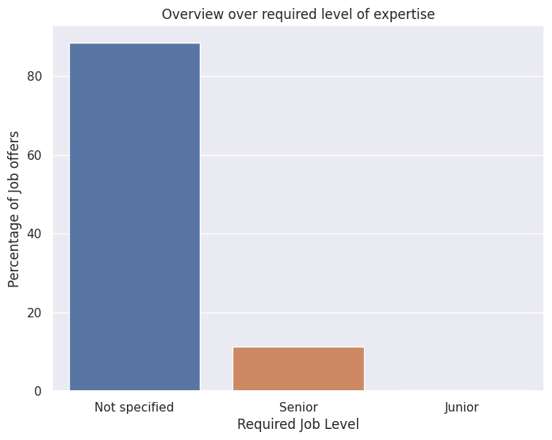
    


<div class="alert alert-block alert-info">
    <b>Key takeaway</b>: Most positions don't specify the level and only 2 Junior positions are offered of the total 672 entries!
</div>

#### 2.2) What are the sectors in which data related jobs are needed?


```python
category = 'Sector'
fig = plt.subplots(figsize = (15,8))
_ = sns.barplot(x= df[category].value_counts().index,
            y=df[category].value_counts()/df.shape[0]*100,
            hue = df[category].value_counts().index)
plt.title('Overview over different sectors')
plt.ylabel('Percentage of Job offers')
plt.xlabel('Job title')
plt.xticks(rotation=90);
```


    
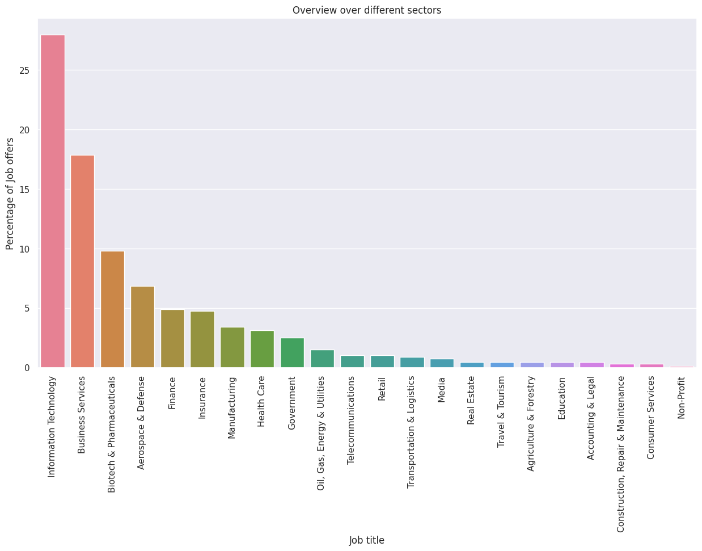
    


<div class="alert alert-block alert-info">
    <b>Key takeaway</b>: The field of data spans throughout a vast number of sectors. IT, Business Services and Biotech & Pharmaceuticals make up for over 50 % of the job market.
</div>

#### 2.3) What are the industries in which data related jobs are needed? What are the top industries?


```python
#extract sorted Industry information from dataframe
df_industry = df['Industry'].value_counts().to_frame().reset_index().sort_values('count', ascending = False)
df_top_industries = df_industry[:10].copy() #extract only the top 10 industries
#summarize the other industries under 'others'
new_row = pd.DataFrame(data = {
    'Industry' : ['others'],
    'count' : [df_industry['count'][10:].sum()]
})
df_industry_compact = pd.concat([df_top_industries, new_row]) #combine new dataframe for a more compact representation
#plotting
fig, axes = plt.subplots(nrows = 1, ncols = 2, figsize = (13,4))
#all industries
df_industry_compact.plot(kind = 'pie', y = 'count',autopct='%1.0f%%', labels = df_industry_compact['Industry'], ax = axes[0],label='',textprops={'fontsize': 9})
axes[0].set_title('All industries')
axes[0].get_legend().remove()
#top 10 industries
df_top_industries.plot(kind = 'pie', y = 'count', labels = df_top_industries['Industry'], ax = axes[1],label='',textprops={'fontsize': 9})
axes[1].set_title('Top 10 industries')
axes[1].get_legend().remove()

```


    
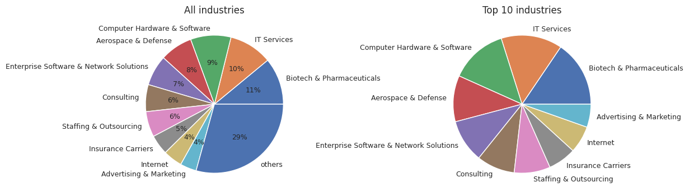
    


<div class="alert alert-block alert-info">
    <b>Key takeaway</b>: The top 10 (of 58) industries make up for 70 % of the job postings. These industries share have a fairly even share. Biotech & Pharmaceuticals and IT Services offer the most jobs.
</div>


#### 2.4) What job titles are most desired?


```python

_ = sns.barplot(x= df["Job Title simplyfied"].value_counts().index,
            y=df["Job Title simplyfied"].value_counts()/df.shape[0]*100,
            hue = df["Job Title simplyfied"].value_counts().index)
plt.title('Overview over different job titles')
plt.ylabel('Percentage of Job offers')
plt.xlabel('Job title')
plt.xticks(rotation=45);
```


    
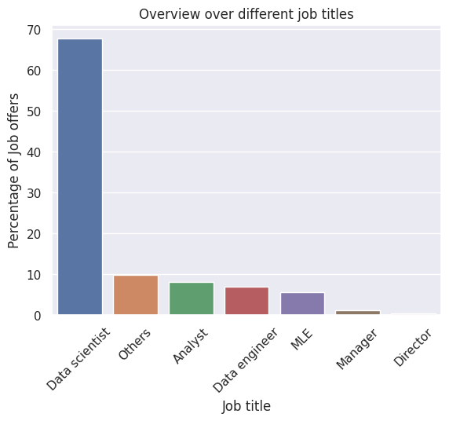
    


<div class="alert alert-block alert-info">
    <b>Key takeaway</b>: Most data related postions are Data scientists, covering more than 65 % of the data set
</div>


#### 2.5) What are the most desired requirements?


```python
requirements = ['statistics','ml', 'python','sql', 'excel', 'hadoop', 'spark',
       'aws', 'tableau', 'big_data',  'r']
sns.barplot(x=requirements,
            y=df[requirements].mean()*100,
            hue = df[requirements].mean().index)
plt.title('Relative Amount of jobs posting asking for specific requirements')
plt.ylabel('Relative Amount in Percent')
plt.xlabel('Requirement')
plt.xticks(rotation=45);

```


    
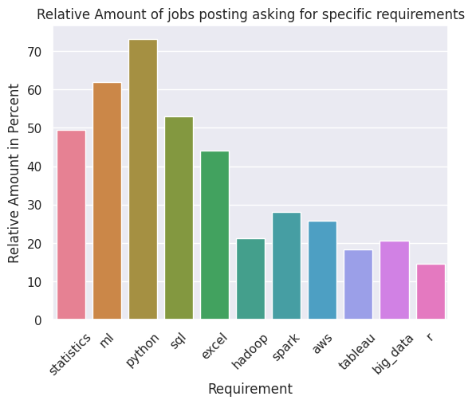
    


<div class="alert alert-block alert-info">
    <b>Key takeaway</b>: Python and machine learning are the most popular requirement for data related postions, covering over 70 % and 60  % of the postings respecively.
    SQL and statistics are required by around half of the job postings.
    Indicated by the requirement hadoop, spark and big_data, the industry starts to require more and more knowledge about big data. Yet, there is still a high demand for excel which does not cope well with large data sets
</div>


#### 2.6) Which states have the most offered positions?


```python
fig = plt.subplots(figsize = (15,8))
_ = sns.barplot(x= df["State"].value_counts().index,
            y=df["State"].value_counts()/df.shape[0]*100,
            hue = df["State"].value_counts().index)
plt.title('Rel. Amount of job offers per state')
plt.ylabel('Percentage of Job offers')
plt.xlabel('State')
plt.xticks(rotation=45);
```


    
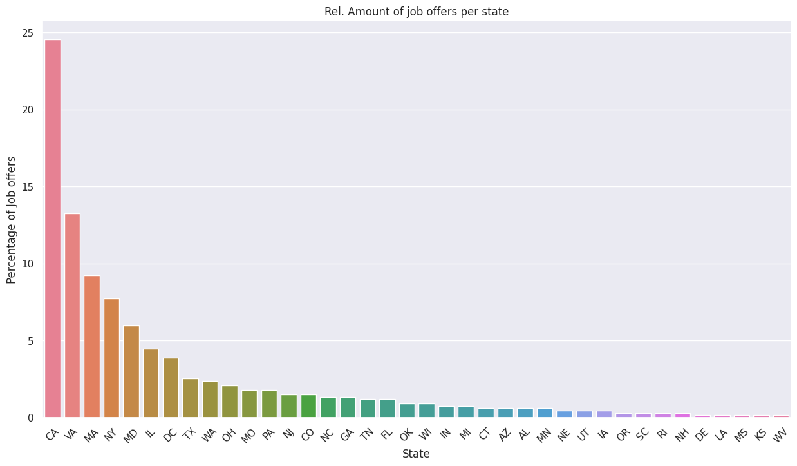
    


<div class="alert alert-block alert-info">
    <b>Key takeaway</b>: Almost a quarter of all jobs postings are located in California
</div>


#### 2.7) A deep dive on California:
Let's take a deep dive on California. This is of personal interest, as I live in Pasadena. 
##### 2.7.1) What cities in California offer the most positions?


```python
df_ca = df[df['State'] == 'CA'] #extract data with locations in California

fig = plt.subplots(figsize = (15,8))
ax = sns.barplot(x= df_ca["City"].value_counts().index,
            y=df_ca["City"].value_counts()/df_ca.shape[0]*100,
            hue = df_ca["City"].value_counts().index)
ax.set_xticklabels(ax.get_xticklabels(), fontsize=10)
plt.title('Offered positions in California')
plt.ylabel('Percentage of Job offers')
plt.xlabel('City')
plt.xticks(rotation=90);
```


    
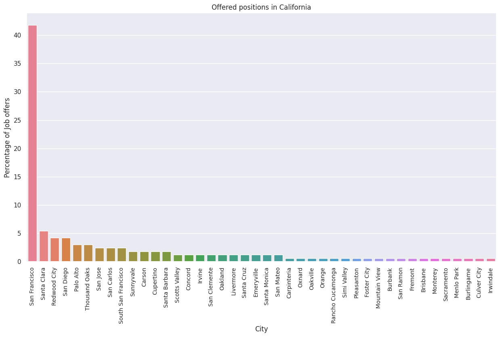
    


There are alot of job postings in San Fransisco. The comparison to other cities is lacking, as the city Los Angeles is not even listed, rather the neighborhoods. The job distribution is better analyzed using geospatial on a map.

##### 2.7.2) What are the companies in the LA region?
To create a map, the coordinated for the cities in California are needed. 


```python
# load the coordiate data
city_df = pd.read_csv("./data/citynames_coords.csv") 
# split coordinates in lateral and longitudinal coordinates
city_df['lat'] = city_df['lat long'].map(lambda x: float(x.split(',')[0]))
city_df['long'] = city_df['lat long'].map(lambda x: float(x.split(',')[1]))
city_df.drop(columns='lat long', inplace=True)
#left join the coordinated onto the California data set df_ca
df_ca = df_ca.merge(city_df, on= 'City',how='left')
# created jittered coordinates for a better representation on the heat map
df_ca['lat_jittered'] = df_ca['lat'] + np.random.uniform(-0.03,0.03,len(df_ca['lat']))
df_ca['long_jittered'] = df_ca['long']+ np.random.uniform(-0.03,0.03,len(df_ca['lat']))

```


```python
map = folium.Map(location=(37,-119.33), zoom_start=5)
feature_group = folium.FeatureGroup("Locations")
#add marker for every job posting
for ind in df_ca.index:
    feature_group.add_child(
        folium.CircleMarker(
            location= [df_ca['lat_jittered'][ind],df_ca['long_jittered'][ind]],
            tooltip=df_ca['Company Name'][ind],
            popup=df_ca['Company Name'][ind] + ' ' + df_ca['Job Title'][ind],
            radius =1
    ))
map.add_child(feature_group)
#created a heat map to visualize job posting density
heat_data=list(zip(df_ca.lat_jittered, df_ca.long_jittered))
from folium.plugins import HeatMap
HeatMap(heat_data).add_to(map)
map
```


<div style="width:100%;"><div style="position:relative;width:100%;height:0;padding-bottom:60%;"><span style="color:#565656">Make this Notebook Trusted to load map: File -> Trust Notebook</span><iframe srcdoc="&lt;!DOCTYPE html&gt;
&lt;html&gt;
&lt;head&gt;

    &lt;meta http-equiv=&quot;content-type&quot; content=&quot;text/html; charset=UTF-8&quot; /&gt;

        &lt;script&gt;
            L_NO_TOUCH = false;
            L_DISABLE_3D = false;
        &lt;/script&gt;

    &lt;style&gt;html, body {width: 100%;height: 100%;margin: 0;padding: 0;}&lt;/style&gt;
    &lt;style&gt;#map {position:absolute;top:0;bottom:0;right:0;left:0;}&lt;/style&gt;
    &lt;script src=&quot;https://cdn.jsdelivr.net/npm/leaflet@1.9.3/dist/leaflet.js&quot;&gt;&lt;/script&gt;
    &lt;script src=&quot;https://code.jquery.com/jquery-3.7.1.min.js&quot;&gt;&lt;/script&gt;
    &lt;script src=&quot;https://cdn.jsdelivr.net/npm/bootstrap@5.2.2/dist/js/bootstrap.bundle.min.js&quot;&gt;&lt;/script&gt;
    &lt;script src=&quot;https://cdnjs.cloudflare.com/ajax/libs/Leaflet.awesome-markers/2.0.2/leaflet.awesome-markers.js&quot;&gt;&lt;/script&gt;
    &lt;link rel=&quot;stylesheet&quot; href=&quot;https://cdn.jsdelivr.net/npm/leaflet@1.9.3/dist/leaflet.css&quot;/&gt;
    &lt;link rel=&quot;stylesheet&quot; href=&quot;https://cdn.jsdelivr.net/npm/bootstrap@5.2.2/dist/css/bootstrap.min.css&quot;/&gt;
    &lt;link rel=&quot;stylesheet&quot; href=&quot;https://netdna.bootstrapcdn.com/bootstrap/3.0.0/css/bootstrap.min.css&quot;/&gt;
    &lt;link rel=&quot;stylesheet&quot; href=&quot;https://cdn.jsdelivr.net/npm/@fortawesome/fontawesome-free@6.2.0/css/all.min.css&quot;/&gt;
    &lt;link rel=&quot;stylesheet&quot; href=&quot;https://cdnjs.cloudflare.com/ajax/libs/Leaflet.awesome-markers/2.0.2/leaflet.awesome-markers.css&quot;/&gt;
    &lt;link rel=&quot;stylesheet&quot; href=&quot;https://cdn.jsdelivr.net/gh/python-visualization/folium/folium/templates/leaflet.awesome.rotate.min.css&quot;/&gt;

            &lt;meta name=&quot;viewport&quot; content=&quot;width=device-width,
                initial-scale=1.0, maximum-scale=1.0, user-scalable=no&quot; /&gt;
            &lt;style&gt;
                #map_a9df0f219f05a7e31b7e6dd3f9ec20ae {
                    position: relative;
                    width: 100.0%;
                    height: 100.0%;
                    left: 0.0%;
                    top: 0.0%;
                }
                .leaflet-container { font-size: 1rem; }
            &lt;/style&gt;

    &lt;script src=&quot;https://cdn.jsdelivr.net/gh/python-visualization/folium@main/folium/templates/leaflet_heat.min.js&quot;&gt;&lt;/script&gt;
&lt;/head&gt;
&lt;body&gt;


            &lt;div class=&quot;folium-map&quot; id=&quot;map_a9df0f219f05a7e31b7e6dd3f9ec20ae&quot; &gt;&lt;/div&gt;

&lt;/body&gt;
&lt;script&gt;


            var map_a9df0f219f05a7e31b7e6dd3f9ec20ae = L.map(
                &quot;map_a9df0f219f05a7e31b7e6dd3f9ec20ae&quot;,
                {
                    center: [37.0, -119.33],
                    crs: L.CRS.EPSG3857,
                    zoom: 5,
                    zoomControl: true,
                    preferCanvas: false,
                }
            );


            var tile_layer_7160c705b3918b3f7f97f0bf89fb7b1b = L.tileLayer(
                &quot;https://tile.openstreetmap.org/{z}/{x}/{y}.png&quot;,
                {&quot;attribution&quot;: &quot;\u0026copy; \u003ca href=\&quot;https://www.openstreetmap.org/copyright\&quot;\u003eOpenStreetMap\u003c/a\u003e contributors&quot;, &quot;detectRetina&quot;: false, &quot;maxNativeZoom&quot;: 19, &quot;maxZoom&quot;: 19, &quot;minZoom&quot;: 0, &quot;noWrap&quot;: false, &quot;opacity&quot;: 1, &quot;subdomains&quot;: &quot;abc&quot;, &quot;tms&quot;: false}
            );


            tile_layer_7160c705b3918b3f7f97f0bf89fb7b1b.addTo(map_a9df0f219f05a7e31b7e6dd3f9ec20ae);


            var feature_group_8c53cc956cf5d7c9955d194a4cc45c0a = L.featureGroup(
                {}
            );


            var circle_marker_2cb744ae58e6c9e773b6eea79de8e71d = L.circleMarker(
                [34.44313565437153, -119.73158958714258],
                {&quot;bubblingMouseEvents&quot;: true, &quot;color&quot;: &quot;#3388ff&quot;, &quot;dashArray&quot;: null, &quot;dashOffset&quot;: null, &quot;fill&quot;: false, &quot;fillColor&quot;: &quot;#3388ff&quot;, &quot;fillOpacity&quot;: 0.2, &quot;fillRule&quot;: &quot;evenodd&quot;, &quot;lineCap&quot;: &quot;round&quot;, &quot;lineJoin&quot;: &quot;round&quot;, &quot;opacity&quot;: 1.0, &quot;radius&quot;: 1, &quot;stroke&quot;: true, &quot;weight&quot;: 3}
            ).addTo(feature_group_8c53cc956cf5d7c9955d194a4cc45c0a);


        var popup_0ebf4418ebf4cd292e2d057af39f1506 = L.popup({&quot;maxWidth&quot;: &quot;100%&quot;});


                var html_11ec41c7f58faecb3c4994a26b558336 = $(`&lt;div id=&quot;html_11ec41c7f58faecb3c4994a26b558336&quot; style=&quot;width: 100.0%; height: 100.0%;&quot;&gt;HG Insights Data Scientist&lt;/div&gt;`)[0];
                popup_0ebf4418ebf4cd292e2d057af39f1506.setContent(html_11ec41c7f58faecb3c4994a26b558336);


        circle_marker_2cb744ae58e6c9e773b6eea79de8e71d.bindPopup(popup_0ebf4418ebf4cd292e2d057af39f1506)
        ;


            circle_marker_2cb744ae58e6c9e773b6eea79de8e71d.bindTooltip(
                `&lt;div&gt;
                     HG Insights
                 &lt;/div&gt;`,
                {&quot;sticky&quot;: true}
            );


            var circle_marker_9836d2684d06f42007ddc0ad3d2eebdd = L.circleMarker(
                [32.694820981819426, -117.1464749588975],
                {&quot;bubblingMouseEvents&quot;: true, &quot;color&quot;: &quot;#3388ff&quot;, &quot;dashArray&quot;: null, &quot;dashOffset&quot;: null, &quot;fill&quot;: false, &quot;fillColor&quot;: &quot;#3388ff&quot;, &quot;fillOpacity&quot;: 0.2, &quot;fillRule&quot;: &quot;evenodd&quot;, &quot;lineCap&quot;: &quot;round&quot;, &quot;lineJoin&quot;: &quot;round&quot;, &quot;opacity&quot;: 1.0, &quot;radius&quot;: 1, &quot;stroke&quot;: true, &quot;weight&quot;: 3}
            ).addTo(feature_group_8c53cc956cf5d7c9955d194a4cc45c0a);


        var popup_2b949f6d49c29c30afa5f99aff0eb236 = L.popup({&quot;maxWidth&quot;: &quot;100%&quot;});


                var html_eeb5b81e7b1cecea1e95d958fab5f7d7 = $(`&lt;div id=&quot;html_eeb5b81e7b1cecea1e95d958fab5f7d7&quot; style=&quot;width: 100.0%; height: 100.0%;&quot;&gt;Intuit - Data Staff Data Scientist - Analytics&lt;/div&gt;`)[0];
                popup_2b949f6d49c29c30afa5f99aff0eb236.setContent(html_eeb5b81e7b1cecea1e95d958fab5f7d7);


        circle_marker_9836d2684d06f42007ddc0ad3d2eebdd.bindPopup(popup_2b949f6d49c29c30afa5f99aff0eb236)
        ;


            circle_marker_9836d2684d06f42007ddc0ad3d2eebdd.bindTooltip(
                `&lt;div&gt;
                     Intuit - Data
                 &lt;/div&gt;`,
                {&quot;sticky&quot;: true}
            );


            var circle_marker_38a6fc4ccaf040b37bac7cc8db125a52 = L.circleMarker(
                [37.79971767509662, -122.41749564702054],
                {&quot;bubblingMouseEvents&quot;: true, &quot;color&quot;: &quot;#3388ff&quot;, &quot;dashArray&quot;: null, &quot;dashOffset&quot;: null, &quot;fill&quot;: false, &quot;fillColor&quot;: &quot;#3388ff&quot;, &quot;fillOpacity&quot;: 0.2, &quot;fillRule&quot;: &quot;evenodd&quot;, &quot;lineCap&quot;: &quot;round&quot;, &quot;lineJoin&quot;: &quot;round&quot;, &quot;opacity&quot;: 1.0, &quot;radius&quot;: 1, &quot;stroke&quot;: true, &quot;weight&quot;: 3}
            ).addTo(feature_group_8c53cc956cf5d7c9955d194a4cc45c0a);


        var popup_ca5154b19ff5a26b8a2ba2398465e747 = L.popup({&quot;maxWidth&quot;: &quot;100%&quot;});


                var html_0c230f7fdb64178a9559061dc33d608c = $(`&lt;div id=&quot;html_0c230f7fdb64178a9559061dc33d608c&quot; style=&quot;width: 100.0%; height: 100.0%;&quot;&gt;Formation Data Scientist&lt;/div&gt;`)[0];
                popup_ca5154b19ff5a26b8a2ba2398465e747.setContent(html_0c230f7fdb64178a9559061dc33d608c);


        circle_marker_38a6fc4ccaf040b37bac7cc8db125a52.bindPopup(popup_ca5154b19ff5a26b8a2ba2398465e747)
        ;


            circle_marker_38a6fc4ccaf040b37bac7cc8db125a52.bindTooltip(
                `&lt;div&gt;
                     Formation
                 &lt;/div&gt;`,
                {&quot;sticky&quot;: true}
            );


            var circle_marker_536ed0e8eb5b42969435560c1a51cbb5 = L.circleMarker(
                [34.00026452440042, -118.48464744144552],
                {&quot;bubblingMouseEvents&quot;: true, &quot;color&quot;: &quot;#3388ff&quot;, &quot;dashArray&quot;: null, &quot;dashOffset&quot;: null, &quot;fill&quot;: false, &quot;fillColor&quot;: &quot;#3388ff&quot;, &quot;fillOpacity&quot;: 0.2, &quot;fillRule&quot;: &quot;evenodd&quot;, &quot;lineCap&quot;: &quot;round&quot;, &quot;lineJoin&quot;: &quot;round&quot;, &quot;opacity&quot;: 1.0, &quot;radius&quot;: 1, &quot;stroke&quot;: true, &quot;weight&quot;: 3}
            ).addTo(feature_group_8c53cc956cf5d7c9955d194a4cc45c0a);


        var popup_602a7677c4457edc4cca681db5cb588b = L.popup({&quot;maxWidth&quot;: &quot;100%&quot;});


                var html_5cdae06074391796f42ebd2e81e1d93d = $(`&lt;div id=&quot;html_5cdae06074391796f42ebd2e81e1d93d&quot; style=&quot;width: 100.0%; height: 100.0%;&quot;&gt;Edmunds.com Senior Analyst/Data Scientist&lt;/div&gt;`)[0];
                popup_602a7677c4457edc4cca681db5cb588b.setContent(html_5cdae06074391796f42ebd2e81e1d93d);


        circle_marker_536ed0e8eb5b42969435560c1a51cbb5.bindPopup(popup_602a7677c4457edc4cca681db5cb588b)
        ;


            circle_marker_536ed0e8eb5b42969435560c1a51cbb5.bindTooltip(
                `&lt;div&gt;
                     Edmunds.com
                 &lt;/div&gt;`,
                {&quot;sticky&quot;: true}
            );


            var circle_marker_059fa8c5c21c8e4476219dc4fb1ce6fc = L.circleMarker(
                [37.66163698600831, -122.4129290510513],
                {&quot;bubblingMouseEvents&quot;: true, &quot;color&quot;: &quot;#3388ff&quot;, &quot;dashArray&quot;: null, &quot;dashOffset&quot;: null, &quot;fill&quot;: false, &quot;fillColor&quot;: &quot;#3388ff&quot;, &quot;fillOpacity&quot;: 0.2, &quot;fillRule&quot;: &quot;evenodd&quot;, &quot;lineCap&quot;: &quot;round&quot;, &quot;lineJoin&quot;: &quot;round&quot;, &quot;opacity&quot;: 1.0, &quot;radius&quot;: 1, &quot;stroke&quot;: true, &quot;weight&quot;: 3}
            ).addTo(feature_group_8c53cc956cf5d7c9955d194a4cc45c0a);


        var popup_843a9fed159f9245dce0c2da2ef06151 = L.popup({&quot;maxWidth&quot;: &quot;100%&quot;});


                var html_6f73157591d5b8e2d42735ebeadd6317 = $(`&lt;div id=&quot;html_6f73157591d5b8e2d42735ebeadd6317&quot; style=&quot;width: 100.0%; height: 100.0%;&quot;&gt;Arsenal Biosciences Scientist - Molecular Biology&lt;/div&gt;`)[0];
                popup_843a9fed159f9245dce0c2da2ef06151.setContent(html_6f73157591d5b8e2d42735ebeadd6317);


        circle_marker_059fa8c5c21c8e4476219dc4fb1ce6fc.bindPopup(popup_843a9fed159f9245dce0c2da2ef06151)
        ;


            circle_marker_059fa8c5c21c8e4476219dc4fb1ce6fc.bindTooltip(
                `&lt;div&gt;
                     Arsenal Biosciences
                 &lt;/div&gt;`,
                {&quot;sticky&quot;: true}
            );


            var circle_marker_0567fb087e984175a5b9f53928ba1acd = L.circleMarker(
                [37.42895395251736, -122.17944219044884],
                {&quot;bubblingMouseEvents&quot;: true, &quot;color&quot;: &quot;#3388ff&quot;, &quot;dashArray&quot;: null, &quot;dashOffset&quot;: null, &quot;fill&quot;: false, &quot;fillColor&quot;: &quot;#3388ff&quot;, &quot;fillOpacity&quot;: 0.2, &quot;fillRule&quot;: &quot;evenodd&quot;, &quot;lineCap&quot;: &quot;round&quot;, &quot;lineJoin&quot;: &quot;round&quot;, &quot;opacity&quot;: 1.0, &quot;radius&quot;: 1, &quot;stroke&quot;: true, &quot;weight&quot;: 3}
            ).addTo(feature_group_8c53cc956cf5d7c9955d194a4cc45c0a);


        var popup_d00e052e80cfb48d8d3d8cb15b09f661 = L.popup({&quot;maxWidth&quot;: &quot;100%&quot;});


                var html_85444f9b5600bd974378b65a82aabbf6 = $(`&lt;div id=&quot;html_85444f9b5600bd974378b65a82aabbf6&quot; style=&quot;width: 100.0%; height: 100.0%;&quot;&gt;Eversight Data Scientist&lt;/div&gt;`)[0];
                popup_d00e052e80cfb48d8d3d8cb15b09f661.setContent(html_85444f9b5600bd974378b65a82aabbf6);


        circle_marker_0567fb087e984175a5b9f53928ba1acd.bindPopup(popup_d00e052e80cfb48d8d3d8cb15b09f661)
        ;


            circle_marker_0567fb087e984175a5b9f53928ba1acd.bindTooltip(
                `&lt;div&gt;
                     Eversight
                 &lt;/div&gt;`,
                {&quot;sticky&quot;: true}
            );


            var circle_marker_5e5d51f1a99cfe8ca6d08d26780e0686 = L.circleMarker(
                [37.807142416569654, -122.41305177003515],
                {&quot;bubblingMouseEvents&quot;: true, &quot;color&quot;: &quot;#3388ff&quot;, &quot;dashArray&quot;: null, &quot;dashOffset&quot;: null, &quot;fill&quot;: false, &quot;fillColor&quot;: &quot;#3388ff&quot;, &quot;fillOpacity&quot;: 0.2, &quot;fillRule&quot;: &quot;evenodd&quot;, &quot;lineCap&quot;: &quot;round&quot;, &quot;lineJoin&quot;: &quot;round&quot;, &quot;opacity&quot;: 1.0, &quot;radius&quot;: 1, &quot;stroke&quot;: true, &quot;weight&quot;: 3}
            ).addTo(feature_group_8c53cc956cf5d7c9955d194a4cc45c0a);


        var popup_eadc2f0de796e37c90dae20880ac4153 = L.popup({&quot;maxWidth&quot;: &quot;100%&quot;});


                var html_d1b3483590c18c4fe645dda947c635a7 = $(`&lt;div id=&quot;html_d1b3483590c18c4fe645dda947c635a7&quot; style=&quot;width: 100.0%; height: 100.0%;&quot;&gt;GovTech Data Scientist&lt;/div&gt;`)[0];
                popup_eadc2f0de796e37c90dae20880ac4153.setContent(html_d1b3483590c18c4fe645dda947c635a7);


        circle_marker_5e5d51f1a99cfe8ca6d08d26780e0686.bindPopup(popup_eadc2f0de796e37c90dae20880ac4153)
        ;


            circle_marker_5e5d51f1a99cfe8ca6d08d26780e0686.bindTooltip(
                `&lt;div&gt;
                     GovTech
                 &lt;/div&gt;`,
                {&quot;sticky&quot;: true}
            );


            var circle_marker_965546173825f61d243e8f03f1b8f921 = L.circleMarker(
                [37.79675051889047, -122.42728555139722],
                {&quot;bubblingMouseEvents&quot;: true, &quot;color&quot;: &quot;#3388ff&quot;, &quot;dashArray&quot;: null, &quot;dashOffset&quot;: null, &quot;fill&quot;: false, &quot;fillColor&quot;: &quot;#3388ff&quot;, &quot;fillOpacity&quot;: 0.2, &quot;fillRule&quot;: &quot;evenodd&quot;, &quot;lineCap&quot;: &quot;round&quot;, &quot;lineJoin&quot;: &quot;round&quot;, &quot;opacity&quot;: 1.0, &quot;radius&quot;: 1, &quot;stroke&quot;: true, &quot;weight&quot;: 3}
            ).addTo(feature_group_8c53cc956cf5d7c9955d194a4cc45c0a);


        var popup_a9ffa9a3da5a0199b02ca15bf6264f3c = L.popup({&quot;maxWidth&quot;: &quot;100%&quot;});


                var html_8435b6592ec02c68d63b35ce9aabd541 = $(`&lt;div id=&quot;html_8435b6592ec02c68d63b35ce9aabd541&quot; style=&quot;width: 100.0%; height: 100.0%;&quot;&gt;Giving Assistant Data Analyst&lt;/div&gt;`)[0];
                popup_a9ffa9a3da5a0199b02ca15bf6264f3c.setContent(html_8435b6592ec02c68d63b35ce9aabd541);


        circle_marker_965546173825f61d243e8f03f1b8f921.bindPopup(popup_a9ffa9a3da5a0199b02ca15bf6264f3c)
        ;


            circle_marker_965546173825f61d243e8f03f1b8f921.bindTooltip(
                `&lt;div&gt;
                     Giving Assistant
                 &lt;/div&gt;`,
                {&quot;sticky&quot;: true}
            );


            var circle_marker_ab773f9b5b9906f82d4d6905bc1652d7 = L.circleMarker(
                [37.80118215554081, -122.42150552026486],
                {&quot;bubblingMouseEvents&quot;: true, &quot;color&quot;: &quot;#3388ff&quot;, &quot;dashArray&quot;: null, &quot;dashOffset&quot;: null, &quot;fill&quot;: false, &quot;fillColor&quot;: &quot;#3388ff&quot;, &quot;fillOpacity&quot;: 0.2, &quot;fillRule&quot;: &quot;evenodd&quot;, &quot;lineCap&quot;: &quot;round&quot;, &quot;lineJoin&quot;: &quot;round&quot;, &quot;opacity&quot;: 1.0, &quot;radius&quot;: 1, &quot;stroke&quot;: true, &quot;weight&quot;: 3}
            ).addTo(feature_group_8c53cc956cf5d7c9955d194a4cc45c0a);


        var popup_ea59da62c62dbbbe1355c83c2db93827 = L.popup({&quot;maxWidth&quot;: &quot;100%&quot;});


                var html_4225135cc5bcbaea07ed717043d0840f = $(`&lt;div id=&quot;html_4225135cc5bcbaea07ed717043d0840f&quot; style=&quot;width: 100.0%; height: 100.0%;&quot;&gt;Netskope Data Scientist&lt;/div&gt;`)[0];
                popup_ea59da62c62dbbbe1355c83c2db93827.setContent(html_4225135cc5bcbaea07ed717043d0840f);


        circle_marker_ab773f9b5b9906f82d4d6905bc1652d7.bindPopup(popup_ea59da62c62dbbbe1355c83c2db93827)
        ;


            circle_marker_ab773f9b5b9906f82d4d6905bc1652d7.bindTooltip(
                `&lt;div&gt;
                     Netskope
                 &lt;/div&gt;`,
                {&quot;sticky&quot;: true}
            );


            var circle_marker_3f971b969f10c4a8dd3ba395b3262049 = L.circleMarker(
                [37.77900667582917, -122.39826914275223],
                {&quot;bubblingMouseEvents&quot;: true, &quot;color&quot;: &quot;#3388ff&quot;, &quot;dashArray&quot;: null, &quot;dashOffset&quot;: null, &quot;fill&quot;: false, &quot;fillColor&quot;: &quot;#3388ff&quot;, &quot;fillOpacity&quot;: 0.2, &quot;fillRule&quot;: &quot;evenodd&quot;, &quot;lineCap&quot;: &quot;round&quot;, &quot;lineJoin&quot;: &quot;round&quot;, &quot;opacity&quot;: 1.0, &quot;radius&quot;: 1, &quot;stroke&quot;: true, &quot;weight&quot;: 3}
            ).addTo(feature_group_8c53cc956cf5d7c9955d194a4cc45c0a);


        var popup_2516bf68256244f3fdb6808d2e9cf3c0 = L.popup({&quot;maxWidth&quot;: &quot;100%&quot;});


                var html_bfc4be47893d0961502978480a4850f2 = $(`&lt;div id=&quot;html_bfc4be47893d0961502978480a4850f2&quot; style=&quot;width: 100.0%; height: 100.0%;&quot;&gt;Twitter Product Data Scientist - Ads Data Science&lt;/div&gt;`)[0];
                popup_2516bf68256244f3fdb6808d2e9cf3c0.setContent(html_bfc4be47893d0961502978480a4850f2);


        circle_marker_3f971b969f10c4a8dd3ba395b3262049.bindPopup(popup_2516bf68256244f3fdb6808d2e9cf3c0)
        ;


            circle_marker_3f971b969f10c4a8dd3ba395b3262049.bindTooltip(
                `&lt;div&gt;
                     Twitter
                 &lt;/div&gt;`,
                {&quot;sticky&quot;: true}
            );


            var circle_marker_1dbf5cffc16832b22650ca0b1c2fb957 = L.circleMarker(
                [37.7833433912331, -122.44502263801611],
                {&quot;bubblingMouseEvents&quot;: true, &quot;color&quot;: &quot;#3388ff&quot;, &quot;dashArray&quot;: null, &quot;dashOffset&quot;: null, &quot;fill&quot;: false, &quot;fillColor&quot;: &quot;#3388ff&quot;, &quot;fillOpacity&quot;: 0.2, &quot;fillRule&quot;: &quot;evenodd&quot;, &quot;lineCap&quot;: &quot;round&quot;, &quot;lineJoin&quot;: &quot;round&quot;, &quot;opacity&quot;: 1.0, &quot;radius&quot;: 1, &quot;stroke&quot;: true, &quot;weight&quot;: 3}
            ).addTo(feature_group_8c53cc956cf5d7c9955d194a4cc45c0a);


        var popup_b286eea3fd5cffabf353e8e3719f421c = L.popup({&quot;maxWidth&quot;: &quot;100%&quot;});


                var html_402fc8cfb80f1668c8ad8a863df7e0a5 = $(`&lt;div id=&quot;html_402fc8cfb80f1668c8ad8a863df7e0a5&quot; style=&quot;width: 100.0%; height: 100.0%;&quot;&gt;Postmates - Corporate HQ Data Scientist&lt;/div&gt;`)[0];
                popup_b286eea3fd5cffabf353e8e3719f421c.setContent(html_402fc8cfb80f1668c8ad8a863df7e0a5);


        circle_marker_1dbf5cffc16832b22650ca0b1c2fb957.bindPopup(popup_b286eea3fd5cffabf353e8e3719f421c)
        ;


            circle_marker_1dbf5cffc16832b22650ca0b1c2fb957.bindTooltip(
                `&lt;div&gt;
                     Postmates - Corporate HQ
                 &lt;/div&gt;`,
                {&quot;sticky&quot;: true}
            );


            var circle_marker_807e13a1e5220abbf475fe80f72b18ec = L.circleMarker(
                [34.402988765271914, -119.73258752862037],
                {&quot;bubblingMouseEvents&quot;: true, &quot;color&quot;: &quot;#3388ff&quot;, &quot;dashArray&quot;: null, &quot;dashOffset&quot;: null, &quot;fill&quot;: false, &quot;fillColor&quot;: &quot;#3388ff&quot;, &quot;fillOpacity&quot;: 0.2, &quot;fillRule&quot;: &quot;evenodd&quot;, &quot;lineCap&quot;: &quot;round&quot;, &quot;lineJoin&quot;: &quot;round&quot;, &quot;opacity&quot;: 1.0, &quot;radius&quot;: 1, &quot;stroke&quot;: true, &quot;weight&quot;: 3}
            ).addTo(feature_group_8c53cc956cf5d7c9955d194a4cc45c0a);


        var popup_a3f877fb0d65ed19c436eff4dae79590 = L.popup({&quot;maxWidth&quot;: &quot;100%&quot;});


                var html_a4255fb0110d16d928894de42afd61fc = $(`&lt;div id=&quot;html_a4255fb0110d16d928894de42afd61fc&quot; style=&quot;width: 100.0%; height: 100.0%;&quot;&gt;HG Insights Data Scientist&lt;/div&gt;`)[0];
                popup_a3f877fb0d65ed19c436eff4dae79590.setContent(html_a4255fb0110d16d928894de42afd61fc);


        circle_marker_807e13a1e5220abbf475fe80f72b18ec.bindPopup(popup_a3f877fb0d65ed19c436eff4dae79590)
        ;


            circle_marker_807e13a1e5220abbf475fe80f72b18ec.bindTooltip(
                `&lt;div&gt;
                     HG Insights
                 &lt;/div&gt;`,
                {&quot;sticky&quot;: true}
            );


            var circle_marker_c31119a7bca9b1858522be2978835534 = L.circleMarker(
                [33.85736939651429, -118.16766244542218],
                {&quot;bubblingMouseEvents&quot;: true, &quot;color&quot;: &quot;#3388ff&quot;, &quot;dashArray&quot;: null, &quot;dashOffset&quot;: null, &quot;fill&quot;: false, &quot;fillColor&quot;: &quot;#3388ff&quot;, &quot;fillOpacity&quot;: 0.2, &quot;fillRule&quot;: &quot;evenodd&quot;, &quot;lineCap&quot;: &quot;round&quot;, &quot;lineJoin&quot;: &quot;round&quot;, &quot;opacity&quot;: 1.0, &quot;radius&quot;: 1, &quot;stroke&quot;: true, &quot;weight&quot;: 3}
            ).addTo(feature_group_8c53cc956cf5d7c9955d194a4cc45c0a);


        var popup_bc62a4b3754d5c0a0bfc795473f10a69 = L.popup({&quot;maxWidth&quot;: &quot;100%&quot;});


                var html_7ed3e01d6895ae4e51ebbe3897f073bc = $(`&lt;div id=&quot;html_7ed3e01d6895ae4e51ebbe3897f073bc&quot; style=&quot;width: 100.0%; height: 100.0%;&quot;&gt;Dermalogica Global Data Analyst&lt;/div&gt;`)[0];
                popup_bc62a4b3754d5c0a0bfc795473f10a69.setContent(html_7ed3e01d6895ae4e51ebbe3897f073bc);


        circle_marker_c31119a7bca9b1858522be2978835534.bindPopup(popup_bc62a4b3754d5c0a0bfc795473f10a69)
        ;


            circle_marker_c31119a7bca9b1858522be2978835534.bindTooltip(
                `&lt;div&gt;
                     Dermalogica
                 &lt;/div&gt;`,
                {&quot;sticky&quot;: true}
            );


            var circle_marker_40ffa3aa53bc377d8b92faf279cb5304 = L.circleMarker(
                [37.22057127595797, -121.65691988892307],
                {&quot;bubblingMouseEvents&quot;: true, &quot;color&quot;: &quot;#3388ff&quot;, &quot;dashArray&quot;: null, &quot;dashOffset&quot;: null, &quot;fill&quot;: false, &quot;fillColor&quot;: &quot;#3388ff&quot;, &quot;fillOpacity&quot;: 0.2, &quot;fillRule&quot;: &quot;evenodd&quot;, &quot;lineCap&quot;: &quot;round&quot;, &quot;lineJoin&quot;: &quot;round&quot;, &quot;opacity&quot;: 1.0, &quot;radius&quot;: 1, &quot;stroke&quot;: true, &quot;weight&quot;: 3}
            ).addTo(feature_group_8c53cc956cf5d7c9955d194a4cc45c0a);


        var popup_4eea6eb0c4e18d1eb7110a0aa09c2599 = L.popup({&quot;maxWidth&quot;: &quot;100%&quot;});


                var html_4a7162c72d54480cdc2540c8954cb52a = $(`&lt;div id=&quot;html_4a7162c72d54480cdc2540c8954cb52a&quot; style=&quot;width: 100.0%; height: 100.0%;&quot;&gt;Grid Dynamics Data Scientist&lt;/div&gt;`)[0];
                popup_4eea6eb0c4e18d1eb7110a0aa09c2599.setContent(html_4a7162c72d54480cdc2540c8954cb52a);


        circle_marker_40ffa3aa53bc377d8b92faf279cb5304.bindPopup(popup_4eea6eb0c4e18d1eb7110a0aa09c2599)
        ;


            circle_marker_40ffa3aa53bc377d8b92faf279cb5304.bindTooltip(
                `&lt;div&gt;
                     Grid Dynamics
                 &lt;/div&gt;`,
                {&quot;sticky&quot;: true}
            );


            var circle_marker_ea36ecd91c2d1ebc540fa0d38105bfcb = L.circleMarker(
                [37.66387677619838, -122.42233763412888],
                {&quot;bubblingMouseEvents&quot;: true, &quot;color&quot;: &quot;#3388ff&quot;, &quot;dashArray&quot;: null, &quot;dashOffset&quot;: null, &quot;fill&quot;: false, &quot;fillColor&quot;: &quot;#3388ff&quot;, &quot;fillOpacity&quot;: 0.2, &quot;fillRule&quot;: &quot;evenodd&quot;, &quot;lineCap&quot;: &quot;round&quot;, &quot;lineJoin&quot;: &quot;round&quot;, &quot;opacity&quot;: 1.0, &quot;radius&quot;: 1, &quot;stroke&quot;: true, &quot;weight&quot;: 3}
            ).addTo(feature_group_8c53cc956cf5d7c9955d194a4cc45c0a);


        var popup_975b12047fde52d2386a21179f4f55ab = L.popup({&quot;maxWidth&quot;: &quot;100%&quot;});


                var html_fd178f40685bac7af06243fe05bbbd93 = $(`&lt;div id=&quot;html_fd178f40685bac7af06243fe05bbbd93&quot; style=&quot;width: 100.0%; height: 100.0%;&quot;&gt;CareDx Data Scientist - Machine Learning&lt;/div&gt;`)[0];
                popup_975b12047fde52d2386a21179f4f55ab.setContent(html_fd178f40685bac7af06243fe05bbbd93);


        circle_marker_ea36ecd91c2d1ebc540fa0d38105bfcb.bindPopup(popup_975b12047fde52d2386a21179f4f55ab)
        ;


            circle_marker_ea36ecd91c2d1ebc540fa0d38105bfcb.bindTooltip(
                `&lt;div&gt;
                     CareDx
                 &lt;/div&gt;`,
                {&quot;sticky&quot;: true}
            );


            var circle_marker_09b3c5e08251ba62d98ae2e0c46cb1af = L.circleMarker(
                [37.462032692911016, -122.23224282253429],
                {&quot;bubblingMouseEvents&quot;: true, &quot;color&quot;: &quot;#3388ff&quot;, &quot;dashArray&quot;: null, &quot;dashOffset&quot;: null, &quot;fill&quot;: false, &quot;fillColor&quot;: &quot;#3388ff&quot;, &quot;fillOpacity&quot;: 0.2, &quot;fillRule&quot;: &quot;evenodd&quot;, &quot;lineCap&quot;: &quot;round&quot;, &quot;lineJoin&quot;: &quot;round&quot;, &quot;opacity&quot;: 1.0, &quot;radius&quot;: 1, &quot;stroke&quot;: true, &quot;weight&quot;: 3}
            ).addTo(feature_group_8c53cc956cf5d7c9955d194a4cc45c0a);


        var popup_490ef977d479cb9690282abc5c258c5e = L.popup({&quot;maxWidth&quot;: &quot;100%&quot;});


                var html_176939e208e31c8bd9a9ff6dffd4a1ee = $(`&lt;div id=&quot;html_176939e208e31c8bd9a9ff6dffd4a1ee&quot; style=&quot;width: 100.0%; height: 100.0%;&quot;&gt;Tempus Labs Data Scientist, Applied Machine Learning - Bay Area&lt;/div&gt;`)[0];
                popup_490ef977d479cb9690282abc5c258c5e.setContent(html_176939e208e31c8bd9a9ff6dffd4a1ee);


        circle_marker_09b3c5e08251ba62d98ae2e0c46cb1af.bindPopup(popup_490ef977d479cb9690282abc5c258c5e)
        ;


            circle_marker_09b3c5e08251ba62d98ae2e0c46cb1af.bindTooltip(
                `&lt;div&gt;
                     Tempus Labs
                 &lt;/div&gt;`,
                {&quot;sticky&quot;: true}
            );


            var circle_marker_36409cf532e6c8bd061d4b290ba5dd38 = L.circleMarker(
                [37.78517381545406, -122.41268682779848],
                {&quot;bubblingMouseEvents&quot;: true, &quot;color&quot;: &quot;#3388ff&quot;, &quot;dashArray&quot;: null, &quot;dashOffset&quot;: null, &quot;fill&quot;: false, &quot;fillColor&quot;: &quot;#3388ff&quot;, &quot;fillOpacity&quot;: 0.2, &quot;fillRule&quot;: &quot;evenodd&quot;, &quot;lineCap&quot;: &quot;round&quot;, &quot;lineJoin&quot;: &quot;round&quot;, &quot;opacity&quot;: 1.0, &quot;radius&quot;: 1, &quot;stroke&quot;: true, &quot;weight&quot;: 3}
            ).addTo(feature_group_8c53cc956cf5d7c9955d194a4cc45c0a);


        var popup_5266c39300830425f4e0e1992b3934dd = L.popup({&quot;maxWidth&quot;: &quot;100%&quot;});


                var html_89c1316eba04adcaa151fc225f1a47ac = $(`&lt;div id=&quot;html_89c1316eba04adcaa151fc225f1a47ac&quot; style=&quot;width: 100.0%; height: 100.0%;&quot;&gt;Autodesk Principal Data Scientist&lt;/div&gt;`)[0];
                popup_5266c39300830425f4e0e1992b3934dd.setContent(html_89c1316eba04adcaa151fc225f1a47ac);


        circle_marker_36409cf532e6c8bd061d4b290ba5dd38.bindPopup(popup_5266c39300830425f4e0e1992b3934dd)
        ;


            circle_marker_36409cf532e6c8bd061d4b290ba5dd38.bindTooltip(
                `&lt;div&gt;
                     Autodesk
                 &lt;/div&gt;`,
                {&quot;sticky&quot;: true}
            );


            var circle_marker_522092378713fa52156175124cd42964 = L.circleMarker(
                [37.84855593116157, -122.26184319003849],
                {&quot;bubblingMouseEvents&quot;: true, &quot;color&quot;: &quot;#3388ff&quot;, &quot;dashArray&quot;: null, &quot;dashOffset&quot;: null, &quot;fill&quot;: false, &quot;fillColor&quot;: &quot;#3388ff&quot;, &quot;fillOpacity&quot;: 0.2, &quot;fillRule&quot;: &quot;evenodd&quot;, &quot;lineCap&quot;: &quot;round&quot;, &quot;lineJoin&quot;: &quot;round&quot;, &quot;opacity&quot;: 1.0, &quot;radius&quot;: 1, &quot;stroke&quot;: true, &quot;weight&quot;: 3}
            ).addTo(feature_group_8c53cc956cf5d7c9955d194a4cc45c0a);


        var popup_37a9793ca0c1c6d9ddff266d78748cdb = L.popup({&quot;maxWidth&quot;: &quot;100%&quot;});


                var html_0711ea85dce7fe5e0fcbb7264a8c93d4 = $(`&lt;div id=&quot;html_0711ea85dce7fe5e0fcbb7264a8c93d4&quot; style=&quot;width: 100.0%; height: 100.0%;&quot;&gt;Amyris Data Scientist 3 (718)&lt;/div&gt;`)[0];
                popup_37a9793ca0c1c6d9ddff266d78748cdb.setContent(html_0711ea85dce7fe5e0fcbb7264a8c93d4);


        circle_marker_522092378713fa52156175124cd42964.bindPopup(popup_37a9793ca0c1c6d9ddff266d78748cdb)
        ;


            circle_marker_522092378713fa52156175124cd42964.bindTooltip(
                `&lt;div&gt;
                     Amyris
                 &lt;/div&gt;`,
                {&quot;sticky&quot;: true}
            );


            var circle_marker_8f06a205d5b8af2169961715d25543ee = L.circleMarker(
                [37.77888000555223, -122.38943897524524],
                {&quot;bubblingMouseEvents&quot;: true, &quot;color&quot;: &quot;#3388ff&quot;, &quot;dashArray&quot;: null, &quot;dashOffset&quot;: null, &quot;fill&quot;: false, &quot;fillColor&quot;: &quot;#3388ff&quot;, &quot;fillOpacity&quot;: 0.2, &quot;fillRule&quot;: &quot;evenodd&quot;, &quot;lineCap&quot;: &quot;round&quot;, &quot;lineJoin&quot;: &quot;round&quot;, &quot;opacity&quot;: 1.0, &quot;radius&quot;: 1, &quot;stroke&quot;: true, &quot;weight&quot;: 3}
            ).addTo(feature_group_8c53cc956cf5d7c9955d194a4cc45c0a);


        var popup_21ef4f02e39253e9cb034bc3318bbd29 = L.popup({&quot;maxWidth&quot;: &quot;100%&quot;});


                var html_40893f3577f1ea27b56bfc81a85f9a69 = $(`&lt;div id=&quot;html_40893f3577f1ea27b56bfc81a85f9a69&quot; style=&quot;width: 100.0%; height: 100.0%;&quot;&gt;Stripe Data Science Manager, Payment Acceptance - USA&lt;/div&gt;`)[0];
                popup_21ef4f02e39253e9cb034bc3318bbd29.setContent(html_40893f3577f1ea27b56bfc81a85f9a69);


        circle_marker_8f06a205d5b8af2169961715d25543ee.bindPopup(popup_21ef4f02e39253e9cb034bc3318bbd29)
        ;


            circle_marker_8f06a205d5b8af2169961715d25543ee.bindTooltip(
                `&lt;div&gt;
                     Stripe
                 &lt;/div&gt;`,
                {&quot;sticky&quot;: true}
            );


            var circle_marker_7f8009d6febf50990e251ccc36d8cd09 = L.circleMarker(
                [37.05129660370025, -121.9848292102401],
                {&quot;bubblingMouseEvents&quot;: true, &quot;color&quot;: &quot;#3388ff&quot;, &quot;dashArray&quot;: null, &quot;dashOffset&quot;: null, &quot;fill&quot;: false, &quot;fillColor&quot;: &quot;#3388ff&quot;, &quot;fillOpacity&quot;: 0.2, &quot;fillRule&quot;: &quot;evenodd&quot;, &quot;lineCap&quot;: &quot;round&quot;, &quot;lineJoin&quot;: &quot;round&quot;, &quot;opacity&quot;: 1.0, &quot;radius&quot;: 1, &quot;stroke&quot;: true, &quot;weight&quot;: 3}
            ).addTo(feature_group_8c53cc956cf5d7c9955d194a4cc45c0a);


        var popup_6471f8e4a18f83054cd7ce1d771fd5f4 = L.popup({&quot;maxWidth&quot;: &quot;100%&quot;});


                var html_6e73c1ed9a4c6a2d09e75de3ace78a48 = $(`&lt;div id=&quot;html_6e73c1ed9a4c6a2d09e75de3ace78a48&quot; style=&quot;width: 100.0%; height: 100.0%;&quot;&gt;Fullpower Technologies, Inc. Data Scientist / Applied Mathematician&lt;/div&gt;`)[0];
                popup_6471f8e4a18f83054cd7ce1d771fd5f4.setContent(html_6e73c1ed9a4c6a2d09e75de3ace78a48);


        circle_marker_7f8009d6febf50990e251ccc36d8cd09.bindPopup(popup_6471f8e4a18f83054cd7ce1d771fd5f4)
        ;


            circle_marker_7f8009d6febf50990e251ccc36d8cd09.bindTooltip(
                `&lt;div&gt;
                     Fullpower Technologies, Inc.
                 &lt;/div&gt;`,
                {&quot;sticky&quot;: true}
            );


            var circle_marker_94412e545c0f21751e86a2bc65fd1a6e = L.circleMarker(
                [32.70835491639948, -117.1391432779504],
                {&quot;bubblingMouseEvents&quot;: true, &quot;color&quot;: &quot;#3388ff&quot;, &quot;dashArray&quot;: null, &quot;dashOffset&quot;: null, &quot;fill&quot;: false, &quot;fillColor&quot;: &quot;#3388ff&quot;, &quot;fillOpacity&quot;: 0.2, &quot;fillRule&quot;: &quot;evenodd&quot;, &quot;lineCap&quot;: &quot;round&quot;, &quot;lineJoin&quot;: &quot;round&quot;, &quot;opacity&quot;: 1.0, &quot;radius&quot;: 1, &quot;stroke&quot;: true, &quot;weight&quot;: 3}
            ).addTo(feature_group_8c53cc956cf5d7c9955d194a4cc45c0a);


        var popup_54a65329a92083285c87ab441808e4e9 = L.popup({&quot;maxWidth&quot;: &quot;100%&quot;});


                var html_ab13852bdd0e54b3b82a6a10fe3f2a66 = $(`&lt;div id=&quot;html_ab13852bdd0e54b3b82a6a10fe3f2a66&quot; style=&quot;width: 100.0%; height: 100.0%;&quot;&gt;Intuit - Data Staff Data Scientist - Analytics&lt;/div&gt;`)[0];
                popup_54a65329a92083285c87ab441808e4e9.setContent(html_ab13852bdd0e54b3b82a6a10fe3f2a66);


        circle_marker_94412e545c0f21751e86a2bc65fd1a6e.bindPopup(popup_54a65329a92083285c87ab441808e4e9)
        ;


            circle_marker_94412e545c0f21751e86a2bc65fd1a6e.bindTooltip(
                `&lt;div&gt;
                     Intuit - Data
                 &lt;/div&gt;`,
                {&quot;sticky&quot;: true}
            );


            var circle_marker_d7658e7c0ef13e729ee636f031625fea = L.circleMarker(
                [34.42111843933872, -119.69525837555958],
                {&quot;bubblingMouseEvents&quot;: true, &quot;color&quot;: &quot;#3388ff&quot;, &quot;dashArray&quot;: null, &quot;dashOffset&quot;: null, &quot;fill&quot;: false, &quot;fillColor&quot;: &quot;#3388ff&quot;, &quot;fillOpacity&quot;: 0.2, &quot;fillRule&quot;: &quot;evenodd&quot;, &quot;lineCap&quot;: &quot;round&quot;, &quot;lineJoin&quot;: &quot;round&quot;, &quot;opacity&quot;: 1.0, &quot;radius&quot;: 1, &quot;stroke&quot;: true, &quot;weight&quot;: 3}
            ).addTo(feature_group_8c53cc956cf5d7c9955d194a4cc45c0a);


        var popup_7bb1bbcb8f6e3b147ada3021ff4bd761 = L.popup({&quot;maxWidth&quot;: &quot;100%&quot;});


                var html_cf6e562b42631669d16c3d823fd0da42 = $(`&lt;div id=&quot;html_cf6e562b42631669d16c3d823fd0da42&quot; style=&quot;width: 100.0%; height: 100.0%;&quot;&gt;Evidation Health Data Scientist - Biomedical/Biostats&lt;/div&gt;`)[0];
                popup_7bb1bbcb8f6e3b147ada3021ff4bd761.setContent(html_cf6e562b42631669d16c3d823fd0da42);


        circle_marker_d7658e7c0ef13e729ee636f031625fea.bindPopup(popup_7bb1bbcb8f6e3b147ada3021ff4bd761)
        ;


            circle_marker_d7658e7c0ef13e729ee636f031625fea.bindTooltip(
                `&lt;div&gt;
                     Evidation
                 &lt;/div&gt;`,
                {&quot;sticky&quot;: true}
            );


            var circle_marker_fd047662d59048ae27e6733b0640a897 = L.circleMarker(
                [37.80896085049761, -122.41342877121625],
                {&quot;bubblingMouseEvents&quot;: true, &quot;color&quot;: &quot;#3388ff&quot;, &quot;dashArray&quot;: null, &quot;dashOffset&quot;: null, &quot;fill&quot;: false, &quot;fillColor&quot;: &quot;#3388ff&quot;, &quot;fillOpacity&quot;: 0.2, &quot;fillRule&quot;: &quot;evenodd&quot;, &quot;lineCap&quot;: &quot;round&quot;, &quot;lineJoin&quot;: &quot;round&quot;, &quot;opacity&quot;: 1.0, &quot;radius&quot;: 1, &quot;stroke&quot;: true, &quot;weight&quot;: 3}
            ).addTo(feature_group_8c53cc956cf5d7c9955d194a4cc45c0a);


        var popup_75753abd6af42228d7204e8fa1982209 = L.popup({&quot;maxWidth&quot;: &quot;100%&quot;});


                var html_35e914550512df2619b8f2a32117ea4d = $(`&lt;div id=&quot;html_35e914550512df2619b8f2a32117ea4d&quot; style=&quot;width: 100.0%; height: 100.0%;&quot;&gt;Autodesk Senior Data Scientist&lt;/div&gt;`)[0];
                popup_75753abd6af42228d7204e8fa1982209.setContent(html_35e914550512df2619b8f2a32117ea4d);


        circle_marker_fd047662d59048ae27e6733b0640a897.bindPopup(popup_75753abd6af42228d7204e8fa1982209)
        ;


            circle_marker_fd047662d59048ae27e6733b0640a897.bindTooltip(
                `&lt;div&gt;
                     Autodesk
                 &lt;/div&gt;`,
                {&quot;sticky&quot;: true}
            );


            var circle_marker_681e248a3a6c391a939dd29d7661f820 = L.circleMarker(
                [32.720935572176636, -117.16157941732835],
                {&quot;bubblingMouseEvents&quot;: true, &quot;color&quot;: &quot;#3388ff&quot;, &quot;dashArray&quot;: null, &quot;dashOffset&quot;: null, &quot;fill&quot;: false, &quot;fillColor&quot;: &quot;#3388ff&quot;, &quot;fillOpacity&quot;: 0.2, &quot;fillRule&quot;: &quot;evenodd&quot;, &quot;lineCap&quot;: &quot;round&quot;, &quot;lineJoin&quot;: &quot;round&quot;, &quot;opacity&quot;: 1.0, &quot;radius&quot;: 1, &quot;stroke&quot;: true, &quot;weight&quot;: 3}
            ).addTo(feature_group_8c53cc956cf5d7c9955d194a4cc45c0a);


        var popup_b55fd71fe824fff0a4d59db11d112d70 = L.popup({&quot;maxWidth&quot;: &quot;100%&quot;});


                var html_12e8302ac5ec42b49f9f2c173b04c39b = $(`&lt;div id=&quot;html_12e8302ac5ec42b49f9f2c173b04c39b&quot; style=&quot;width: 100.0%; height: 100.0%;&quot;&gt;Intuit - Data Staff Data Scientist&lt;/div&gt;`)[0];
                popup_b55fd71fe824fff0a4d59db11d112d70.setContent(html_12e8302ac5ec42b49f9f2c173b04c39b);


        circle_marker_681e248a3a6c391a939dd29d7661f820.bindPopup(popup_b55fd71fe824fff0a4d59db11d112d70)
        ;


            circle_marker_681e248a3a6c391a939dd29d7661f820.bindTooltip(
                `&lt;div&gt;
                     Intuit - Data
                 &lt;/div&gt;`,
                {&quot;sticky&quot;: true}
            );


            var circle_marker_4f091386b5890b7be6d44a6c2737ded8 = L.circleMarker(
                [32.690379038475314, -117.16975717456911],
                {&quot;bubblingMouseEvents&quot;: true, &quot;color&quot;: &quot;#3388ff&quot;, &quot;dashArray&quot;: null, &quot;dashOffset&quot;: null, &quot;fill&quot;: false, &quot;fillColor&quot;: &quot;#3388ff&quot;, &quot;fillOpacity&quot;: 0.2, &quot;fillRule&quot;: &quot;evenodd&quot;, &quot;lineCap&quot;: &quot;round&quot;, &quot;lineJoin&quot;: &quot;round&quot;, &quot;opacity&quot;: 1.0, &quot;radius&quot;: 1, &quot;stroke&quot;: true, &quot;weight&quot;: 3}
            ).addTo(feature_group_8c53cc956cf5d7c9955d194a4cc45c0a);


        var popup_8c1753e93181f8f42654621dbb1a005e = L.popup({&quot;maxWidth&quot;: &quot;100%&quot;});


                var html_722598eb4667e3c383890ff23d8e93da = $(`&lt;div id=&quot;html_722598eb4667e3c383890ff23d8e93da&quot; style=&quot;width: 100.0%; height: 100.0%;&quot;&gt;HP Inc. Lead Data Scientist&lt;/div&gt;`)[0];
                popup_8c1753e93181f8f42654621dbb1a005e.setContent(html_722598eb4667e3c383890ff23d8e93da);


        circle_marker_4f091386b5890b7be6d44a6c2737ded8.bindPopup(popup_8c1753e93181f8f42654621dbb1a005e)
        ;


            circle_marker_4f091386b5890b7be6d44a6c2737ded8.bindTooltip(
                `&lt;div&gt;
                     HP Inc.
                 &lt;/div&gt;`,
                {&quot;sticky&quot;: true}
            );


            var circle_marker_a63d323a05d9e0966adef9e1ac9b604c = L.circleMarker(
                [37.550955048678816, -122.32823536149348],
                {&quot;bubblingMouseEvents&quot;: true, &quot;color&quot;: &quot;#3388ff&quot;, &quot;dashArray&quot;: null, &quot;dashOffset&quot;: null, &quot;fill&quot;: false, &quot;fillColor&quot;: &quot;#3388ff&quot;, &quot;fillOpacity&quot;: 0.2, &quot;fillRule&quot;: &quot;evenodd&quot;, &quot;lineCap&quot;: &quot;round&quot;, &quot;lineJoin&quot;: &quot;round&quot;, &quot;opacity&quot;: 1.0, &quot;radius&quot;: 1, &quot;stroke&quot;: true, &quot;weight&quot;: 3}
            ).addTo(feature_group_8c53cc956cf5d7c9955d194a4cc45c0a);


        var popup_072e5bc8cf8a3b53b004df12cc94e652 = L.popup({&quot;maxWidth&quot;: &quot;100%&quot;});


                var html_7863ea3233542f312a40403cae1c0205 = $(`&lt;div id=&quot;html_7863ea3233542f312a40403cae1c0205&quot; style=&quot;width: 100.0%; height: 100.0%;&quot;&gt;Phantom AI Data Engineer&lt;/div&gt;`)[0];
                popup_072e5bc8cf8a3b53b004df12cc94e652.setContent(html_7863ea3233542f312a40403cae1c0205);


        circle_marker_a63d323a05d9e0966adef9e1ac9b604c.bindPopup(popup_072e5bc8cf8a3b53b004df12cc94e652)
        ;


            circle_marker_a63d323a05d9e0966adef9e1ac9b604c.bindTooltip(
                `&lt;div&gt;
                     Phantom AI
                 &lt;/div&gt;`,
                {&quot;sticky&quot;: true}
            );


            var circle_marker_47a8e58f81ba426e7f060e7ec8e46d88 = L.circleMarker(
                [37.66701980230122, -122.44414328405537],
                {&quot;bubblingMouseEvents&quot;: true, &quot;color&quot;: &quot;#3388ff&quot;, &quot;dashArray&quot;: null, &quot;dashOffset&quot;: null, &quot;fill&quot;: false, &quot;fillColor&quot;: &quot;#3388ff&quot;, &quot;fillOpacity&quot;: 0.2, &quot;fillRule&quot;: &quot;evenodd&quot;, &quot;lineCap&quot;: &quot;round&quot;, &quot;lineJoin&quot;: &quot;round&quot;, &quot;opacity&quot;: 1.0, &quot;radius&quot;: 1, &quot;stroke&quot;: true, &quot;weight&quot;: 3}
            ).addTo(feature_group_8c53cc956cf5d7c9955d194a4cc45c0a);


        var popup_7849a2fcc2215a7a15682dc2d3af1a17 = L.popup({&quot;maxWidth&quot;: &quot;100%&quot;});


                var html_9cd01369a7741c3864dce7a44f62c048 = $(`&lt;div id=&quot;html_9cd01369a7741c3864dce7a44f62c048&quot; style=&quot;width: 100.0%; height: 100.0%;&quot;&gt;Arsenal Biosciences NGS Scientist&lt;/div&gt;`)[0];
                popup_7849a2fcc2215a7a15682dc2d3af1a17.setContent(html_9cd01369a7741c3864dce7a44f62c048);


        circle_marker_47a8e58f81ba426e7f060e7ec8e46d88.bindPopup(popup_7849a2fcc2215a7a15682dc2d3af1a17)
        ;


            circle_marker_47a8e58f81ba426e7f060e7ec8e46d88.bindTooltip(
                `&lt;div&gt;
                     Arsenal Biosciences
                 &lt;/div&gt;`,
                {&quot;sticky&quot;: true}
            );


            var circle_marker_d26845a793a5fef815ebe3bc63b14344 = L.circleMarker(
                [37.805631385541574, -122.41431164170397],
                {&quot;bubblingMouseEvents&quot;: true, &quot;color&quot;: &quot;#3388ff&quot;, &quot;dashArray&quot;: null, &quot;dashOffset&quot;: null, &quot;fill&quot;: false, &quot;fillColor&quot;: &quot;#3388ff&quot;, &quot;fillOpacity&quot;: 0.2, &quot;fillRule&quot;: &quot;evenodd&quot;, &quot;lineCap&quot;: &quot;round&quot;, &quot;lineJoin&quot;: &quot;round&quot;, &quot;opacity&quot;: 1.0, &quot;radius&quot;: 1, &quot;stroke&quot;: true, &quot;weight&quot;: 3}
            ).addTo(feature_group_8c53cc956cf5d7c9955d194a4cc45c0a);


        var popup_6eb249b481cb4c5db3a5991dc6af7f2e = L.popup({&quot;maxWidth&quot;: &quot;100%&quot;});


                var html_034c68cf0b754f5d5db1f24b7a0ae61f = $(`&lt;div id=&quot;html_034c68cf0b754f5d5db1f24b7a0ae61f&quot; style=&quot;width: 100.0%; height: 100.0%;&quot;&gt;Scoop Senior Data Engineer&lt;/div&gt;`)[0];
                popup_6eb249b481cb4c5db3a5991dc6af7f2e.setContent(html_034c68cf0b754f5d5db1f24b7a0ae61f);


        circle_marker_d26845a793a5fef815ebe3bc63b14344.bindPopup(popup_6eb249b481cb4c5db3a5991dc6af7f2e)
        ;


            circle_marker_d26845a793a5fef815ebe3bc63b14344.bindTooltip(
                `&lt;div&gt;
                     Scoop
                 &lt;/div&gt;`,
                {&quot;sticky&quot;: true}
            );


            var circle_marker_755806b7c97974eb41086d01e47ae133 = L.circleMarker(
                [37.34747382225659, -122.06081935774357],
                {&quot;bubblingMouseEvents&quot;: true, &quot;color&quot;: &quot;#3388ff&quot;, &quot;dashArray&quot;: null, &quot;dashOffset&quot;: null, &quot;fill&quot;: false, &quot;fillColor&quot;: &quot;#3388ff&quot;, &quot;fillOpacity&quot;: 0.2, &quot;fillRule&quot;: &quot;evenodd&quot;, &quot;lineCap&quot;: &quot;round&quot;, &quot;lineJoin&quot;: &quot;round&quot;, &quot;opacity&quot;: 1.0, &quot;radius&quot;: 1, &quot;stroke&quot;: true, &quot;weight&quot;: 3}
            ).addTo(feature_group_8c53cc956cf5d7c9955d194a4cc45c0a);


        var popup_158fb9b6e0d9bbcae8f3a2b2fa7c6ff1 = L.popup({&quot;maxWidth&quot;: &quot;100%&quot;});


                var html_4c7b5eb90feea7f97c28053bf13031df = $(`&lt;div id=&quot;html_4c7b5eb90feea7f97c28053bf13031df&quot; style=&quot;width: 100.0%; height: 100.0%;&quot;&gt;Juniper Networks Sr. ML/Data Scientist - AI/NLP/Chatbot&lt;/div&gt;`)[0];
                popup_158fb9b6e0d9bbcae8f3a2b2fa7c6ff1.setContent(html_4c7b5eb90feea7f97c28053bf13031df);


        circle_marker_755806b7c97974eb41086d01e47ae133.bindPopup(popup_158fb9b6e0d9bbcae8f3a2b2fa7c6ff1)
        ;


            circle_marker_755806b7c97974eb41086d01e47ae133.bindTooltip(
                `&lt;div&gt;
                     Juniper Networks
                 &lt;/div&gt;`,
                {&quot;sticky&quot;: true}
            );


            var circle_marker_81e45c88670836ab6d43cf46b3f07353 = L.circleMarker(
                [37.35185382342893, -122.00248884066467],
                {&quot;bubblingMouseEvents&quot;: true, &quot;color&quot;: &quot;#3388ff&quot;, &quot;dashArray&quot;: null, &quot;dashOffset&quot;: null, &quot;fill&quot;: false, &quot;fillColor&quot;: &quot;#3388ff&quot;, &quot;fillOpacity&quot;: 0.2, &quot;fillRule&quot;: &quot;evenodd&quot;, &quot;lineCap&quot;: &quot;round&quot;, &quot;lineJoin&quot;: &quot;round&quot;, &quot;opacity&quot;: 1.0, &quot;radius&quot;: 1, &quot;stroke&quot;: true, &quot;weight&quot;: 3}
            ).addTo(feature_group_8c53cc956cf5d7c9955d194a4cc45c0a);


        var popup_3a29f615a7d6ca39a44c2f5563f5d908 = L.popup({&quot;maxWidth&quot;: &quot;100%&quot;});


                var html_bdd37124b763d178c6b5db552b7e116f = $(`&lt;div id=&quot;html_bdd37124b763d178c6b5db552b7e116f&quot; style=&quot;width: 100.0%; height: 100.0%;&quot;&gt;Juniper Networks Sr. ML/Data Scientist - AI/NLP/Chatbot&lt;/div&gt;`)[0];
                popup_3a29f615a7d6ca39a44c2f5563f5d908.setContent(html_bdd37124b763d178c6b5db552b7e116f);


        circle_marker_81e45c88670836ab6d43cf46b3f07353.bindPopup(popup_3a29f615a7d6ca39a44c2f5563f5d908)
        ;


            circle_marker_81e45c88670836ab6d43cf46b3f07353.bindTooltip(
                `&lt;div&gt;
                     Juniper Networks
                 &lt;/div&gt;`,
                {&quot;sticky&quot;: true}
            );


            var circle_marker_8f5695926e0e5e0d5009e9752f0e2adf = L.circleMarker(
                [37.7674086098585, -122.44486160210386],
                {&quot;bubblingMouseEvents&quot;: true, &quot;color&quot;: &quot;#3388ff&quot;, &quot;dashArray&quot;: null, &quot;dashOffset&quot;: null, &quot;fill&quot;: false, &quot;fillColor&quot;: &quot;#3388ff&quot;, &quot;fillOpacity&quot;: 0.2, &quot;fillRule&quot;: &quot;evenodd&quot;, &quot;lineCap&quot;: &quot;round&quot;, &quot;lineJoin&quot;: &quot;round&quot;, &quot;opacity&quot;: 1.0, &quot;radius&quot;: 1, &quot;stroke&quot;: true, &quot;weight&quot;: 3}
            ).addTo(feature_group_8c53cc956cf5d7c9955d194a4cc45c0a);


        var popup_1772053b32baa14b357415dbd55a307b = L.popup({&quot;maxWidth&quot;: &quot;100%&quot;});


                var html_1b6cba224a01cb2a5f2236a2788bc5b0 = $(`&lt;div id=&quot;html_1b6cba224a01cb2a5f2236a2788bc5b0&quot; style=&quot;width: 100.0%; height: 100.0%;&quot;&gt;Notion Labs Data Scientist&lt;/div&gt;`)[0];
                popup_1772053b32baa14b357415dbd55a307b.setContent(html_1b6cba224a01cb2a5f2236a2788bc5b0);


        circle_marker_8f5695926e0e5e0d5009e9752f0e2adf.bindPopup(popup_1772053b32baa14b357415dbd55a307b)
        ;


            circle_marker_8f5695926e0e5e0d5009e9752f0e2adf.bindTooltip(
                `&lt;div&gt;
                     Notion Labs
                 &lt;/div&gt;`,
                {&quot;sticky&quot;: true}
            );


            var circle_marker_d58b1ecbbedf788de2776d9171e66521 = L.circleMarker(
                [34.00067988151906, -118.40059150326731],
                {&quot;bubblingMouseEvents&quot;: true, &quot;color&quot;: &quot;#3388ff&quot;, &quot;dashArray&quot;: null, &quot;dashOffset&quot;: null, &quot;fill&quot;: false, &quot;fillColor&quot;: &quot;#3388ff&quot;, &quot;fillOpacity&quot;: 0.2, &quot;fillRule&quot;: &quot;evenodd&quot;, &quot;lineCap&quot;: &quot;round&quot;, &quot;lineJoin&quot;: &quot;round&quot;, &quot;opacity&quot;: 1.0, &quot;radius&quot;: 1, &quot;stroke&quot;: true, &quot;weight&quot;: 3}
            ).addTo(feature_group_8c53cc956cf5d7c9955d194a4cc45c0a);


        var popup_e1eb4537d36d7becb8f8b18e33fdec9e = L.popup({&quot;maxWidth&quot;: &quot;100%&quot;});


                var html_b94d5e8a4c983ec717a81feaf81bc48a = $(`&lt;div id=&quot;html_b94d5e8a4c983ec717a81feaf81bc48a&quot; style=&quot;width: 100.0%; height: 100.0%;&quot;&gt;Direct Agents Data Engineer&lt;/div&gt;`)[0];
                popup_e1eb4537d36d7becb8f8b18e33fdec9e.setContent(html_b94d5e8a4c983ec717a81feaf81bc48a);


        circle_marker_d58b1ecbbedf788de2776d9171e66521.bindPopup(popup_e1eb4537d36d7becb8f8b18e33fdec9e)
        ;


            circle_marker_d58b1ecbbedf788de2776d9171e66521.bindTooltip(
                `&lt;div&gt;
                     Direct Agents
                 &lt;/div&gt;`,
                {&quot;sticky&quot;: true}
            );


            var circle_marker_bd9172d0935a77dea46410a35129492a = L.circleMarker(
                [37.48605990546715, -122.32763037544233],
                {&quot;bubblingMouseEvents&quot;: true, &quot;color&quot;: &quot;#3388ff&quot;, &quot;dashArray&quot;: null, &quot;dashOffset&quot;: null, &quot;fill&quot;: false, &quot;fillColor&quot;: &quot;#3388ff&quot;, &quot;fillOpacity&quot;: 0.2, &quot;fillRule&quot;: &quot;evenodd&quot;, &quot;lineCap&quot;: &quot;round&quot;, &quot;lineJoin&quot;: &quot;round&quot;, &quot;opacity&quot;: 1.0, &quot;radius&quot;: 1, &quot;stroke&quot;: true, &quot;weight&quot;: 3}
            ).addTo(feature_group_8c53cc956cf5d7c9955d194a4cc45c0a);


        var popup_974101a53a76b0079ec5f064543bca59 = L.popup({&quot;maxWidth&quot;: &quot;100%&quot;});


                var html_9ea86f7df67d88b83f551aba88b1760c = $(`&lt;div id=&quot;html_9ea86f7df67d88b83f551aba88b1760c&quot; style=&quot;width: 100.0%; height: 100.0%;&quot;&gt;Upstart Data Scientist&lt;/div&gt;`)[0];
                popup_974101a53a76b0079ec5f064543bca59.setContent(html_9ea86f7df67d88b83f551aba88b1760c);


        circle_marker_bd9172d0935a77dea46410a35129492a.bindPopup(popup_974101a53a76b0079ec5f064543bca59)
        ;


            circle_marker_bd9172d0935a77dea46410a35129492a.bindTooltip(
                `&lt;div&gt;
                     Upstart
                 &lt;/div&gt;`,
                {&quot;sticky&quot;: true}
            );


            var circle_marker_595e890a6d7648dc7ee24ede7911b6c1 = L.circleMarker(
                [37.79514411523214, -122.3942139554757],
                {&quot;bubblingMouseEvents&quot;: true, &quot;color&quot;: &quot;#3388ff&quot;, &quot;dashArray&quot;: null, &quot;dashOffset&quot;: null, &quot;fill&quot;: false, &quot;fillColor&quot;: &quot;#3388ff&quot;, &quot;fillOpacity&quot;: 0.2, &quot;fillRule&quot;: &quot;evenodd&quot;, &quot;lineCap&quot;: &quot;round&quot;, &quot;lineJoin&quot;: &quot;round&quot;, &quot;opacity&quot;: 1.0, &quot;radius&quot;: 1, &quot;stroke&quot;: true, &quot;weight&quot;: 3}
            ).addTo(feature_group_8c53cc956cf5d7c9955d194a4cc45c0a);


        var popup_38f2bf639f3e8f4159c5bcedb4f2b75e = L.popup({&quot;maxWidth&quot;: &quot;100%&quot;});


                var html_7055ce34f2d0f35a17910fce385eb9e1 = $(`&lt;div id=&quot;html_7055ce34f2d0f35a17910fce385eb9e1&quot; style=&quot;width: 100.0%; height: 100.0%;&quot;&gt;Envision LLC Data Analyst&lt;/div&gt;`)[0];
                popup_38f2bf639f3e8f4159c5bcedb4f2b75e.setContent(html_7055ce34f2d0f35a17910fce385eb9e1);


        circle_marker_595e890a6d7648dc7ee24ede7911b6c1.bindPopup(popup_38f2bf639f3e8f4159c5bcedb4f2b75e)
        ;


            circle_marker_595e890a6d7648dc7ee24ede7911b6c1.bindTooltip(
                `&lt;div&gt;
                     Envision LLC
                 &lt;/div&gt;`,
                {&quot;sticky&quot;: true}
            );


            var circle_marker_3843b97d80ad89ef0a0d80749bb27db2 = L.circleMarker(
                [37.433576284878974, -122.13879885377922],
                {&quot;bubblingMouseEvents&quot;: true, &quot;color&quot;: &quot;#3388ff&quot;, &quot;dashArray&quot;: null, &quot;dashOffset&quot;: null, &quot;fill&quot;: false, &quot;fillColor&quot;: &quot;#3388ff&quot;, &quot;fillOpacity&quot;: 0.2, &quot;fillRule&quot;: &quot;evenodd&quot;, &quot;lineCap&quot;: &quot;round&quot;, &quot;lineJoin&quot;: &quot;round&quot;, &quot;opacity&quot;: 1.0, &quot;radius&quot;: 1, &quot;stroke&quot;: true, &quot;weight&quot;: 3}
            ).addTo(feature_group_8c53cc956cf5d7c9955d194a4cc45c0a);


        var popup_eae632372f4d5144bf6ac30015418881 = L.popup({&quot;maxWidth&quot;: &quot;100%&quot;});


                var html_5b8e6c00683901ac20a9cb9aa243732a = $(`&lt;div id=&quot;html_5b8e6c00683901ac20a9cb9aa243732a&quot; style=&quot;width: 100.0%; height: 100.0%;&quot;&gt;AppLovin Data Engineer&lt;/div&gt;`)[0];
                popup_eae632372f4d5144bf6ac30015418881.setContent(html_5b8e6c00683901ac20a9cb9aa243732a);


        circle_marker_3843b97d80ad89ef0a0d80749bb27db2.bindPopup(popup_eae632372f4d5144bf6ac30015418881)
        ;


            circle_marker_3843b97d80ad89ef0a0d80749bb27db2.bindTooltip(
                `&lt;div&gt;
                     AppLovin
                 &lt;/div&gt;`,
                {&quot;sticky&quot;: true}
            );


            var circle_marker_eb9789f8aa1b1e0091b5a82dd1c07eb8 = L.circleMarker(
                [37.79713140010522, -122.4167242679593],
                {&quot;bubblingMouseEvents&quot;: true, &quot;color&quot;: &quot;#3388ff&quot;, &quot;dashArray&quot;: null, &quot;dashOffset&quot;: null, &quot;fill&quot;: false, &quot;fillColor&quot;: &quot;#3388ff&quot;, &quot;fillOpacity&quot;: 0.2, &quot;fillRule&quot;: &quot;evenodd&quot;, &quot;lineCap&quot;: &quot;round&quot;, &quot;lineJoin&quot;: &quot;round&quot;, &quot;opacity&quot;: 1.0, &quot;radius&quot;: 1, &quot;stroke&quot;: true, &quot;weight&quot;: 3}
            ).addTo(feature_group_8c53cc956cf5d7c9955d194a4cc45c0a);


        var popup_7fa176c6c7a4e1c20f75156b1a1613fb = L.popup({&quot;maxWidth&quot;: &quot;100%&quot;});


                var html_1614b0ccff274da3eeb9a99c8510b503 = $(`&lt;div id=&quot;html_1614b0ccff274da3eeb9a99c8510b503&quot; style=&quot;width: 100.0%; height: 100.0%;&quot;&gt;Tempo Automation Senior Data Scientist&lt;/div&gt;`)[0];
                popup_7fa176c6c7a4e1c20f75156b1a1613fb.setContent(html_1614b0ccff274da3eeb9a99c8510b503);


        circle_marker_eb9789f8aa1b1e0091b5a82dd1c07eb8.bindPopup(popup_7fa176c6c7a4e1c20f75156b1a1613fb)
        ;


            circle_marker_eb9789f8aa1b1e0091b5a82dd1c07eb8.bindTooltip(
                `&lt;div&gt;
                     Tempo Automation
                 &lt;/div&gt;`,
                {&quot;sticky&quot;: true}
            );


            var circle_marker_c1a59fe7b6fe76d8999fbe512b6a9014 = L.circleMarker(
                [32.73403513788721, -117.14939045450171],
                {&quot;bubblingMouseEvents&quot;: true, &quot;color&quot;: &quot;#3388ff&quot;, &quot;dashArray&quot;: null, &quot;dashOffset&quot;: null, &quot;fill&quot;: false, &quot;fillColor&quot;: &quot;#3388ff&quot;, &quot;fillOpacity&quot;: 0.2, &quot;fillRule&quot;: &quot;evenodd&quot;, &quot;lineCap&quot;: &quot;round&quot;, &quot;lineJoin&quot;: &quot;round&quot;, &quot;opacity&quot;: 1.0, &quot;radius&quot;: 1, &quot;stroke&quot;: true, &quot;weight&quot;: 3}
            ).addTo(feature_group_8c53cc956cf5d7c9955d194a4cc45c0a);


        var popup_e84d1b42b7525a3ba987dc054e3ed4c1 = L.popup({&quot;maxWidth&quot;: &quot;100%&quot;});


                var html_d0c355292c397a4d42adb27ea053f7f4 = $(`&lt;div id=&quot;html_d0c355292c397a4d42adb27ea053f7f4&quot; style=&quot;width: 100.0%; height: 100.0%;&quot;&gt;Crown Bioscience Scientist - Biomarker and Flow Cytometry&lt;/div&gt;`)[0];
                popup_e84d1b42b7525a3ba987dc054e3ed4c1.setContent(html_d0c355292c397a4d42adb27ea053f7f4);


        circle_marker_c1a59fe7b6fe76d8999fbe512b6a9014.bindPopup(popup_e84d1b42b7525a3ba987dc054e3ed4c1)
        ;


            circle_marker_c1a59fe7b6fe76d8999fbe512b6a9014.bindTooltip(
                `&lt;div&gt;
                     Crown Bioscience
                 &lt;/div&gt;`,
                {&quot;sticky&quot;: true}
            );


            var circle_marker_f0b500bda77a411b5a1afbf9087386ff = L.circleMarker(
                [34.369650036861565, -119.53944027991011],
                {&quot;bubblingMouseEvents&quot;: true, &quot;color&quot;: &quot;#3388ff&quot;, &quot;dashArray&quot;: null, &quot;dashOffset&quot;: null, &quot;fill&quot;: false, &quot;fillColor&quot;: &quot;#3388ff&quot;, &quot;fillOpacity&quot;: 0.2, &quot;fillRule&quot;: &quot;evenodd&quot;, &quot;lineCap&quot;: &quot;round&quot;, &quot;lineJoin&quot;: &quot;round&quot;, &quot;opacity&quot;: 1.0, &quot;radius&quot;: 1, &quot;stroke&quot;: true, &quot;weight&quot;: 3}
            ).addTo(feature_group_8c53cc956cf5d7c9955d194a4cc45c0a);


        var popup_1363728de034182c30c5b2c0d321e8ab = L.popup({&quot;maxWidth&quot;: &quot;100%&quot;});


                var html_e1b16f969e7c8ab491befd7342fc8c79 = $(`&lt;div id=&quot;html_e1b16f969e7c8ab491befd7342fc8c79&quot; style=&quot;width: 100.0%; height: 100.0%;&quot;&gt;Procore Technologies Data Engineer&lt;/div&gt;`)[0];
                popup_1363728de034182c30c5b2c0d321e8ab.setContent(html_e1b16f969e7c8ab491befd7342fc8c79);


        circle_marker_f0b500bda77a411b5a1afbf9087386ff.bindPopup(popup_1363728de034182c30c5b2c0d321e8ab)
        ;


            circle_marker_f0b500bda77a411b5a1afbf9087386ff.bindTooltip(
                `&lt;div&gt;
                     Procore Technologies
                 &lt;/div&gt;`,
                {&quot;sticky&quot;: true}
            );


            var circle_marker_451af326e60d4129d12818a8712d30e0 = L.circleMarker(
                [37.75709627833793, -122.41474450943032],
                {&quot;bubblingMouseEvents&quot;: true, &quot;color&quot;: &quot;#3388ff&quot;, &quot;dashArray&quot;: null, &quot;dashOffset&quot;: null, &quot;fill&quot;: false, &quot;fillColor&quot;: &quot;#3388ff&quot;, &quot;fillOpacity&quot;: 0.2, &quot;fillRule&quot;: &quot;evenodd&quot;, &quot;lineCap&quot;: &quot;round&quot;, &quot;lineJoin&quot;: &quot;round&quot;, &quot;opacity&quot;: 1.0, &quot;radius&quot;: 1, &quot;stroke&quot;: true, &quot;weight&quot;: 3}
            ).addTo(feature_group_8c53cc956cf5d7c9955d194a4cc45c0a);


        var popup_2b95c781dcb0f03e3f151e2c6f89aadc = L.popup({&quot;maxWidth&quot;: &quot;100%&quot;});


                var html_efb89ff5353c3ceebeb98f76899b9c03 = $(`&lt;div id=&quot;html_efb89ff5353c3ceebeb98f76899b9c03&quot; style=&quot;width: 100.0%; height: 100.0%;&quot;&gt;Demandbase Data Scientist&lt;/div&gt;`)[0];
                popup_2b95c781dcb0f03e3f151e2c6f89aadc.setContent(html_efb89ff5353c3ceebeb98f76899b9c03);


        circle_marker_451af326e60d4129d12818a8712d30e0.bindPopup(popup_2b95c781dcb0f03e3f151e2c6f89aadc)
        ;


            circle_marker_451af326e60d4129d12818a8712d30e0.bindTooltip(
                `&lt;div&gt;
                     Demandbase
                 &lt;/div&gt;`,
                {&quot;sticky&quot;: true}
            );


            var circle_marker_c0afc7c92f941c8209bd71f36abf6992 = L.circleMarker(
                [37.758112632554024, -122.44827221254505],
                {&quot;bubblingMouseEvents&quot;: true, &quot;color&quot;: &quot;#3388ff&quot;, &quot;dashArray&quot;: null, &quot;dashOffset&quot;: null, &quot;fill&quot;: false, &quot;fillColor&quot;: &quot;#3388ff&quot;, &quot;fillOpacity&quot;: 0.2, &quot;fillRule&quot;: &quot;evenodd&quot;, &quot;lineCap&quot;: &quot;round&quot;, &quot;lineJoin&quot;: &quot;round&quot;, &quot;opacity&quot;: 1.0, &quot;radius&quot;: 1, &quot;stroke&quot;: true, &quot;weight&quot;: 3}
            ).addTo(feature_group_8c53cc956cf5d7c9955d194a4cc45c0a);


        var popup_b6ffb95332d73c16679d9b70ce9e891b = L.popup({&quot;maxWidth&quot;: &quot;100%&quot;});


                var html_f8e8d6bf22ab9ac3de9ffc7c2115e3d5 = $(`&lt;div id=&quot;html_f8e8d6bf22ab9ac3de9ffc7c2115e3d5&quot; style=&quot;width: 100.0%; height: 100.0%;&quot;&gt;Autodesk Senior Data Analyst&lt;/div&gt;`)[0];
                popup_b6ffb95332d73c16679d9b70ce9e891b.setContent(html_f8e8d6bf22ab9ac3de9ffc7c2115e3d5);


        circle_marker_c0afc7c92f941c8209bd71f36abf6992.bindPopup(popup_b6ffb95332d73c16679d9b70ce9e891b)
        ;


            circle_marker_c0afc7c92f941c8209bd71f36abf6992.bindTooltip(
                `&lt;div&gt;
                     Autodesk
                 &lt;/div&gt;`,
                {&quot;sticky&quot;: true}
            );


            var circle_marker_06ed6416bcbcf345c777e9afa4ac2268 = L.circleMarker(
                [37.79923648869006, -122.43097363148144],
                {&quot;bubblingMouseEvents&quot;: true, &quot;color&quot;: &quot;#3388ff&quot;, &quot;dashArray&quot;: null, &quot;dashOffset&quot;: null, &quot;fill&quot;: false, &quot;fillColor&quot;: &quot;#3388ff&quot;, &quot;fillOpacity&quot;: 0.2, &quot;fillRule&quot;: &quot;evenodd&quot;, &quot;lineCap&quot;: &quot;round&quot;, &quot;lineJoin&quot;: &quot;round&quot;, &quot;opacity&quot;: 1.0, &quot;radius&quot;: 1, &quot;stroke&quot;: true, &quot;weight&quot;: 3}
            ).addTo(feature_group_8c53cc956cf5d7c9955d194a4cc45c0a);


        var popup_2a3469fac1d696b45b8d174969623bbb = L.popup({&quot;maxWidth&quot;: &quot;100%&quot;});


                var html_ec30f5cf5708e3f4ffb5876e174ba019 = $(`&lt;div id=&quot;html_ec30f5cf5708e3f4ffb5876e174ba019&quot; style=&quot;width: 100.0%; height: 100.0%;&quot;&gt;Autodesk Senior Data Analyst&lt;/div&gt;`)[0];
                popup_2a3469fac1d696b45b8d174969623bbb.setContent(html_ec30f5cf5708e3f4ffb5876e174ba019);


        circle_marker_06ed6416bcbcf345c777e9afa4ac2268.bindPopup(popup_2a3469fac1d696b45b8d174969623bbb)
        ;


            circle_marker_06ed6416bcbcf345c777e9afa4ac2268.bindTooltip(
                `&lt;div&gt;
                     Autodesk
                 &lt;/div&gt;`,
                {&quot;sticky&quot;: true}
            );


            var circle_marker_33d2b98cf002ed1a5bbd4f6fd55a3a4a = L.circleMarker(
                [37.462412664888454, -122.26194264749925],
                {&quot;bubblingMouseEvents&quot;: true, &quot;color&quot;: &quot;#3388ff&quot;, &quot;dashArray&quot;: null, &quot;dashOffset&quot;: null, &quot;fill&quot;: false, &quot;fillColor&quot;: &quot;#3388ff&quot;, &quot;fillOpacity&quot;: 0.2, &quot;fillRule&quot;: &quot;evenodd&quot;, &quot;lineCap&quot;: &quot;round&quot;, &quot;lineJoin&quot;: &quot;round&quot;, &quot;opacity&quot;: 1.0, &quot;radius&quot;: 1, &quot;stroke&quot;: true, &quot;weight&quot;: 3}
            ).addTo(feature_group_8c53cc956cf5d7c9955d194a4cc45c0a);


        var popup_d1e8fec8c28b6f4defa1eb90182f3481 = L.popup({&quot;maxWidth&quot;: &quot;100%&quot;});


                var html_8b9235315e5b97cd2ced9901ab53913d = $(`&lt;div id=&quot;html_8b9235315e5b97cd2ced9901ab53913d&quot; style=&quot;width: 100.0%; height: 100.0%;&quot;&gt;Tempus Labs Machine Learning Scientist - Bay Area, CA&lt;/div&gt;`)[0];
                popup_d1e8fec8c28b6f4defa1eb90182f3481.setContent(html_8b9235315e5b97cd2ced9901ab53913d);


        circle_marker_33d2b98cf002ed1a5bbd4f6fd55a3a4a.bindPopup(popup_d1e8fec8c28b6f4defa1eb90182f3481)
        ;


            circle_marker_33d2b98cf002ed1a5bbd4f6fd55a3a4a.bindTooltip(
                `&lt;div&gt;
                     Tempus Labs
                 &lt;/div&gt;`,
                {&quot;sticky&quot;: true}
            );


            var circle_marker_f31e4c5521cada4a0b9b56929ea27e84 = L.circleMarker(
                [37.488839452349985, -122.22060324343971],
                {&quot;bubblingMouseEvents&quot;: true, &quot;color&quot;: &quot;#3388ff&quot;, &quot;dashArray&quot;: null, &quot;dashOffset&quot;: null, &quot;fill&quot;: false, &quot;fillColor&quot;: &quot;#3388ff&quot;, &quot;fillOpacity&quot;: 0.2, &quot;fillRule&quot;: &quot;evenodd&quot;, &quot;lineCap&quot;: &quot;round&quot;, &quot;lineJoin&quot;: &quot;round&quot;, &quot;opacity&quot;: 1.0, &quot;radius&quot;: 1, &quot;stroke&quot;: true, &quot;weight&quot;: 3}
            ).addTo(feature_group_8c53cc956cf5d7c9955d194a4cc45c0a);


        var popup_dbdaaa955c045c2f4629a3349883a784 = L.popup({&quot;maxWidth&quot;: &quot;100%&quot;});


                var html_8d2657cd65db0ae42de7c508946858e8 = $(`&lt;div id=&quot;html_8d2657cd65db0ae42de7c508946858e8&quot; style=&quot;width: 100.0%; height: 100.0%;&quot;&gt;C3.ai Data Scientist&lt;/div&gt;`)[0];
                popup_dbdaaa955c045c2f4629a3349883a784.setContent(html_8d2657cd65db0ae42de7c508946858e8);


        circle_marker_f31e4c5521cada4a0b9b56929ea27e84.bindPopup(popup_dbdaaa955c045c2f4629a3349883a784)
        ;


            circle_marker_f31e4c5521cada4a0b9b56929ea27e84.bindTooltip(
                `&lt;div&gt;
                     C3.ai
                 &lt;/div&gt;`,
                {&quot;sticky&quot;: true}
            );


            var circle_marker_65722bf4c1a5981c6ef4a3ad91fd14e1 = L.circleMarker(
                [32.724699600462955, -117.19074378260478],
                {&quot;bubblingMouseEvents&quot;: true, &quot;color&quot;: &quot;#3388ff&quot;, &quot;dashArray&quot;: null, &quot;dashOffset&quot;: null, &quot;fill&quot;: false, &quot;fillColor&quot;: &quot;#3388ff&quot;, &quot;fillOpacity&quot;: 0.2, &quot;fillRule&quot;: &quot;evenodd&quot;, &quot;lineCap&quot;: &quot;round&quot;, &quot;lineJoin&quot;: &quot;round&quot;, &quot;opacity&quot;: 1.0, &quot;radius&quot;: 1, &quot;stroke&quot;: true, &quot;weight&quot;: 3}
            ).addTo(feature_group_8c53cc956cf5d7c9955d194a4cc45c0a);


        var popup_daf30639e55e4c5d58e13634333150a5 = L.popup({&quot;maxWidth&quot;: &quot;100%&quot;});


                var html_fcf11df9f991bc78856a9577be69b7f2 = $(`&lt;div id=&quot;html_fcf11df9f991bc78856a9577be69b7f2&quot; style=&quot;width: 100.0%; height: 100.0%;&quot;&gt;Midland Credit Management Data Analyst&lt;/div&gt;`)[0];
                popup_daf30639e55e4c5d58e13634333150a5.setContent(html_fcf11df9f991bc78856a9577be69b7f2);


        circle_marker_65722bf4c1a5981c6ef4a3ad91fd14e1.bindPopup(popup_daf30639e55e4c5d58e13634333150a5)
        ;


            circle_marker_65722bf4c1a5981c6ef4a3ad91fd14e1.bindTooltip(
                `&lt;div&gt;
                     Midland Credit Management
                 &lt;/div&gt;`,
                {&quot;sticky&quot;: true}
            );


            var circle_marker_7e90c3ba0e2e9eb245bdd920a84663b4 = L.circleMarker(
                [37.79358152076607, -122.44184415519587],
                {&quot;bubblingMouseEvents&quot;: true, &quot;color&quot;: &quot;#3388ff&quot;, &quot;dashArray&quot;: null, &quot;dashOffset&quot;: null, &quot;fill&quot;: false, &quot;fillColor&quot;: &quot;#3388ff&quot;, &quot;fillOpacity&quot;: 0.2, &quot;fillRule&quot;: &quot;evenodd&quot;, &quot;lineCap&quot;: &quot;round&quot;, &quot;lineJoin&quot;: &quot;round&quot;, &quot;opacity&quot;: 1.0, &quot;radius&quot;: 1, &quot;stroke&quot;: true, &quot;weight&quot;: 3}
            ).addTo(feature_group_8c53cc956cf5d7c9955d194a4cc45c0a);


        var popup_4797d1d7a6c7cac0c4b933f459fa4be9 = L.popup({&quot;maxWidth&quot;: &quot;100%&quot;});


                var html_ac43a7e37d836e34664857c9059db9e1 = $(`&lt;div id=&quot;html_ac43a7e37d836e34664857c9059db9e1&quot; style=&quot;width: 100.0%; height: 100.0%;&quot;&gt;Life360 Senior Data Analyst&lt;/div&gt;`)[0];
                popup_4797d1d7a6c7cac0c4b933f459fa4be9.setContent(html_ac43a7e37d836e34664857c9059db9e1);


        circle_marker_7e90c3ba0e2e9eb245bdd920a84663b4.bindPopup(popup_4797d1d7a6c7cac0c4b933f459fa4be9)
        ;


            circle_marker_7e90c3ba0e2e9eb245bdd920a84663b4.bindTooltip(
                `&lt;div&gt;
                     Life360
                 &lt;/div&gt;`,
                {&quot;sticky&quot;: true}
            );


            var circle_marker_6599054a18ccb11225308d58ed089cd2 = L.circleMarker(
                [37.47725163938559, -122.25744125815821],
                {&quot;bubblingMouseEvents&quot;: true, &quot;color&quot;: &quot;#3388ff&quot;, &quot;dashArray&quot;: null, &quot;dashOffset&quot;: null, &quot;fill&quot;: false, &quot;fillColor&quot;: &quot;#3388ff&quot;, &quot;fillOpacity&quot;: 0.2, &quot;fillRule&quot;: &quot;evenodd&quot;, &quot;lineCap&quot;: &quot;round&quot;, &quot;lineJoin&quot;: &quot;round&quot;, &quot;opacity&quot;: 1.0, &quot;radius&quot;: 1, &quot;stroke&quot;: true, &quot;weight&quot;: 3}
            ).addTo(feature_group_8c53cc956cf5d7c9955d194a4cc45c0a);


        var popup_e82a8ba9d6bd2ea639c3753c05a318eb = L.popup({&quot;maxWidth&quot;: &quot;100%&quot;});


                var html_c9c24865fbe4364abdd8d979d29f9b37 = $(`&lt;div id=&quot;html_c9c24865fbe4364abdd8d979d29f9b37&quot; style=&quot;width: 100.0%; height: 100.0%;&quot;&gt;Natera Production Engineer - Statistics/Data Analysis&lt;/div&gt;`)[0];
                popup_e82a8ba9d6bd2ea639c3753c05a318eb.setContent(html_c9c24865fbe4364abdd8d979d29f9b37);


        circle_marker_6599054a18ccb11225308d58ed089cd2.bindPopup(popup_e82a8ba9d6bd2ea639c3753c05a318eb)
        ;


            circle_marker_6599054a18ccb11225308d58ed089cd2.bindTooltip(
                `&lt;div&gt;
                     Natera
                 &lt;/div&gt;`,
                {&quot;sticky&quot;: true}
            );


            var circle_marker_ee0dcb4a8cefed968d80c34af6c675d4 = L.circleMarker(
                [37.6479899512871, -122.43473953089565],
                {&quot;bubblingMouseEvents&quot;: true, &quot;color&quot;: &quot;#3388ff&quot;, &quot;dashArray&quot;: null, &quot;dashOffset&quot;: null, &quot;fill&quot;: false, &quot;fillColor&quot;: &quot;#3388ff&quot;, &quot;fillOpacity&quot;: 0.2, &quot;fillRule&quot;: &quot;evenodd&quot;, &quot;lineCap&quot;: &quot;round&quot;, &quot;lineJoin&quot;: &quot;round&quot;, &quot;opacity&quot;: 1.0, &quot;radius&quot;: 1, &quot;stroke&quot;: true, &quot;weight&quot;: 3}
            ).addTo(feature_group_8c53cc956cf5d7c9955d194a4cc45c0a);


        var popup_cb8ca844aedddcb2520d1b2b22ef05a1 = L.popup({&quot;maxWidth&quot;: &quot;100%&quot;});


                var html_05ff4b0aa17ae45692ac3a538d77a295 = $(`&lt;div id=&quot;html_05ff4b0aa17ae45692ac3a538d77a295&quot; style=&quot;width: 100.0%; height: 100.0%;&quot;&gt;Genentech Statistical Scientist&lt;/div&gt;`)[0];
                popup_cb8ca844aedddcb2520d1b2b22ef05a1.setContent(html_05ff4b0aa17ae45692ac3a538d77a295);


        circle_marker_ee0dcb4a8cefed968d80c34af6c675d4.bindPopup(popup_cb8ca844aedddcb2520d1b2b22ef05a1)
        ;


            circle_marker_ee0dcb4a8cefed968d80c34af6c675d4.bindTooltip(
                `&lt;div&gt;
                     Genentech
                 &lt;/div&gt;`,
                {&quot;sticky&quot;: true}
            );


            var circle_marker_b21e32924ebe3ca4bbb586d75db198ea = L.circleMarker(
                [37.793336550001065, -122.40178953617492],
                {&quot;bubblingMouseEvents&quot;: true, &quot;color&quot;: &quot;#3388ff&quot;, &quot;dashArray&quot;: null, &quot;dashOffset&quot;: null, &quot;fill&quot;: false, &quot;fillColor&quot;: &quot;#3388ff&quot;, &quot;fillOpacity&quot;: 0.2, &quot;fillRule&quot;: &quot;evenodd&quot;, &quot;lineCap&quot;: &quot;round&quot;, &quot;lineJoin&quot;: &quot;round&quot;, &quot;opacity&quot;: 1.0, &quot;radius&quot;: 1, &quot;stroke&quot;: true, &quot;weight&quot;: 3}
            ).addTo(feature_group_8c53cc956cf5d7c9955d194a4cc45c0a);


        var popup_6dee30c9c29f2f59e40a89f3fa6f9629 = L.popup({&quot;maxWidth&quot;: &quot;100%&quot;});


                var html_9657df5d819883b18e005af48cde96db = $(`&lt;div id=&quot;html_9657df5d819883b18e005af48cde96db&quot; style=&quot;width: 100.0%; height: 100.0%;&quot;&gt;Sage Intacct Principal Machine Learning Scientist&lt;/div&gt;`)[0];
                popup_6dee30c9c29f2f59e40a89f3fa6f9629.setContent(html_9657df5d819883b18e005af48cde96db);


        circle_marker_b21e32924ebe3ca4bbb586d75db198ea.bindPopup(popup_6dee30c9c29f2f59e40a89f3fa6f9629)
        ;


            circle_marker_b21e32924ebe3ca4bbb586d75db198ea.bindTooltip(
                `&lt;div&gt;
                     Sage Intacct
                 &lt;/div&gt;`,
                {&quot;sticky&quot;: true}
            );


            var circle_marker_bf55aae838b262e266afc9ee17c04e5d = L.circleMarker(
                [37.210879744090704, -121.70252669885474],
                {&quot;bubblingMouseEvents&quot;: true, &quot;color&quot;: &quot;#3388ff&quot;, &quot;dashArray&quot;: null, &quot;dashOffset&quot;: null, &quot;fill&quot;: false, &quot;fillColor&quot;: &quot;#3388ff&quot;, &quot;fillOpacity&quot;: 0.2, &quot;fillRule&quot;: &quot;evenodd&quot;, &quot;lineCap&quot;: &quot;round&quot;, &quot;lineJoin&quot;: &quot;round&quot;, &quot;opacity&quot;: 1.0, &quot;radius&quot;: 1, &quot;stroke&quot;: true, &quot;weight&quot;: 3}
            ).addTo(feature_group_8c53cc956cf5d7c9955d194a4cc45c0a);


        var popup_2344d4112fb6799a4f93481e8f6d5de8 = L.popup({&quot;maxWidth&quot;: &quot;100%&quot;});


                var html_1254fb7b5609727481b6a364a10f3105 = $(`&lt;div id=&quot;html_1254fb7b5609727481b6a364a10f3105&quot; style=&quot;width: 100.0%; height: 100.0%;&quot;&gt;Shape Security Data Engineer&lt;/div&gt;`)[0];
                popup_2344d4112fb6799a4f93481e8f6d5de8.setContent(html_1254fb7b5609727481b6a364a10f3105);


        circle_marker_bf55aae838b262e266afc9ee17c04e5d.bindPopup(popup_2344d4112fb6799a4f93481e8f6d5de8)
        ;


            circle_marker_bf55aae838b262e266afc9ee17c04e5d.bindTooltip(
                `&lt;div&gt;
                     Shape Security
                 &lt;/div&gt;`,
                {&quot;sticky&quot;: true}
            );


            var circle_marker_05c853474e6889fe37b17ac74327ade6 = L.circleMarker(
                [37.778287055164, -122.44635074076248],
                {&quot;bubblingMouseEvents&quot;: true, &quot;color&quot;: &quot;#3388ff&quot;, &quot;dashArray&quot;: null, &quot;dashOffset&quot;: null, &quot;fill&quot;: false, &quot;fillColor&quot;: &quot;#3388ff&quot;, &quot;fillOpacity&quot;: 0.2, &quot;fillRule&quot;: &quot;evenodd&quot;, &quot;lineCap&quot;: &quot;round&quot;, &quot;lineJoin&quot;: &quot;round&quot;, &quot;opacity&quot;: 1.0, &quot;radius&quot;: 1, &quot;stroke&quot;: true, &quot;weight&quot;: 3}
            ).addTo(feature_group_8c53cc956cf5d7c9955d194a4cc45c0a);


        var popup_ca54d1a1c111b12b97a8a3b16e037049 = L.popup({&quot;maxWidth&quot;: &quot;100%&quot;});


                var html_8b344253c5f874be3077b75d410187c3 = $(`&lt;div id=&quot;html_8b344253c5f874be3077b75d410187c3&quot; style=&quot;width: 100.0%; height: 100.0%;&quot;&gt;SkillSoniq Data Scientist&lt;/div&gt;`)[0];
                popup_ca54d1a1c111b12b97a8a3b16e037049.setContent(html_8b344253c5f874be3077b75d410187c3);


        circle_marker_05c853474e6889fe37b17ac74327ade6.bindPopup(popup_ca54d1a1c111b12b97a8a3b16e037049)
        ;


            circle_marker_05c853474e6889fe37b17ac74327ade6.bindTooltip(
                `&lt;div&gt;
                     SkillSoniq
                 &lt;/div&gt;`,
                {&quot;sticky&quot;: true}
            );


            var circle_marker_44b5205a7c05d92a860c16217f51bd96 = L.circleMarker(
                [37.505686988704994, -122.27633955062102],
                {&quot;bubblingMouseEvents&quot;: true, &quot;color&quot;: &quot;#3388ff&quot;, &quot;dashArray&quot;: null, &quot;dashOffset&quot;: null, &quot;fill&quot;: false, &quot;fillColor&quot;: &quot;#3388ff&quot;, &quot;fillOpacity&quot;: 0.2, &quot;fillRule&quot;: &quot;evenodd&quot;, &quot;lineCap&quot;: &quot;round&quot;, &quot;lineJoin&quot;: &quot;round&quot;, &quot;opacity&quot;: 1.0, &quot;radius&quot;: 1, &quot;stroke&quot;: true, &quot;weight&quot;: 3}
            ).addTo(feature_group_8c53cc956cf5d7c9955d194a4cc45c0a);


        var popup_c56e1007ea15c49117bf26b96ddfb89e = L.popup({&quot;maxWidth&quot;: &quot;100%&quot;});


                var html_19e438e6bdcf01dd7344979afee1dc52 = $(`&lt;div id=&quot;html_19e438e6bdcf01dd7344979afee1dc52&quot; style=&quot;width: 100.0%; height: 100.0%;&quot;&gt;Joby Aviation Data Scientist&lt;/div&gt;`)[0];
                popup_c56e1007ea15c49117bf26b96ddfb89e.setContent(html_19e438e6bdcf01dd7344979afee1dc52);


        circle_marker_44b5205a7c05d92a860c16217f51bd96.bindPopup(popup_c56e1007ea15c49117bf26b96ddfb89e)
        ;


            circle_marker_44b5205a7c05d92a860c16217f51bd96.bindTooltip(
                `&lt;div&gt;
                     Joby Aviation
                 &lt;/div&gt;`,
                {&quot;sticky&quot;: true}
            );


            var circle_marker_f19b95a1e348421cdd21ef82e513e0bf = L.circleMarker(
                [37.80362178505891, -122.44745041370575],
                {&quot;bubblingMouseEvents&quot;: true, &quot;color&quot;: &quot;#3388ff&quot;, &quot;dashArray&quot;: null, &quot;dashOffset&quot;: null, &quot;fill&quot;: false, &quot;fillColor&quot;: &quot;#3388ff&quot;, &quot;fillOpacity&quot;: 0.2, &quot;fillRule&quot;: &quot;evenodd&quot;, &quot;lineCap&quot;: &quot;round&quot;, &quot;lineJoin&quot;: &quot;round&quot;, &quot;opacity&quot;: 1.0, &quot;radius&quot;: 1, &quot;stroke&quot;: true, &quot;weight&quot;: 3}
            ).addTo(feature_group_8c53cc956cf5d7c9955d194a4cc45c0a);


        var popup_fff08675bf3efab429d184d9b48a8bea = L.popup({&quot;maxWidth&quot;: &quot;100%&quot;});


                var html_40828f8481ab73eb20666ac24d412a9d = $(`&lt;div id=&quot;html_40828f8481ab73eb20666ac24d412a9d&quot; style=&quot;width: 100.0%; height: 100.0%;&quot;&gt;Rocket Lawyer Data Engineer&lt;/div&gt;`)[0];
                popup_fff08675bf3efab429d184d9b48a8bea.setContent(html_40828f8481ab73eb20666ac24d412a9d);


        circle_marker_f19b95a1e348421cdd21ef82e513e0bf.bindPopup(popup_fff08675bf3efab429d184d9b48a8bea)
        ;


            circle_marker_f19b95a1e348421cdd21ef82e513e0bf.bindTooltip(
                `&lt;div&gt;
                     Rocket Lawyer
                 &lt;/div&gt;`,
                {&quot;sticky&quot;: true}
            );


            var circle_marker_ff4d04ed3093f5c3f3f13889c1f9fbf4 = L.circleMarker(
                [37.02598910739268, -122.03871256537076],
                {&quot;bubblingMouseEvents&quot;: true, &quot;color&quot;: &quot;#3388ff&quot;, &quot;dashArray&quot;: null, &quot;dashOffset&quot;: null, &quot;fill&quot;: false, &quot;fillColor&quot;: &quot;#3388ff&quot;, &quot;fillOpacity&quot;: 0.2, &quot;fillRule&quot;: &quot;evenodd&quot;, &quot;lineCap&quot;: &quot;round&quot;, &quot;lineJoin&quot;: &quot;round&quot;, &quot;opacity&quot;: 1.0, &quot;radius&quot;: 1, &quot;stroke&quot;: true, &quot;weight&quot;: 3}
            ).addTo(feature_group_8c53cc956cf5d7c9955d194a4cc45c0a);


        var popup_fdbfcb26e9f35e84a7dff56c1dc4b384 = L.popup({&quot;maxWidth&quot;: &quot;100%&quot;});


                var html_96195ee16afe3cad10494ede7f03f138 = $(`&lt;div id=&quot;html_96195ee16afe3cad10494ede7f03f138&quot; style=&quot;width: 100.0%; height: 100.0%;&quot;&gt;Central California Alliance for Health Analytics Manager - Data Mart&lt;/div&gt;`)[0];
                popup_fdbfcb26e9f35e84a7dff56c1dc4b384.setContent(html_96195ee16afe3cad10494ede7f03f138);


        circle_marker_ff4d04ed3093f5c3f3f13889c1f9fbf4.bindPopup(popup_fdbfcb26e9f35e84a7dff56c1dc4b384)
        ;


            circle_marker_ff4d04ed3093f5c3f3f13889c1f9fbf4.bindTooltip(
                `&lt;div&gt;
                     Central California Alliance for Health
                 &lt;/div&gt;`,
                {&quot;sticky&quot;: true}
            );


            var circle_marker_3d19074e9e81b93f6b765d3140d5c6a3 = L.circleMarker(
                [37.49233307838649, -122.21288936592248],
                {&quot;bubblingMouseEvents&quot;: true, &quot;color&quot;: &quot;#3388ff&quot;, &quot;dashArray&quot;: null, &quot;dashOffset&quot;: null, &quot;fill&quot;: false, &quot;fillColor&quot;: &quot;#3388ff&quot;, &quot;fillOpacity&quot;: 0.2, &quot;fillRule&quot;: &quot;evenodd&quot;, &quot;lineCap&quot;: &quot;round&quot;, &quot;lineJoin&quot;: &quot;round&quot;, &quot;opacity&quot;: 1.0, &quot;radius&quot;: 1, &quot;stroke&quot;: true, &quot;weight&quot;: 3}
            ).addTo(feature_group_8c53cc956cf5d7c9955d194a4cc45c0a);


        var popup_e3063597f6909adef8fe1e9914a03604 = L.popup({&quot;maxWidth&quot;: &quot;100%&quot;});


                var html_c12b2ed004ac09313427ab3744a76534 = $(`&lt;div id=&quot;html_c12b2ed004ac09313427ab3744a76534&quot; style=&quot;width: 100.0%; height: 100.0%;&quot;&gt;Tempus Labs Senior Machine Learning Scientist - Bay Area, CA&lt;/div&gt;`)[0];
                popup_e3063597f6909adef8fe1e9914a03604.setContent(html_c12b2ed004ac09313427ab3744a76534);


        circle_marker_3d19074e9e81b93f6b765d3140d5c6a3.bindPopup(popup_e3063597f6909adef8fe1e9914a03604)
        ;


            circle_marker_3d19074e9e81b93f6b765d3140d5c6a3.bindTooltip(
                `&lt;div&gt;
                     Tempus Labs
                 &lt;/div&gt;`,
                {&quot;sticky&quot;: true}
            );


            var circle_marker_9aef4bb640ad0d9adf2adeb6635cbfec = L.circleMarker(
                [37.77072762475608, -122.4120639234521],
                {&quot;bubblingMouseEvents&quot;: true, &quot;color&quot;: &quot;#3388ff&quot;, &quot;dashArray&quot;: null, &quot;dashOffset&quot;: null, &quot;fill&quot;: false, &quot;fillColor&quot;: &quot;#3388ff&quot;, &quot;fillOpacity&quot;: 0.2, &quot;fillRule&quot;: &quot;evenodd&quot;, &quot;lineCap&quot;: &quot;round&quot;, &quot;lineJoin&quot;: &quot;round&quot;, &quot;opacity&quot;: 1.0, &quot;radius&quot;: 1, &quot;stroke&quot;: true, &quot;weight&quot;: 3}
            ).addTo(feature_group_8c53cc956cf5d7c9955d194a4cc45c0a);


        var popup_9bc4d0d959c86497b3f00f0d2c2d63f7 = L.popup({&quot;maxWidth&quot;: &quot;100%&quot;});


                var html_eb9629569d9cb0b7c89893806d98476b = $(`&lt;div id=&quot;html_eb9629569d9cb0b7c89893806d98476b&quot; style=&quot;width: 100.0%; height: 100.0%;&quot;&gt;Opendoor Staff Data Scientist - Pricing&lt;/div&gt;`)[0];
                popup_9bc4d0d959c86497b3f00f0d2c2d63f7.setContent(html_eb9629569d9cb0b7c89893806d98476b);


        circle_marker_9aef4bb640ad0d9adf2adeb6635cbfec.bindPopup(popup_9bc4d0d959c86497b3f00f0d2c2d63f7)
        ;


            circle_marker_9aef4bb640ad0d9adf2adeb6635cbfec.bindTooltip(
                `&lt;div&gt;
                     Opendoor
                 &lt;/div&gt;`,
                {&quot;sticky&quot;: true}
            );


            var circle_marker_566508eb3238826b423518fcfe4468ee = L.circleMarker(
                [37.756621628715095, -122.43614846989026],
                {&quot;bubblingMouseEvents&quot;: true, &quot;color&quot;: &quot;#3388ff&quot;, &quot;dashArray&quot;: null, &quot;dashOffset&quot;: null, &quot;fill&quot;: false, &quot;fillColor&quot;: &quot;#3388ff&quot;, &quot;fillOpacity&quot;: 0.2, &quot;fillRule&quot;: &quot;evenodd&quot;, &quot;lineCap&quot;: &quot;round&quot;, &quot;lineJoin&quot;: &quot;round&quot;, &quot;opacity&quot;: 1.0, &quot;radius&quot;: 1, &quot;stroke&quot;: true, &quot;weight&quot;: 3}
            ).addTo(feature_group_8c53cc956cf5d7c9955d194a4cc45c0a);


        var popup_71b8c6c14e09388448802c9dce6d0bc1 = L.popup({&quot;maxWidth&quot;: &quot;100%&quot;});


                var html_5515cf9899636cabe519c2110a4b8767 = $(`&lt;div id=&quot;html_5515cf9899636cabe519c2110a4b8767&quot; style=&quot;width: 100.0%; height: 100.0%;&quot;&gt;Surya Systems Data Scientist&lt;/div&gt;`)[0];
                popup_71b8c6c14e09388448802c9dce6d0bc1.setContent(html_5515cf9899636cabe519c2110a4b8767);


        circle_marker_566508eb3238826b423518fcfe4468ee.bindPopup(popup_71b8c6c14e09388448802c9dce6d0bc1)
        ;


            circle_marker_566508eb3238826b423518fcfe4468ee.bindTooltip(
                `&lt;div&gt;
                     Surya Systems
                 &lt;/div&gt;`,
                {&quot;sticky&quot;: true}
            );


            var circle_marker_acb9f1de5f0fc9ee32ed73bb902ec7bf = L.circleMarker(
                [37.756707279591744, -122.41491378514856],
                {&quot;bubblingMouseEvents&quot;: true, &quot;color&quot;: &quot;#3388ff&quot;, &quot;dashArray&quot;: null, &quot;dashOffset&quot;: null, &quot;fill&quot;: false, &quot;fillColor&quot;: &quot;#3388ff&quot;, &quot;fillOpacity&quot;: 0.2, &quot;fillRule&quot;: &quot;evenodd&quot;, &quot;lineCap&quot;: &quot;round&quot;, &quot;lineJoin&quot;: &quot;round&quot;, &quot;opacity&quot;: 1.0, &quot;radius&quot;: 1, &quot;stroke&quot;: true, &quot;weight&quot;: 3}
            ).addTo(feature_group_8c53cc956cf5d7c9955d194a4cc45c0a);


        var popup_539d2cc8b1a38fac43adbe70d4b004dc = L.popup({&quot;maxWidth&quot;: &quot;100%&quot;});


                var html_a3ad40c66a0ff9e399c177c847e10b8a = $(`&lt;div id=&quot;html_a3ad40c66a0ff9e399c177c847e10b8a&quot; style=&quot;width: 100.0%; height: 100.0%;&quot;&gt;Life360 Senior Data Analyst&lt;/div&gt;`)[0];
                popup_539d2cc8b1a38fac43adbe70d4b004dc.setContent(html_a3ad40c66a0ff9e399c177c847e10b8a);


        circle_marker_acb9f1de5f0fc9ee32ed73bb902ec7bf.bindPopup(popup_539d2cc8b1a38fac43adbe70d4b004dc)
        ;


            circle_marker_acb9f1de5f0fc9ee32ed73bb902ec7bf.bindTooltip(
                `&lt;div&gt;
                     Life360
                 &lt;/div&gt;`,
                {&quot;sticky&quot;: true}
            );


            var circle_marker_cb905f0357ee25a3d47109eead3e694b = L.circleMarker(
                [37.42788132670463, -122.15641544594625],
                {&quot;bubblingMouseEvents&quot;: true, &quot;color&quot;: &quot;#3388ff&quot;, &quot;dashArray&quot;: null, &quot;dashOffset&quot;: null, &quot;fill&quot;: false, &quot;fillColor&quot;: &quot;#3388ff&quot;, &quot;fillOpacity&quot;: 0.2, &quot;fillRule&quot;: &quot;evenodd&quot;, &quot;lineCap&quot;: &quot;round&quot;, &quot;lineJoin&quot;: &quot;round&quot;, &quot;opacity&quot;: 1.0, &quot;radius&quot;: 1, &quot;stroke&quot;: true, &quot;weight&quot;: 3}
            ).addTo(feature_group_8c53cc956cf5d7c9955d194a4cc45c0a);


        var popup_3c81b30b3739b08c5bcbc55a1565dbd6 = L.popup({&quot;maxWidth&quot;: &quot;100%&quot;});


                var html_d23265267726e0e00d05f4fa390b102e = $(`&lt;div id=&quot;html_d23265267726e0e00d05f4fa390b102e&quot; style=&quot;width: 100.0%; height: 100.0%;&quot;&gt;Gigya Data Scientist&lt;/div&gt;`)[0];
                popup_3c81b30b3739b08c5bcbc55a1565dbd6.setContent(html_d23265267726e0e00d05f4fa390b102e);


        circle_marker_cb905f0357ee25a3d47109eead3e694b.bindPopup(popup_3c81b30b3739b08c5bcbc55a1565dbd6)
        ;


            circle_marker_cb905f0357ee25a3d47109eead3e694b.bindTooltip(
                `&lt;div&gt;
                     Gigya
                 &lt;/div&gt;`,
                {&quot;sticky&quot;: true}
            );


            var circle_marker_5e63eda0ebdab8aedf9a43b4089835d6 = L.circleMarker(
                [37.785615250383216, -122.29350229957065],
                {&quot;bubblingMouseEvents&quot;: true, &quot;color&quot;: &quot;#3388ff&quot;, &quot;dashArray&quot;: null, &quot;dashOffset&quot;: null, &quot;fill&quot;: false, &quot;fillColor&quot;: &quot;#3388ff&quot;, &quot;fillOpacity&quot;: 0.2, &quot;fillRule&quot;: &quot;evenodd&quot;, &quot;lineCap&quot;: &quot;round&quot;, &quot;lineJoin&quot;: &quot;round&quot;, &quot;opacity&quot;: 1.0, &quot;radius&quot;: 1, &quot;stroke&quot;: true, &quot;weight&quot;: 3}
            ).addTo(feature_group_8c53cc956cf5d7c9955d194a4cc45c0a);


        var popup_0cc0bcd358649a936089fc68cbb2ed21 = L.popup({&quot;maxWidth&quot;: &quot;100%&quot;});


                var html_d25b7f0fee70c396ef8f5a0a454f551d = $(`&lt;div id=&quot;html_d25b7f0fee70c396ef8f5a0a454f551d&quot; style=&quot;width: 100.0%; height: 100.0%;&quot;&gt;Trace Data Data Scientist&lt;/div&gt;`)[0];
                popup_0cc0bcd358649a936089fc68cbb2ed21.setContent(html_d25b7f0fee70c396ef8f5a0a454f551d);


        circle_marker_5e63eda0ebdab8aedf9a43b4089835d6.bindPopup(popup_0cc0bcd358649a936089fc68cbb2ed21)
        ;


            circle_marker_5e63eda0ebdab8aedf9a43b4089835d6.bindTooltip(
                `&lt;div&gt;
                     Trace Data
                 &lt;/div&gt;`,
                {&quot;sticky&quot;: true}
            );


            var circle_marker_657cf5ed8005a1211ab68d256e51d425 = L.circleMarker(
                [37.74926414816951, -122.43336697767784],
                {&quot;bubblingMouseEvents&quot;: true, &quot;color&quot;: &quot;#3388ff&quot;, &quot;dashArray&quot;: null, &quot;dashOffset&quot;: null, &quot;fill&quot;: false, &quot;fillColor&quot;: &quot;#3388ff&quot;, &quot;fillOpacity&quot;: 0.2, &quot;fillRule&quot;: &quot;evenodd&quot;, &quot;lineCap&quot;: &quot;round&quot;, &quot;lineJoin&quot;: &quot;round&quot;, &quot;opacity&quot;: 1.0, &quot;radius&quot;: 1, &quot;stroke&quot;: true, &quot;weight&quot;: 3}
            ).addTo(feature_group_8c53cc956cf5d7c9955d194a4cc45c0a);


        var popup_d774cc00e3e4a77c54ea3158a1c8e5cb = L.popup({&quot;maxWidth&quot;: &quot;100%&quot;});


                var html_e78dd3cc1e48c223fd52812c40edbc62 = $(`&lt;div id=&quot;html_e78dd3cc1e48c223fd52812c40edbc62&quot; style=&quot;width: 100.0%; height: 100.0%;&quot;&gt;Descript Data Scientist&lt;/div&gt;`)[0];
                popup_d774cc00e3e4a77c54ea3158a1c8e5cb.setContent(html_e78dd3cc1e48c223fd52812c40edbc62);


        circle_marker_657cf5ed8005a1211ab68d256e51d425.bindPopup(popup_d774cc00e3e4a77c54ea3158a1c8e5cb)
        ;


            circle_marker_657cf5ed8005a1211ab68d256e51d425.bindTooltip(
                `&lt;div&gt;
                     Descript
                 &lt;/div&gt;`,
                {&quot;sticky&quot;: true}
            );


            var circle_marker_83808841eb0d40880217f5c12485f84c = L.circleMarker(
                [37.7818808309063, -122.44442817652943],
                {&quot;bubblingMouseEvents&quot;: true, &quot;color&quot;: &quot;#3388ff&quot;, &quot;dashArray&quot;: null, &quot;dashOffset&quot;: null, &quot;fill&quot;: false, &quot;fillColor&quot;: &quot;#3388ff&quot;, &quot;fillOpacity&quot;: 0.2, &quot;fillRule&quot;: &quot;evenodd&quot;, &quot;lineCap&quot;: &quot;round&quot;, &quot;lineJoin&quot;: &quot;round&quot;, &quot;opacity&quot;: 1.0, &quot;radius&quot;: 1, &quot;stroke&quot;: true, &quot;weight&quot;: 3}
            ).addTo(feature_group_8c53cc956cf5d7c9955d194a4cc45c0a);


        var popup_0360694262be8b6922c1cbeba8623e3c = L.popup({&quot;maxWidth&quot;: &quot;100%&quot;});


                var html_5c8336248d37f5e1af9534f55bb14928 = $(`&lt;div id=&quot;html_5c8336248d37f5e1af9534f55bb14928&quot; style=&quot;width: 100.0%; height: 100.0%;&quot;&gt;Rapid Value Solutions Data Scientist&lt;/div&gt;`)[0];
                popup_0360694262be8b6922c1cbeba8623e3c.setContent(html_5c8336248d37f5e1af9534f55bb14928);


        circle_marker_83808841eb0d40880217f5c12485f84c.bindPopup(popup_0360694262be8b6922c1cbeba8623e3c)
        ;


            circle_marker_83808841eb0d40880217f5c12485f84c.bindTooltip(
                `&lt;div&gt;
                     Rapid Value Solutions
                 &lt;/div&gt;`,
                {&quot;sticky&quot;: true}
            );


            var circle_marker_4a0b16900b12201a338a2d13dd343ba8 = L.circleMarker(
                [37.32678689808061, -121.8814255348261],
                {&quot;bubblingMouseEvents&quot;: true, &quot;color&quot;: &quot;#3388ff&quot;, &quot;dashArray&quot;: null, &quot;dashOffset&quot;: null, &quot;fill&quot;: false, &quot;fillColor&quot;: &quot;#3388ff&quot;, &quot;fillOpacity&quot;: 0.2, &quot;fillRule&quot;: &quot;evenodd&quot;, &quot;lineCap&quot;: &quot;round&quot;, &quot;lineJoin&quot;: &quot;round&quot;, &quot;opacity&quot;: 1.0, &quot;radius&quot;: 1, &quot;stroke&quot;: true, &quot;weight&quot;: 3}
            ).addTo(feature_group_8c53cc956cf5d7c9955d194a4cc45c0a);


        var popup_4a591675459aab3adcbf50205bdd7e87 = L.popup({&quot;maxWidth&quot;: &quot;100%&quot;});


                var html_ebac0475eba96edfc6a8ea49d486c31e = $(`&lt;div id=&quot;html_ebac0475eba96edfc6a8ea49d486c31e&quot; style=&quot;width: 100.0%; height: 100.0%;&quot;&gt;Affinity Solutions Staff BI and Data Engineer&lt;/div&gt;`)[0];
                popup_4a591675459aab3adcbf50205bdd7e87.setContent(html_ebac0475eba96edfc6a8ea49d486c31e);


        circle_marker_4a0b16900b12201a338a2d13dd343ba8.bindPopup(popup_4a591675459aab3adcbf50205bdd7e87)
        ;


            circle_marker_4a0b16900b12201a338a2d13dd343ba8.bindTooltip(
                `&lt;div&gt;
                     Affinity Solutions
                 &lt;/div&gt;`,
                {&quot;sticky&quot;: true}
            );


            var circle_marker_98d2a7b416f86d776bbdb1561a3bcab2 = L.circleMarker(
                [37.78654528506016, -122.44288842793983],
                {&quot;bubblingMouseEvents&quot;: true, &quot;color&quot;: &quot;#3388ff&quot;, &quot;dashArray&quot;: null, &quot;dashOffset&quot;: null, &quot;fill&quot;: false, &quot;fillColor&quot;: &quot;#3388ff&quot;, &quot;fillOpacity&quot;: 0.2, &quot;fillRule&quot;: &quot;evenodd&quot;, &quot;lineCap&quot;: &quot;round&quot;, &quot;lineJoin&quot;: &quot;round&quot;, &quot;opacity&quot;: 1.0, &quot;radius&quot;: 1, &quot;stroke&quot;: true, &quot;weight&quot;: 3}
            ).addTo(feature_group_8c53cc956cf5d7c9955d194a4cc45c0a);


        var popup_99dffc816c4a8e315730c2aca15086c3 = L.popup({&quot;maxWidth&quot;: &quot;100%&quot;});


                var html_736e61be4f9cf772b71f0f67db78b915 = $(`&lt;div id=&quot;html_736e61be4f9cf772b71f0f67db78b915&quot; style=&quot;width: 100.0%; height: 100.0%;&quot;&gt;Sage Intacct Principal Machine Learning Scientist&lt;/div&gt;`)[0];
                popup_99dffc816c4a8e315730c2aca15086c3.setContent(html_736e61be4f9cf772b71f0f67db78b915);


        circle_marker_98d2a7b416f86d776bbdb1561a3bcab2.bindPopup(popup_99dffc816c4a8e315730c2aca15086c3)
        ;


            circle_marker_98d2a7b416f86d776bbdb1561a3bcab2.bindTooltip(
                `&lt;div&gt;
                     Sage Intacct
                 &lt;/div&gt;`,
                {&quot;sticky&quot;: true}
            );


            var circle_marker_02830cdb29d0dfc76fa73bffdae03863 = L.circleMarker(
                [37.349602546639076, -121.88080628999941],
                {&quot;bubblingMouseEvents&quot;: true, &quot;color&quot;: &quot;#3388ff&quot;, &quot;dashArray&quot;: null, &quot;dashOffset&quot;: null, &quot;fill&quot;: false, &quot;fillColor&quot;: &quot;#3388ff&quot;, &quot;fillOpacity&quot;: 0.2, &quot;fillRule&quot;: &quot;evenodd&quot;, &quot;lineCap&quot;: &quot;round&quot;, &quot;lineJoin&quot;: &quot;round&quot;, &quot;opacity&quot;: 1.0, &quot;radius&quot;: 1, &quot;stroke&quot;: true, &quot;weight&quot;: 3}
            ).addTo(feature_group_8c53cc956cf5d7c9955d194a4cc45c0a);


        var popup_9826fa25156010af4ddd59eee7af3bad = L.popup({&quot;maxWidth&quot;: &quot;100%&quot;});


                var html_deab160de88ba27c8f231a0b394c9675 = $(`&lt;div id=&quot;html_deab160de88ba27c8f231a0b394c9675&quot; style=&quot;width: 100.0%; height: 100.0%;&quot;&gt;eBay Data Scientist&lt;/div&gt;`)[0];
                popup_9826fa25156010af4ddd59eee7af3bad.setContent(html_deab160de88ba27c8f231a0b394c9675);


        circle_marker_02830cdb29d0dfc76fa73bffdae03863.bindPopup(popup_9826fa25156010af4ddd59eee7af3bad)
        ;


            circle_marker_02830cdb29d0dfc76fa73bffdae03863.bindTooltip(
                `&lt;div&gt;
                     eBay
                 &lt;/div&gt;`,
                {&quot;sticky&quot;: true}
            );


            var circle_marker_14a787d95917e65007db45df515eeada = L.circleMarker(
                [37.21958119844955, -121.6563395257033],
                {&quot;bubblingMouseEvents&quot;: true, &quot;color&quot;: &quot;#3388ff&quot;, &quot;dashArray&quot;: null, &quot;dashOffset&quot;: null, &quot;fill&quot;: false, &quot;fillColor&quot;: &quot;#3388ff&quot;, &quot;fillOpacity&quot;: 0.2, &quot;fillRule&quot;: &quot;evenodd&quot;, &quot;lineCap&quot;: &quot;round&quot;, &quot;lineJoin&quot;: &quot;round&quot;, &quot;opacity&quot;: 1.0, &quot;radius&quot;: 1, &quot;stroke&quot;: true, &quot;weight&quot;: 3}
            ).addTo(feature_group_8c53cc956cf5d7c9955d194a4cc45c0a);


        var popup_c363512499a082ac6353beddc78f5d84 = L.popup({&quot;maxWidth&quot;: &quot;100%&quot;});


                var html_3151ce57824061e32b26679e7fa08777 = $(`&lt;div id=&quot;html_3151ce57824061e32b26679e7fa08777&quot; style=&quot;width: 100.0%; height: 100.0%;&quot;&gt;Shape Security Data Engineer&lt;/div&gt;`)[0];
                popup_c363512499a082ac6353beddc78f5d84.setContent(html_3151ce57824061e32b26679e7fa08777);


        circle_marker_14a787d95917e65007db45df515eeada.bindPopup(popup_c363512499a082ac6353beddc78f5d84)
        ;


            circle_marker_14a787d95917e65007db45df515eeada.bindTooltip(
                `&lt;div&gt;
                     Shape Security
                 &lt;/div&gt;`,
                {&quot;sticky&quot;: true}
            );


            var circle_marker_31216b624c35b1bd395e447f12fa2eb7 = L.circleMarker(
                [37.8044362107229, -122.400645488124],
                {&quot;bubblingMouseEvents&quot;: true, &quot;color&quot;: &quot;#3388ff&quot;, &quot;dashArray&quot;: null, &quot;dashOffset&quot;: null, &quot;fill&quot;: false, &quot;fillColor&quot;: &quot;#3388ff&quot;, &quot;fillOpacity&quot;: 0.2, &quot;fillRule&quot;: &quot;evenodd&quot;, &quot;lineCap&quot;: &quot;round&quot;, &quot;lineJoin&quot;: &quot;round&quot;, &quot;opacity&quot;: 1.0, &quot;radius&quot;: 1, &quot;stroke&quot;: true, &quot;weight&quot;: 3}
            ).addTo(feature_group_8c53cc956cf5d7c9955d194a4cc45c0a);


        var popup_66d1af31e5e92250a14bb906d38ed7e1 = L.popup({&quot;maxWidth&quot;: &quot;100%&quot;});


                var html_6c61e7f2fee83c2b407a88f81f25397d = $(`&lt;div id=&quot;html_6c61e7f2fee83c2b407a88f81f25397d&quot; style=&quot;width: 100.0%; height: 100.0%;&quot;&gt;SkillSoniq Data Scientist&lt;/div&gt;`)[0];
                popup_66d1af31e5e92250a14bb906d38ed7e1.setContent(html_6c61e7f2fee83c2b407a88f81f25397d);


        circle_marker_31216b624c35b1bd395e447f12fa2eb7.bindPopup(popup_66d1af31e5e92250a14bb906d38ed7e1)
        ;


            circle_marker_31216b624c35b1bd395e447f12fa2eb7.bindTooltip(
                `&lt;div&gt;
                     SkillSoniq
                 &lt;/div&gt;`,
                {&quot;sticky&quot;: true}
            );


            var circle_marker_1353b5ff6b22d2786a328fc8a462ec92 = L.circleMarker(
                [37.69699446537629, -121.76063586549252],
                {&quot;bubblingMouseEvents&quot;: true, &quot;color&quot;: &quot;#3388ff&quot;, &quot;dashArray&quot;: null, &quot;dashOffset&quot;: null, &quot;fill&quot;: false, &quot;fillColor&quot;: &quot;#3388ff&quot;, &quot;fillOpacity&quot;: 0.2, &quot;fillRule&quot;: &quot;evenodd&quot;, &quot;lineCap&quot;: &quot;round&quot;, &quot;lineJoin&quot;: &quot;round&quot;, &quot;opacity&quot;: 1.0, &quot;radius&quot;: 1, &quot;stroke&quot;: true, &quot;weight&quot;: 3}
            ).addTo(feature_group_8c53cc956cf5d7c9955d194a4cc45c0a);


        var popup_384f6fe8ee4251e45a8df8c676363d9f = L.popup({&quot;maxWidth&quot;: &quot;100%&quot;});


                var html_48c11b619edb01387a3422a0ebc16494 = $(`&lt;div id=&quot;html_48c11b619edb01387a3422a0ebc16494&quot; style=&quot;width: 100.0%; height: 100.0%;&quot;&gt;Lawrence Livermore National Lab Data Scientist&lt;/div&gt;`)[0];
                popup_384f6fe8ee4251e45a8df8c676363d9f.setContent(html_48c11b619edb01387a3422a0ebc16494);


        circle_marker_1353b5ff6b22d2786a328fc8a462ec92.bindPopup(popup_384f6fe8ee4251e45a8df8c676363d9f)
        ;


            circle_marker_1353b5ff6b22d2786a328fc8a462ec92.bindTooltip(
                `&lt;div&gt;
                     Lawrence Livermore National Lab
                 &lt;/div&gt;`,
                {&quot;sticky&quot;: true}
            );


            var circle_marker_3fcaa9e87f0856fb274c78a0d65bd960 = L.circleMarker(
                [33.671920825104344, -117.83764301391908],
                {&quot;bubblingMouseEvents&quot;: true, &quot;color&quot;: &quot;#3388ff&quot;, &quot;dashArray&quot;: null, &quot;dashOffset&quot;: null, &quot;fill&quot;: false, &quot;fillColor&quot;: &quot;#3388ff&quot;, &quot;fillOpacity&quot;: 0.2, &quot;fillRule&quot;: &quot;evenodd&quot;, &quot;lineCap&quot;: &quot;round&quot;, &quot;lineJoin&quot;: &quot;round&quot;, &quot;opacity&quot;: 1.0, &quot;radius&quot;: 1, &quot;stroke&quot;: true, &quot;weight&quot;: 3}
            ).addTo(feature_group_8c53cc956cf5d7c9955d194a4cc45c0a);


        var popup_d4a74308c91aa117a255180542850301 = L.popup({&quot;maxWidth&quot;: &quot;100%&quot;});


                var html_72fd07b718530ff093c7217f1eb91108 = $(`&lt;div id=&quot;html_72fd07b718530ff093c7217f1eb91108&quot; style=&quot;width: 100.0%; height: 100.0%;&quot;&gt;Altus Group Data Scientist&lt;/div&gt;`)[0];
                popup_d4a74308c91aa117a255180542850301.setContent(html_72fd07b718530ff093c7217f1eb91108);


        circle_marker_3fcaa9e87f0856fb274c78a0d65bd960.bindPopup(popup_d4a74308c91aa117a255180542850301)
        ;


            circle_marker_3fcaa9e87f0856fb274c78a0d65bd960.bindTooltip(
                `&lt;div&gt;
                     Altus Group
                 &lt;/div&gt;`,
                {&quot;sticky&quot;: true}
            );


            var circle_marker_dfb480e2c2009314187d101fad255b22 = L.circleMarker(
                [33.660442060444616, -117.82566160037138],
                {&quot;bubblingMouseEvents&quot;: true, &quot;color&quot;: &quot;#3388ff&quot;, &quot;dashArray&quot;: null, &quot;dashOffset&quot;: null, &quot;fill&quot;: false, &quot;fillColor&quot;: &quot;#3388ff&quot;, &quot;fillOpacity&quot;: 0.2, &quot;fillRule&quot;: &quot;evenodd&quot;, &quot;lineCap&quot;: &quot;round&quot;, &quot;lineJoin&quot;: &quot;round&quot;, &quot;opacity&quot;: 1.0, &quot;radius&quot;: 1, &quot;stroke&quot;: true, &quot;weight&quot;: 3}
            ).addTo(feature_group_8c53cc956cf5d7c9955d194a4cc45c0a);


        var popup_d5581a329cb541157577496f43f6ef03 = L.popup({&quot;maxWidth&quot;: &quot;100%&quot;});


                var html_eb89999bc139e3997f698d71cf5665bb = $(`&lt;div id=&quot;html_eb89999bc139e3997f698d71cf5665bb&quot; style=&quot;width: 100.0%; height: 100.0%;&quot;&gt;Jobot Data Scientist&lt;/div&gt;`)[0];
                popup_d5581a329cb541157577496f43f6ef03.setContent(html_eb89999bc139e3997f698d71cf5665bb);


        circle_marker_dfb480e2c2009314187d101fad255b22.bindPopup(popup_d5581a329cb541157577496f43f6ef03)
        ;


            circle_marker_dfb480e2c2009314187d101fad255b22.bindTooltip(
                `&lt;div&gt;
                     Jobot
                 &lt;/div&gt;`,
                {&quot;sticky&quot;: true}
            );


            var circle_marker_85bc85384191ff08d2a96acb87fca36e = L.circleMarker(
                [37.76092586656104, -122.43428383145485],
                {&quot;bubblingMouseEvents&quot;: true, &quot;color&quot;: &quot;#3388ff&quot;, &quot;dashArray&quot;: null, &quot;dashOffset&quot;: null, &quot;fill&quot;: false, &quot;fillColor&quot;: &quot;#3388ff&quot;, &quot;fillOpacity&quot;: 0.2, &quot;fillRule&quot;: &quot;evenodd&quot;, &quot;lineCap&quot;: &quot;round&quot;, &quot;lineJoin&quot;: &quot;round&quot;, &quot;opacity&quot;: 1.0, &quot;radius&quot;: 1, &quot;stroke&quot;: true, &quot;weight&quot;: 3}
            ).addTo(feature_group_8c53cc956cf5d7c9955d194a4cc45c0a);


        var popup_14c1ac631d9280ee14cebf00f9fdc606 = L.popup({&quot;maxWidth&quot;: &quot;100%&quot;});


                var html_0c18eb3d63fbb5fd5cd5d37c9bc87412 = $(`&lt;div id=&quot;html_0c18eb3d63fbb5fd5cd5d37c9bc87412&quot; style=&quot;width: 100.0%; height: 100.0%;&quot;&gt;Trovetechs Inc Data Scientist&lt;/div&gt;`)[0];
                popup_14c1ac631d9280ee14cebf00f9fdc606.setContent(html_0c18eb3d63fbb5fd5cd5d37c9bc87412);


        circle_marker_85bc85384191ff08d2a96acb87fca36e.bindPopup(popup_14c1ac631d9280ee14cebf00f9fdc606)
        ;


            circle_marker_85bc85384191ff08d2a96acb87fca36e.bindTooltip(
                `&lt;div&gt;
                     Trovetechs Inc
                 &lt;/div&gt;`,
                {&quot;sticky&quot;: true}
            );


            var circle_marker_80335d0f93c26a17b4e0c1bc87a1b131 = L.circleMarker(
                [34.02670899723969, -118.46601598065344],
                {&quot;bubblingMouseEvents&quot;: true, &quot;color&quot;: &quot;#3388ff&quot;, &quot;dashArray&quot;: null, &quot;dashOffset&quot;: null, &quot;fill&quot;: false, &quot;fillColor&quot;: &quot;#3388ff&quot;, &quot;fillOpacity&quot;: 0.2, &quot;fillRule&quot;: &quot;evenodd&quot;, &quot;lineCap&quot;: &quot;round&quot;, &quot;lineJoin&quot;: &quot;round&quot;, &quot;opacity&quot;: 1.0, &quot;radius&quot;: 1, &quot;stroke&quot;: true, &quot;weight&quot;: 3}
            ).addTo(feature_group_8c53cc956cf5d7c9955d194a4cc45c0a);


        var popup_6c038ac4175bd23907b7a81a3ff085d7 = L.popup({&quot;maxWidth&quot;: &quot;100%&quot;});


                var html_b874fcc772a9a5f4319e1b4ab44e0934 = $(`&lt;div id=&quot;html_b874fcc772a9a5f4319e1b4ab44e0934&quot; style=&quot;width: 100.0%; height: 100.0%;&quot;&gt;Edmunds.com Senior Analyst/Data Scientist&lt;/div&gt;`)[0];
                popup_6c038ac4175bd23907b7a81a3ff085d7.setContent(html_b874fcc772a9a5f4319e1b4ab44e0934);


        circle_marker_80335d0f93c26a17b4e0c1bc87a1b131.bindPopup(popup_6c038ac4175bd23907b7a81a3ff085d7)
        ;


            circle_marker_80335d0f93c26a17b4e0c1bc87a1b131.bindTooltip(
                `&lt;div&gt;
                     Edmunds.com
                 &lt;/div&gt;`,
                {&quot;sticky&quot;: true}
            );


            var circle_marker_4f6ca103f9004f9cbe978b0940182781 = L.circleMarker(
                [37.76568966324656, -122.39571722193145],
                {&quot;bubblingMouseEvents&quot;: true, &quot;color&quot;: &quot;#3388ff&quot;, &quot;dashArray&quot;: null, &quot;dashOffset&quot;: null, &quot;fill&quot;: false, &quot;fillColor&quot;: &quot;#3388ff&quot;, &quot;fillOpacity&quot;: 0.2, &quot;fillRule&quot;: &quot;evenodd&quot;, &quot;lineCap&quot;: &quot;round&quot;, &quot;lineJoin&quot;: &quot;round&quot;, &quot;opacity&quot;: 1.0, &quot;radius&quot;: 1, &quot;stroke&quot;: true, &quot;weight&quot;: 3}
            ).addTo(feature_group_8c53cc956cf5d7c9955d194a4cc45c0a);


        var popup_6934a0ac2eb5a4eced03e3b608ec648c = L.popup({&quot;maxWidth&quot;: &quot;100%&quot;});


                var html_513bdd01c62b3503b167fa7380a65ee6 = $(`&lt;div id=&quot;html_513bdd01c62b3503b167fa7380a65ee6&quot; style=&quot;width: 100.0%; height: 100.0%;&quot;&gt;Trovetechs Inc Data Scientist&lt;/div&gt;`)[0];
                popup_6934a0ac2eb5a4eced03e3b608ec648c.setContent(html_513bdd01c62b3503b167fa7380a65ee6);


        circle_marker_4f6ca103f9004f9cbe978b0940182781.bindPopup(popup_6934a0ac2eb5a4eced03e3b608ec648c)
        ;


            circle_marker_4f6ca103f9004f9cbe978b0940182781.bindTooltip(
                `&lt;div&gt;
                     Trovetechs Inc
                 &lt;/div&gt;`,
                {&quot;sticky&quot;: true}
            );


            var circle_marker_f58ff8451c75529fd39804e9728668b8 = L.circleMarker(
                [37.488685104547635, -122.27028744276902],
                {&quot;bubblingMouseEvents&quot;: true, &quot;color&quot;: &quot;#3388ff&quot;, &quot;dashArray&quot;: null, &quot;dashOffset&quot;: null, &quot;fill&quot;: false, &quot;fillColor&quot;: &quot;#3388ff&quot;, &quot;fillOpacity&quot;: 0.2, &quot;fillRule&quot;: &quot;evenodd&quot;, &quot;lineCap&quot;: &quot;round&quot;, &quot;lineJoin&quot;: &quot;round&quot;, &quot;opacity&quot;: 1.0, &quot;radius&quot;: 1, &quot;stroke&quot;: true, &quot;weight&quot;: 3}
            ).addTo(feature_group_8c53cc956cf5d7c9955d194a4cc45c0a);


        var popup_c0cdc873d88bac13f480b46702f8b062 = L.popup({&quot;maxWidth&quot;: &quot;100%&quot;});


                var html_0785ca0091182a9cd0c2845f08d70a1d = $(`&lt;div id=&quot;html_0785ca0091182a9cd0c2845f08d70a1d&quot; style=&quot;width: 100.0%; height: 100.0%;&quot;&gt;Joby Aviation Data Scientist&lt;/div&gt;`)[0];
                popup_c0cdc873d88bac13f480b46702f8b062.setContent(html_0785ca0091182a9cd0c2845f08d70a1d);


        circle_marker_f58ff8451c75529fd39804e9728668b8.bindPopup(popup_c0cdc873d88bac13f480b46702f8b062)
        ;


            circle_marker_f58ff8451c75529fd39804e9728668b8.bindTooltip(
                `&lt;div&gt;
                     Joby Aviation
                 &lt;/div&gt;`,
                {&quot;sticky&quot;: true}
            );


            var circle_marker_481c07afa34307128849861ac6387690 = L.circleMarker(
                [37.449868655907586, -122.16192105788159],
                {&quot;bubblingMouseEvents&quot;: true, &quot;color&quot;: &quot;#3388ff&quot;, &quot;dashArray&quot;: null, &quot;dashOffset&quot;: null, &quot;fill&quot;: false, &quot;fillColor&quot;: &quot;#3388ff&quot;, &quot;fillOpacity&quot;: 0.2, &quot;fillRule&quot;: &quot;evenodd&quot;, &quot;lineCap&quot;: &quot;round&quot;, &quot;lineJoin&quot;: &quot;round&quot;, &quot;opacity&quot;: 1.0, &quot;radius&quot;: 1, &quot;stroke&quot;: true, &quot;weight&quot;: 3}
            ).addTo(feature_group_8c53cc956cf5d7c9955d194a4cc45c0a);


        var popup_c94c380bb2d15c8dce3f6d9a98f43370 = L.popup({&quot;maxWidth&quot;: &quot;100%&quot;});


                var html_46fa32ab82b2f7aaf4fb7d1e5c1a3dbf = $(`&lt;div id=&quot;html_46fa32ab82b2f7aaf4fb7d1e5c1a3dbf&quot; style=&quot;width: 100.0%; height: 100.0%;&quot;&gt;Mackin Data Scientist&lt;/div&gt;`)[0];
                popup_c94c380bb2d15c8dce3f6d9a98f43370.setContent(html_46fa32ab82b2f7aaf4fb7d1e5c1a3dbf);


        circle_marker_481c07afa34307128849861ac6387690.bindPopup(popup_c94c380bb2d15c8dce3f6d9a98f43370)
        ;


            circle_marker_481c07afa34307128849861ac6387690.bindTooltip(
                `&lt;div&gt;
                     Mackin
                 &lt;/div&gt;`,
                {&quot;sticky&quot;: true}
            );


            var circle_marker_3a8034060f287286b51b391ab74244cb = L.circleMarker(
                [37.77260555973637, -122.39124608203073],
                {&quot;bubblingMouseEvents&quot;: true, &quot;color&quot;: &quot;#3388ff&quot;, &quot;dashArray&quot;: null, &quot;dashOffset&quot;: null, &quot;fill&quot;: false, &quot;fillColor&quot;: &quot;#3388ff&quot;, &quot;fillOpacity&quot;: 0.2, &quot;fillRule&quot;: &quot;evenodd&quot;, &quot;lineCap&quot;: &quot;round&quot;, &quot;lineJoin&quot;: &quot;round&quot;, &quot;opacity&quot;: 1.0, &quot;radius&quot;: 1, &quot;stroke&quot;: true, &quot;weight&quot;: 3}
            ).addTo(feature_group_8c53cc956cf5d7c9955d194a4cc45c0a);


        var popup_502b3d59e9c3c298e798e71dbc2c49cb = L.popup({&quot;maxWidth&quot;: &quot;100%&quot;});


                var html_5dba4399d5b587558b8e3cecc82f8d1a = $(`&lt;div id=&quot;html_5dba4399d5b587558b8e3cecc82f8d1a&quot; style=&quot;width: 100.0%; height: 100.0%;&quot;&gt;PETADATA Data Scientist&lt;/div&gt;`)[0];
                popup_502b3d59e9c3c298e798e71dbc2c49cb.setContent(html_5dba4399d5b587558b8e3cecc82f8d1a);


        circle_marker_3a8034060f287286b51b391ab74244cb.bindPopup(popup_502b3d59e9c3c298e798e71dbc2c49cb)
        ;


            circle_marker_3a8034060f287286b51b391ab74244cb.bindTooltip(
                `&lt;div&gt;
                     PETADATA
                 &lt;/div&gt;`,
                {&quot;sticky&quot;: true}
            );


            var circle_marker_2f0550c7aa1ca29639d4fdcb0ec321e1 = L.circleMarker(
                [37.75661935837451, -122.4018222658253],
                {&quot;bubblingMouseEvents&quot;: true, &quot;color&quot;: &quot;#3388ff&quot;, &quot;dashArray&quot;: null, &quot;dashOffset&quot;: null, &quot;fill&quot;: false, &quot;fillColor&quot;: &quot;#3388ff&quot;, &quot;fillOpacity&quot;: 0.2, &quot;fillRule&quot;: &quot;evenodd&quot;, &quot;lineCap&quot;: &quot;round&quot;, &quot;lineJoin&quot;: &quot;round&quot;, &quot;opacity&quot;: 1.0, &quot;radius&quot;: 1, &quot;stroke&quot;: true, &quot;weight&quot;: 3}
            ).addTo(feature_group_8c53cc956cf5d7c9955d194a4cc45c0a);


        var popup_7be7528b359b3a62fdc34e8ace8d274e = L.popup({&quot;maxWidth&quot;: &quot;100%&quot;});


                var html_bea5c3ff0e848b9ce04dfde5d89f21d7 = $(`&lt;div id=&quot;html_bea5c3ff0e848b9ce04dfde5d89f21d7&quot; style=&quot;width: 100.0%; height: 100.0%;&quot;&gt;Take-Two Data Scientist&lt;/div&gt;`)[0];
                popup_7be7528b359b3a62fdc34e8ace8d274e.setContent(html_bea5c3ff0e848b9ce04dfde5d89f21d7);


        circle_marker_2f0550c7aa1ca29639d4fdcb0ec321e1.bindPopup(popup_7be7528b359b3a62fdc34e8ace8d274e)
        ;


            circle_marker_2f0550c7aa1ca29639d4fdcb0ec321e1.bindTooltip(
                `&lt;div&gt;
                     Take-Two
                 &lt;/div&gt;`,
                {&quot;sticky&quot;: true}
            );


            var circle_marker_96df067884302a7563b41c2e0b952179 = L.circleMarker(
                [38.5621190161307, -121.48582103879802],
                {&quot;bubblingMouseEvents&quot;: true, &quot;color&quot;: &quot;#3388ff&quot;, &quot;dashArray&quot;: null, &quot;dashOffset&quot;: null, &quot;fill&quot;: false, &quot;fillColor&quot;: &quot;#3388ff&quot;, &quot;fillOpacity&quot;: 0.2, &quot;fillRule&quot;: &quot;evenodd&quot;, &quot;lineCap&quot;: &quot;round&quot;, &quot;lineJoin&quot;: &quot;round&quot;, &quot;opacity&quot;: 1.0, &quot;radius&quot;: 1, &quot;stroke&quot;: true, &quot;weight&quot;: 3}
            ).addTo(feature_group_8c53cc956cf5d7c9955d194a4cc45c0a);


        var popup_9d4629c70e8c490d0ff5a2683b0a49e3 = L.popup({&quot;maxWidth&quot;: &quot;100%&quot;});


                var html_5143559de409a86781d644f600475aa4 = $(`&lt;div id=&quot;html_5143559de409a86781d644f600475aa4&quot; style=&quot;width: 100.0%; height: 100.0%;&quot;&gt;Capio Group Data Scientist&lt;/div&gt;`)[0];
                popup_9d4629c70e8c490d0ff5a2683b0a49e3.setContent(html_5143559de409a86781d644f600475aa4);


        circle_marker_96df067884302a7563b41c2e0b952179.bindPopup(popup_9d4629c70e8c490d0ff5a2683b0a49e3)
        ;


            circle_marker_96df067884302a7563b41c2e0b952179.bindTooltip(
                `&lt;div&gt;
                     Capio Group
                 &lt;/div&gt;`,
                {&quot;sticky&quot;: true}
            );


            var circle_marker_fa313285d99ca0583205ff40c88e6a45 = L.circleMarker(
                [36.23444805029679, -121.37764581245271],
                {&quot;bubblingMouseEvents&quot;: true, &quot;color&quot;: &quot;#3388ff&quot;, &quot;dashArray&quot;: null, &quot;dashOffset&quot;: null, &quot;fill&quot;: false, &quot;fillColor&quot;: &quot;#3388ff&quot;, &quot;fillOpacity&quot;: 0.2, &quot;fillRule&quot;: &quot;evenodd&quot;, &quot;lineCap&quot;: &quot;round&quot;, &quot;lineJoin&quot;: &quot;round&quot;, &quot;opacity&quot;: 1.0, &quot;radius&quot;: 1, &quot;stroke&quot;: true, &quot;weight&quot;: 3}
            ).addTo(feature_group_8c53cc956cf5d7c9955d194a4cc45c0a);


        var popup_1156b98c4042ca4f63954eba10dc8f59 = L.popup({&quot;maxWidth&quot;: &quot;100%&quot;});


                var html_6d493dd1ae7224b3c2575596bf36de2a = $(`&lt;div id=&quot;html_6d493dd1ae7224b3c2575596bf36de2a&quot; style=&quot;width: 100.0%; height: 100.0%;&quot;&gt;Market America Inc Data Scientist&lt;/div&gt;`)[0];
                popup_1156b98c4042ca4f63954eba10dc8f59.setContent(html_6d493dd1ae7224b3c2575596bf36de2a);


        circle_marker_fa313285d99ca0583205ff40c88e6a45.bindPopup(popup_1156b98c4042ca4f63954eba10dc8f59)
        ;


            circle_marker_fa313285d99ca0583205ff40c88e6a45.bindTooltip(
                `&lt;div&gt;
                     Market America Inc
                 &lt;/div&gt;`,
                {&quot;sticky&quot;: true}
            );


            var circle_marker_120b71a03f7f8724e3cc45d47b7a8b45 = L.circleMarker(
                [37.76951157607247, -122.4143488088851],
                {&quot;bubblingMouseEvents&quot;: true, &quot;color&quot;: &quot;#3388ff&quot;, &quot;dashArray&quot;: null, &quot;dashOffset&quot;: null, &quot;fill&quot;: false, &quot;fillColor&quot;: &quot;#3388ff&quot;, &quot;fillOpacity&quot;: 0.2, &quot;fillRule&quot;: &quot;evenodd&quot;, &quot;lineCap&quot;: &quot;round&quot;, &quot;lineJoin&quot;: &quot;round&quot;, &quot;opacity&quot;: 1.0, &quot;radius&quot;: 1, &quot;stroke&quot;: true, &quot;weight&quot;: 3}
            ).addTo(feature_group_8c53cc956cf5d7c9955d194a4cc45c0a);


        var popup_9296e4d9ac8f9ef86620f4a01932358a = L.popup({&quot;maxWidth&quot;: &quot;100%&quot;});


                var html_0a74338ac06ab2e06377edea01b54145 = $(`&lt;div id=&quot;html_0a74338ac06ab2e06377edea01b54145&quot; style=&quot;width: 100.0%; height: 100.0%;&quot;&gt;Metromile Senior Data Scientist&lt;/div&gt;`)[0];
                popup_9296e4d9ac8f9ef86620f4a01932358a.setContent(html_0a74338ac06ab2e06377edea01b54145);


        circle_marker_120b71a03f7f8724e3cc45d47b7a8b45.bindPopup(popup_9296e4d9ac8f9ef86620f4a01932358a)
        ;


            circle_marker_120b71a03f7f8724e3cc45d47b7a8b45.bindTooltip(
                `&lt;div&gt;
                     Metromile
                 &lt;/div&gt;`,
                {&quot;sticky&quot;: true}
            );


            var circle_marker_94954873888bde8f4cdec2b7cf88fefb = L.circleMarker(
                [37.99245901541421, -122.00961460218487],
                {&quot;bubblingMouseEvents&quot;: true, &quot;color&quot;: &quot;#3388ff&quot;, &quot;dashArray&quot;: null, &quot;dashOffset&quot;: null, &quot;fill&quot;: false, &quot;fillColor&quot;: &quot;#3388ff&quot;, &quot;fillOpacity&quot;: 0.2, &quot;fillRule&quot;: &quot;evenodd&quot;, &quot;lineCap&quot;: &quot;round&quot;, &quot;lineJoin&quot;: &quot;round&quot;, &quot;opacity&quot;: 1.0, &quot;radius&quot;: 1, &quot;stroke&quot;: true, &quot;weight&quot;: 3}
            ).addTo(feature_group_8c53cc956cf5d7c9955d194a4cc45c0a);


        var popup_d951c0ddc0fc68e146bbac2e3a5a458f = L.popup({&quot;maxWidth&quot;: &quot;100%&quot;});


                var html_d280a9f5c7db52c0fce17d48f630a18b = $(`&lt;div id=&quot;html_d280a9f5c7db52c0fce17d48f630a18b&quot; style=&quot;width: 100.0%; height: 100.0%;&quot;&gt;Conch Technologies, Inc Data Scientist&lt;/div&gt;`)[0];
                popup_d951c0ddc0fc68e146bbac2e3a5a458f.setContent(html_d280a9f5c7db52c0fce17d48f630a18b);


        circle_marker_94954873888bde8f4cdec2b7cf88fefb.bindPopup(popup_d951c0ddc0fc68e146bbac2e3a5a458f)
        ;


            circle_marker_94954873888bde8f4cdec2b7cf88fefb.bindTooltip(
                `&lt;div&gt;
                     Conch Technologies, Inc
                 &lt;/div&gt;`,
                {&quot;sticky&quot;: true}
            );


            var circle_marker_cb978783b818f8188c27bf2c93fc76da = L.circleMarker(
                [37.77099709947424, -122.4429790482546],
                {&quot;bubblingMouseEvents&quot;: true, &quot;color&quot;: &quot;#3388ff&quot;, &quot;dashArray&quot;: null, &quot;dashOffset&quot;: null, &quot;fill&quot;: false, &quot;fillColor&quot;: &quot;#3388ff&quot;, &quot;fillOpacity&quot;: 0.2, &quot;fillRule&quot;: &quot;evenodd&quot;, &quot;lineCap&quot;: &quot;round&quot;, &quot;lineJoin&quot;: &quot;round&quot;, &quot;opacity&quot;: 1.0, &quot;radius&quot;: 1, &quot;stroke&quot;: true, &quot;weight&quot;: 3}
            ).addTo(feature_group_8c53cc956cf5d7c9955d194a4cc45c0a);


        var popup_970f347fd51c82f53107478a405edbff = L.popup({&quot;maxWidth&quot;: &quot;100%&quot;});


                var html_2eaab1f569ac5a52fb720580f1c14f5d = $(`&lt;div id=&quot;html_2eaab1f569ac5a52fb720580f1c14f5d&quot; style=&quot;width: 100.0%; height: 100.0%;&quot;&gt;GovTech Data Scientist&lt;/div&gt;`)[0];
                popup_970f347fd51c82f53107478a405edbff.setContent(html_2eaab1f569ac5a52fb720580f1c14f5d);


        circle_marker_cb978783b818f8188c27bf2c93fc76da.bindPopup(popup_970f347fd51c82f53107478a405edbff)
        ;


            circle_marker_cb978783b818f8188c27bf2c93fc76da.bindTooltip(
                `&lt;div&gt;
                     GovTech
                 &lt;/div&gt;`,
                {&quot;sticky&quot;: true}
            );


            var circle_marker_2b36769742809c4a691e3fc3e11958d4 = L.circleMarker(
                [37.78767508681819, -122.39062075848976],
                {&quot;bubblingMouseEvents&quot;: true, &quot;color&quot;: &quot;#3388ff&quot;, &quot;dashArray&quot;: null, &quot;dashOffset&quot;: null, &quot;fill&quot;: false, &quot;fillColor&quot;: &quot;#3388ff&quot;, &quot;fillOpacity&quot;: 0.2, &quot;fillRule&quot;: &quot;evenodd&quot;, &quot;lineCap&quot;: &quot;round&quot;, &quot;lineJoin&quot;: &quot;round&quot;, &quot;opacity&quot;: 1.0, &quot;radius&quot;: 1, &quot;stroke&quot;: true, &quot;weight&quot;: 3}
            ).addTo(feature_group_8c53cc956cf5d7c9955d194a4cc45c0a);


        var popup_954284721d017f51675eab940c024d0d = L.popup({&quot;maxWidth&quot;: &quot;100%&quot;});


                var html_8ef8f5379ac70d6adc5f60f265cfc20d = $(`&lt;div id=&quot;html_8ef8f5379ac70d6adc5f60f265cfc20d&quot; style=&quot;width: 100.0%; height: 100.0%;&quot;&gt;Rocket Lawyer Data Engineer&lt;/div&gt;`)[0];
                popup_954284721d017f51675eab940c024d0d.setContent(html_8ef8f5379ac70d6adc5f60f265cfc20d);


        circle_marker_2b36769742809c4a691e3fc3e11958d4.bindPopup(popup_954284721d017f51675eab940c024d0d)
        ;


            circle_marker_2b36769742809c4a691e3fc3e11958d4.bindTooltip(
                `&lt;div&gt;
                     Rocket Lawyer
                 &lt;/div&gt;`,
                {&quot;sticky&quot;: true}
            );


            var circle_marker_a02b0a3ec7b0591f969553145c42fdaa = L.circleMarker(
                [37.817085298805175, -122.28994495863725],
                {&quot;bubblingMouseEvents&quot;: true, &quot;color&quot;: &quot;#3388ff&quot;, &quot;dashArray&quot;: null, &quot;dashOffset&quot;: null, &quot;fill&quot;: false, &quot;fillColor&quot;: &quot;#3388ff&quot;, &quot;fillOpacity&quot;: 0.2, &quot;fillRule&quot;: &quot;evenodd&quot;, &quot;lineCap&quot;: &quot;round&quot;, &quot;lineJoin&quot;: &quot;round&quot;, &quot;opacity&quot;: 1.0, &quot;radius&quot;: 1, &quot;stroke&quot;: true, &quot;weight&quot;: 3}
            ).addTo(feature_group_8c53cc956cf5d7c9955d194a4cc45c0a);


        var popup_01f32178dd6749ec0f1bf1ac7eecefcb = L.popup({&quot;maxWidth&quot;: &quot;100%&quot;});


                var html_c8414ef9c35217d18b23234fef0821c9 = $(`&lt;div id=&quot;html_c8414ef9c35217d18b23234fef0821c9&quot; style=&quot;width: 100.0%; height: 100.0%;&quot;&gt;22nd Century Technologies Data Scientist&lt;/div&gt;`)[0];
                popup_01f32178dd6749ec0f1bf1ac7eecefcb.setContent(html_c8414ef9c35217d18b23234fef0821c9);


        circle_marker_a02b0a3ec7b0591f969553145c42fdaa.bindPopup(popup_01f32178dd6749ec0f1bf1ac7eecefcb)
        ;


            circle_marker_a02b0a3ec7b0591f969553145c42fdaa.bindTooltip(
                `&lt;div&gt;
                     22nd Century Technologies
                 &lt;/div&gt;`,
                {&quot;sticky&quot;: true}
            );


            var circle_marker_531e93d61caf615da037ae428e35e609 = L.circleMarker(
                [37.80230014248093, -122.44369620604739],
                {&quot;bubblingMouseEvents&quot;: true, &quot;color&quot;: &quot;#3388ff&quot;, &quot;dashArray&quot;: null, &quot;dashOffset&quot;: null, &quot;fill&quot;: false, &quot;fillColor&quot;: &quot;#3388ff&quot;, &quot;fillOpacity&quot;: 0.2, &quot;fillRule&quot;: &quot;evenodd&quot;, &quot;lineCap&quot;: &quot;round&quot;, &quot;lineJoin&quot;: &quot;round&quot;, &quot;opacity&quot;: 1.0, &quot;radius&quot;: 1, &quot;stroke&quot;: true, &quot;weight&quot;: 3}
            ).addTo(feature_group_8c53cc956cf5d7c9955d194a4cc45c0a);


        var popup_f66d00ebe0228da74b9dfd9711c4d67d = L.popup({&quot;maxWidth&quot;: &quot;100%&quot;});


                var html_6d9961659a1e243b40b49ea1836bfb0b = $(`&lt;div id=&quot;html_6d9961659a1e243b40b49ea1836bfb0b&quot; style=&quot;width: 100.0%; height: 100.0%;&quot;&gt;Huxley Data Scientist&lt;/div&gt;`)[0];
                popup_f66d00ebe0228da74b9dfd9711c4d67d.setContent(html_6d9961659a1e243b40b49ea1836bfb0b);


        circle_marker_531e93d61caf615da037ae428e35e609.bindPopup(popup_f66d00ebe0228da74b9dfd9711c4d67d)
        ;


            circle_marker_531e93d61caf615da037ae428e35e609.bindTooltip(
                `&lt;div&gt;
                     Huxley
                 &lt;/div&gt;`,
                {&quot;sticky&quot;: true}
            );


            var circle_marker_f30a0a6b27e544fc775683fc42bac8f3 = L.circleMarker(
                [37.76053997924569, -122.41563199346263],
                {&quot;bubblingMouseEvents&quot;: true, &quot;color&quot;: &quot;#3388ff&quot;, &quot;dashArray&quot;: null, &quot;dashOffset&quot;: null, &quot;fill&quot;: false, &quot;fillColor&quot;: &quot;#3388ff&quot;, &quot;fillOpacity&quot;: 0.2, &quot;fillRule&quot;: &quot;evenodd&quot;, &quot;lineCap&quot;: &quot;round&quot;, &quot;lineJoin&quot;: &quot;round&quot;, &quot;opacity&quot;: 1.0, &quot;radius&quot;: 1, &quot;stroke&quot;: true, &quot;weight&quot;: 3}
            ).addTo(feature_group_8c53cc956cf5d7c9955d194a4cc45c0a);


        var popup_c5e2aafdbbe8a32634b593e85c4212e5 = L.popup({&quot;maxWidth&quot;: &quot;100%&quot;});


                var html_d05dca492bfb6fccd78b0dce79680437 = $(`&lt;div id=&quot;html_d05dca492bfb6fccd78b0dce79680437&quot; style=&quot;width: 100.0%; height: 100.0%;&quot;&gt;Stride Search Data Scientist&lt;/div&gt;`)[0];
                popup_c5e2aafdbbe8a32634b593e85c4212e5.setContent(html_d05dca492bfb6fccd78b0dce79680437);


        circle_marker_f30a0a6b27e544fc775683fc42bac8f3.bindPopup(popup_c5e2aafdbbe8a32634b593e85c4212e5)
        ;


            circle_marker_f30a0a6b27e544fc775683fc42bac8f3.bindTooltip(
                `&lt;div&gt;
                     Stride Search
                 &lt;/div&gt;`,
                {&quot;sticky&quot;: true}
            );


            var circle_marker_81d34c5455ca06831e12ffdf8f7c9a81 = L.circleMarker(
                [33.828318828331234, -118.19927120251829],
                {&quot;bubblingMouseEvents&quot;: true, &quot;color&quot;: &quot;#3388ff&quot;, &quot;dashArray&quot;: null, &quot;dashOffset&quot;: null, &quot;fill&quot;: false, &quot;fillColor&quot;: &quot;#3388ff&quot;, &quot;fillOpacity&quot;: 0.2, &quot;fillRule&quot;: &quot;evenodd&quot;, &quot;lineCap&quot;: &quot;round&quot;, &quot;lineJoin&quot;: &quot;round&quot;, &quot;opacity&quot;: 1.0, &quot;radius&quot;: 1, &quot;stroke&quot;: true, &quot;weight&quot;: 3}
            ).addTo(feature_group_8c53cc956cf5d7c9955d194a4cc45c0a);


        var popup_bad02dba0153352501fe240ce0881d8c = L.popup({&quot;maxWidth&quot;: &quot;100%&quot;});


                var html_2275dd42151f05c6b139103bac77ae13 = $(`&lt;div id=&quot;html_2275dd42151f05c6b139103bac77ae13&quot; style=&quot;width: 100.0%; height: 100.0%;&quot;&gt;Dermalogica Data Analyst - Unilever Prestige&lt;/div&gt;`)[0];
                popup_bad02dba0153352501fe240ce0881d8c.setContent(html_2275dd42151f05c6b139103bac77ae13);


        circle_marker_81d34c5455ca06831e12ffdf8f7c9a81.bindPopup(popup_bad02dba0153352501fe240ce0881d8c)
        ;


            circle_marker_81d34c5455ca06831e12ffdf8f7c9a81.bindTooltip(
                `&lt;div&gt;
                     Dermalogica
                 &lt;/div&gt;`,
                {&quot;sticky&quot;: true}
            );


            var circle_marker_8820ba328e63cb32a3dac41d6c488e54 = L.circleMarker(
                [37.23757113847747, -121.69868008831033],
                {&quot;bubblingMouseEvents&quot;: true, &quot;color&quot;: &quot;#3388ff&quot;, &quot;dashArray&quot;: null, &quot;dashOffset&quot;: null, &quot;fill&quot;: false, &quot;fillColor&quot;: &quot;#3388ff&quot;, &quot;fillOpacity&quot;: 0.2, &quot;fillRule&quot;: &quot;evenodd&quot;, &quot;lineCap&quot;: &quot;round&quot;, &quot;lineJoin&quot;: &quot;round&quot;, &quot;opacity&quot;: 1.0, &quot;radius&quot;: 1, &quot;stroke&quot;: true, &quot;weight&quot;: 3}
            ).addTo(feature_group_8c53cc956cf5d7c9955d194a4cc45c0a);


        var popup_8529f841437d1c067beed34c011ce38a = L.popup({&quot;maxWidth&quot;: &quot;100%&quot;});


                var html_e707de236a6452f75445457afda366bb = $(`&lt;div id=&quot;html_e707de236a6452f75445457afda366bb&quot; style=&quot;width: 100.0%; height: 100.0%;&quot;&gt;Netskope Data Scientist&lt;/div&gt;`)[0];
                popup_8529f841437d1c067beed34c011ce38a.setContent(html_e707de236a6452f75445457afda366bb);


        circle_marker_8820ba328e63cb32a3dac41d6c488e54.bindPopup(popup_8529f841437d1c067beed34c011ce38a)
        ;


            circle_marker_8820ba328e63cb32a3dac41d6c488e54.bindTooltip(
                `&lt;div&gt;
                     Netskope
                 &lt;/div&gt;`,
                {&quot;sticky&quot;: true}
            );


            var circle_marker_9e9d45113d214f54c50c00aceb4e55d8 = L.circleMarker(
                [37.471216046958844, -122.18712745670942],
                {&quot;bubblingMouseEvents&quot;: true, &quot;color&quot;: &quot;#3388ff&quot;, &quot;dashArray&quot;: null, &quot;dashOffset&quot;: null, &quot;fill&quot;: false, &quot;fillColor&quot;: &quot;#3388ff&quot;, &quot;fillOpacity&quot;: 0.2, &quot;fillRule&quot;: &quot;evenodd&quot;, &quot;lineCap&quot;: &quot;round&quot;, &quot;lineJoin&quot;: &quot;round&quot;, &quot;opacity&quot;: 1.0, &quot;radius&quot;: 1, &quot;stroke&quot;: true, &quot;weight&quot;: 3}
            ).addTo(feature_group_8c53cc956cf5d7c9955d194a4cc45c0a);


        var popup_345b08e365a71c182e9a55331b140d8d = L.popup({&quot;maxWidth&quot;: &quot;100%&quot;});


                var html_f5730110884421e58fc3f1f7cc2572ba = $(`&lt;div id=&quot;html_f5730110884421e58fc3f1f7cc2572ba&quot; style=&quot;width: 100.0%; height: 100.0%;&quot;&gt;Eversight Data Scientist&lt;/div&gt;`)[0];
                popup_345b08e365a71c182e9a55331b140d8d.setContent(html_f5730110884421e58fc3f1f7cc2572ba);


        circle_marker_9e9d45113d214f54c50c00aceb4e55d8.bindPopup(popup_345b08e365a71c182e9a55331b140d8d)
        ;


            circle_marker_9e9d45113d214f54c50c00aceb4e55d8.bindTooltip(
                `&lt;div&gt;
                     Eversight
                 &lt;/div&gt;`,
                {&quot;sticky&quot;: true}
            );


            var circle_marker_a5549b60fa8415c50c172f9b28e6b6c4 = L.circleMarker(
                [37.34097019714629, -121.91394233755629],
                {&quot;bubblingMouseEvents&quot;: true, &quot;color&quot;: &quot;#3388ff&quot;, &quot;dashArray&quot;: null, &quot;dashOffset&quot;: null, &quot;fill&quot;: false, &quot;fillColor&quot;: &quot;#3388ff&quot;, &quot;fillOpacity&quot;: 0.2, &quot;fillRule&quot;: &quot;evenodd&quot;, &quot;lineCap&quot;: &quot;round&quot;, &quot;lineJoin&quot;: &quot;round&quot;, &quot;opacity&quot;: 1.0, &quot;radius&quot;: 1, &quot;stroke&quot;: true, &quot;weight&quot;: 3}
            ).addTo(feature_group_8c53cc956cf5d7c9955d194a4cc45c0a);


        var popup_dbc3a78abd89b63ea3f846d5aa3bbfc0 = L.popup({&quot;maxWidth&quot;: &quot;100%&quot;});


                var html_6045d0cbd753cca0c5a7669df7d59c8c = $(`&lt;div id=&quot;html_6045d0cbd753cca0c5a7669df7d59c8c&quot; style=&quot;width: 100.0%; height: 100.0%;&quot;&gt;Western Digital Data Engineer - Kafka&lt;/div&gt;`)[0];
                popup_dbc3a78abd89b63ea3f846d5aa3bbfc0.setContent(html_6045d0cbd753cca0c5a7669df7d59c8c);


        circle_marker_a5549b60fa8415c50c172f9b28e6b6c4.bindPopup(popup_dbc3a78abd89b63ea3f846d5aa3bbfc0)
        ;


            circle_marker_a5549b60fa8415c50c172f9b28e6b6c4.bindTooltip(
                `&lt;div&gt;
                     Western Digital
                 &lt;/div&gt;`,
                {&quot;sticky&quot;: true}
            );


            var circle_marker_6f4156abd066e38cbcff9c0d8eb0deaf = L.circleMarker(
                [37.22301660168571, -121.68773042068139],
                {&quot;bubblingMouseEvents&quot;: true, &quot;color&quot;: &quot;#3388ff&quot;, &quot;dashArray&quot;: null, &quot;dashOffset&quot;: null, &quot;fill&quot;: false, &quot;fillColor&quot;: &quot;#3388ff&quot;, &quot;fillOpacity&quot;: 0.2, &quot;fillRule&quot;: &quot;evenodd&quot;, &quot;lineCap&quot;: &quot;round&quot;, &quot;lineJoin&quot;: &quot;round&quot;, &quot;opacity&quot;: 1.0, &quot;radius&quot;: 1, &quot;stroke&quot;: true, &quot;weight&quot;: 3}
            ).addTo(feature_group_8c53cc956cf5d7c9955d194a4cc45c0a);


        var popup_9fd8f2c1365fc25831e0c22da8c664bf = L.popup({&quot;maxWidth&quot;: &quot;100%&quot;});


                var html_2b1b4c6abb9d04b5140c0a069d2c87cc = $(`&lt;div id=&quot;html_2b1b4c6abb9d04b5140c0a069d2c87cc&quot; style=&quot;width: 100.0%; height: 100.0%;&quot;&gt;Shimento, Inc. Data Scientist&lt;/div&gt;`)[0];
                popup_9fd8f2c1365fc25831e0c22da8c664bf.setContent(html_2b1b4c6abb9d04b5140c0a069d2c87cc);


        circle_marker_6f4156abd066e38cbcff9c0d8eb0deaf.bindPopup(popup_9fd8f2c1365fc25831e0c22da8c664bf)
        ;


            circle_marker_6f4156abd066e38cbcff9c0d8eb0deaf.bindTooltip(
                `&lt;div&gt;
                     Shimento, Inc.
                 &lt;/div&gt;`,
                {&quot;sticky&quot;: true}
            );


            var circle_marker_f3abf746a153f6f4c3b93621ddedfbed = L.circleMarker(
                [37.468909931151074, -122.1846949211696],
                {&quot;bubblingMouseEvents&quot;: true, &quot;color&quot;: &quot;#3388ff&quot;, &quot;dashArray&quot;: null, &quot;dashOffset&quot;: null, &quot;fill&quot;: false, &quot;fillColor&quot;: &quot;#3388ff&quot;, &quot;fillOpacity&quot;: 0.2, &quot;fillRule&quot;: &quot;evenodd&quot;, &quot;lineCap&quot;: &quot;round&quot;, &quot;lineJoin&quot;: &quot;round&quot;, &quot;opacity&quot;: 1.0, &quot;radius&quot;: 1, &quot;stroke&quot;: true, &quot;weight&quot;: 3}
            ).addTo(feature_group_8c53cc956cf5d7c9955d194a4cc45c0a);


        var popup_ff2ff14aaec3c343376ce86fb0dbb537 = L.popup({&quot;maxWidth&quot;: &quot;100%&quot;});


                var html_defcc5dd232c8abad286c74bf2ae0c8a = $(`&lt;div id=&quot;html_defcc5dd232c8abad286c74bf2ae0c8a&quot; style=&quot;width: 100.0%; height: 100.0%;&quot;&gt;Point72 Ventures Data Scientist&lt;/div&gt;`)[0];
                popup_ff2ff14aaec3c343376ce86fb0dbb537.setContent(html_defcc5dd232c8abad286c74bf2ae0c8a);


        circle_marker_f3abf746a153f6f4c3b93621ddedfbed.bindPopup(popup_ff2ff14aaec3c343376ce86fb0dbb537)
        ;


            circle_marker_f3abf746a153f6f4c3b93621ddedfbed.bindTooltip(
                `&lt;div&gt;
                     Point72 Ventures
                 &lt;/div&gt;`,
                {&quot;sticky&quot;: true}
            );


            var circle_marker_c68d38befdb4641b52ac5434229495dd = L.circleMarker(
                [37.780103732487625, -122.4463812739816],
                {&quot;bubblingMouseEvents&quot;: true, &quot;color&quot;: &quot;#3388ff&quot;, &quot;dashArray&quot;: null, &quot;dashOffset&quot;: null, &quot;fill&quot;: false, &quot;fillColor&quot;: &quot;#3388ff&quot;, &quot;fillOpacity&quot;: 0.2, &quot;fillRule&quot;: &quot;evenodd&quot;, &quot;lineCap&quot;: &quot;round&quot;, &quot;lineJoin&quot;: &quot;round&quot;, &quot;opacity&quot;: 1.0, &quot;radius&quot;: 1, &quot;stroke&quot;: true, &quot;weight&quot;: 3}
            ).addTo(feature_group_8c53cc956cf5d7c9955d194a4cc45c0a);


        var popup_7c173a483f6c42ade1ee3ccc75a56c82 = L.popup({&quot;maxWidth&quot;: &quot;100%&quot;});


                var html_c4eb7b8d84849a4d0433ea02dcdd4f97 = $(`&lt;div id=&quot;html_c4eb7b8d84849a4d0433ea02dcdd4f97&quot; style=&quot;width: 100.0%; height: 100.0%;&quot;&gt;Hatch Data Inc Data Scientist&lt;/div&gt;`)[0];
                popup_7c173a483f6c42ade1ee3ccc75a56c82.setContent(html_c4eb7b8d84849a4d0433ea02dcdd4f97);


        circle_marker_c68d38befdb4641b52ac5434229495dd.bindPopup(popup_7c173a483f6c42ade1ee3ccc75a56c82)
        ;


            circle_marker_c68d38befdb4641b52ac5434229495dd.bindTooltip(
                `&lt;div&gt;
                     Hatch Data Inc
                 &lt;/div&gt;`,
                {&quot;sticky&quot;: true}
            );


            var circle_marker_7c410eb86be06202dcc6cc5608bac514 = L.circleMarker(
                [37.787997258304706, -122.43857664092387],
                {&quot;bubblingMouseEvents&quot;: true, &quot;color&quot;: &quot;#3388ff&quot;, &quot;dashArray&quot;: null, &quot;dashOffset&quot;: null, &quot;fill&quot;: false, &quot;fillColor&quot;: &quot;#3388ff&quot;, &quot;fillOpacity&quot;: 0.2, &quot;fillRule&quot;: &quot;evenodd&quot;, &quot;lineCap&quot;: &quot;round&quot;, &quot;lineJoin&quot;: &quot;round&quot;, &quot;opacity&quot;: 1.0, &quot;radius&quot;: 1, &quot;stroke&quot;: true, &quot;weight&quot;: 3}
            ).addTo(feature_group_8c53cc956cf5d7c9955d194a4cc45c0a);


        var popup_5c91b0b0aa94f14ba96f49193e8b94ea = L.popup({&quot;maxWidth&quot;: &quot;100%&quot;});


                var html_59030a2d43d5359ad577468f5810e5fa = $(`&lt;div id=&quot;html_59030a2d43d5359ad577468f5810e5fa&quot; style=&quot;width: 100.0%; height: 100.0%;&quot;&gt;Hatch Data Inc Data Scientist&lt;/div&gt;`)[0];
                popup_5c91b0b0aa94f14ba96f49193e8b94ea.setContent(html_59030a2d43d5359ad577468f5810e5fa);


        circle_marker_7c410eb86be06202dcc6cc5608bac514.bindPopup(popup_5c91b0b0aa94f14ba96f49193e8b94ea)
        ;


            circle_marker_7c410eb86be06202dcc6cc5608bac514.bindTooltip(
                `&lt;div&gt;
                     Hatch Data Inc
                 &lt;/div&gt;`,
                {&quot;sticky&quot;: true}
            );


            var circle_marker_566b436a0fb4e7aae61a1fca17edf5da = L.circleMarker(
                [37.76997323595144, -122.39496894384405],
                {&quot;bubblingMouseEvents&quot;: true, &quot;color&quot;: &quot;#3388ff&quot;, &quot;dashArray&quot;: null, &quot;dashOffset&quot;: null, &quot;fill&quot;: false, &quot;fillColor&quot;: &quot;#3388ff&quot;, &quot;fillOpacity&quot;: 0.2, &quot;fillRule&quot;: &quot;evenodd&quot;, &quot;lineCap&quot;: &quot;round&quot;, &quot;lineJoin&quot;: &quot;round&quot;, &quot;opacity&quot;: 1.0, &quot;radius&quot;: 1, &quot;stroke&quot;: true, &quot;weight&quot;: 3}
            ).addTo(feature_group_8c53cc956cf5d7c9955d194a4cc45c0a);


        var popup_150ab8d1ff1879dd48f8f6aef067134d = L.popup({&quot;maxWidth&quot;: &quot;100%&quot;});


                var html_e5913130fa7e5d368a7bd231da65047d = $(`&lt;div id=&quot;html_e5913130fa7e5d368a7bd231da65047d&quot; style=&quot;width: 100.0%; height: 100.0%;&quot;&gt;Hatch Data Inc Data Scientist&lt;/div&gt;`)[0];
                popup_150ab8d1ff1879dd48f8f6aef067134d.setContent(html_e5913130fa7e5d368a7bd231da65047d);


        circle_marker_566b436a0fb4e7aae61a1fca17edf5da.bindPopup(popup_150ab8d1ff1879dd48f8f6aef067134d)
        ;


            circle_marker_566b436a0fb4e7aae61a1fca17edf5da.bindTooltip(
                `&lt;div&gt;
                     Hatch Data Inc
                 &lt;/div&gt;`,
                {&quot;sticky&quot;: true}
            );


            var circle_marker_84301c1d1d16d92e701f9d31bf5d6270 = L.circleMarker(
                [37.78569666212172, -122.43515868811649],
                {&quot;bubblingMouseEvents&quot;: true, &quot;color&quot;: &quot;#3388ff&quot;, &quot;dashArray&quot;: null, &quot;dashOffset&quot;: null, &quot;fill&quot;: false, &quot;fillColor&quot;: &quot;#3388ff&quot;, &quot;fillOpacity&quot;: 0.2, &quot;fillRule&quot;: &quot;evenodd&quot;, &quot;lineCap&quot;: &quot;round&quot;, &quot;lineJoin&quot;: &quot;round&quot;, &quot;opacity&quot;: 1.0, &quot;radius&quot;: 1, &quot;stroke&quot;: true, &quot;weight&quot;: 3}
            ).addTo(feature_group_8c53cc956cf5d7c9955d194a4cc45c0a);


        var popup_a50b2bf76ff693f0542018201d3827e8 = L.popup({&quot;maxWidth&quot;: &quot;100%&quot;});


                var html_4d2f67b9323c8389813434e21d413e33 = $(`&lt;div id=&quot;html_4d2f67b9323c8389813434e21d413e33&quot; style=&quot;width: 100.0%; height: 100.0%;&quot;&gt;Hatch Data Inc Data Scientist&lt;/div&gt;`)[0];
                popup_a50b2bf76ff693f0542018201d3827e8.setContent(html_4d2f67b9323c8389813434e21d413e33);


        circle_marker_84301c1d1d16d92e701f9d31bf5d6270.bindPopup(popup_a50b2bf76ff693f0542018201d3827e8)
        ;


            circle_marker_84301c1d1d16d92e701f9d31bf5d6270.bindTooltip(
                `&lt;div&gt;
                     Hatch Data Inc
                 &lt;/div&gt;`,
                {&quot;sticky&quot;: true}
            );


            var circle_marker_8cf00b81d5f1c283cafb741a1e95176b = L.circleMarker(
                [37.79863655154682, -122.40310225333195],
                {&quot;bubblingMouseEvents&quot;: true, &quot;color&quot;: &quot;#3388ff&quot;, &quot;dashArray&quot;: null, &quot;dashOffset&quot;: null, &quot;fill&quot;: false, &quot;fillColor&quot;: &quot;#3388ff&quot;, &quot;fillOpacity&quot;: 0.2, &quot;fillRule&quot;: &quot;evenodd&quot;, &quot;lineCap&quot;: &quot;round&quot;, &quot;lineJoin&quot;: &quot;round&quot;, &quot;opacity&quot;: 1.0, &quot;radius&quot;: 1, &quot;stroke&quot;: true, &quot;weight&quot;: 3}
            ).addTo(feature_group_8c53cc956cf5d7c9955d194a4cc45c0a);


        var popup_946df06996595095029ae69ca477dddc = L.popup({&quot;maxWidth&quot;: &quot;100%&quot;});


                var html_fff928bc46e2abf448a3f0fa16f6cbbd = $(`&lt;div id=&quot;html_fff928bc46e2abf448a3f0fa16f6cbbd&quot; style=&quot;width: 100.0%; height: 100.0%;&quot;&gt;Hatch Data Inc Data Scientist&lt;/div&gt;`)[0];
                popup_946df06996595095029ae69ca477dddc.setContent(html_fff928bc46e2abf448a3f0fa16f6cbbd);


        circle_marker_8cf00b81d5f1c283cafb741a1e95176b.bindPopup(popup_946df06996595095029ae69ca477dddc)
        ;


            circle_marker_8cf00b81d5f1c283cafb741a1e95176b.bindTooltip(
                `&lt;div&gt;
                     Hatch Data Inc
                 &lt;/div&gt;`,
                {&quot;sticky&quot;: true}
            );


            var circle_marker_d1a35da616950a4958368a022ab4eb1f = L.circleMarker(
                [37.76914631270882, -122.42560343110111],
                {&quot;bubblingMouseEvents&quot;: true, &quot;color&quot;: &quot;#3388ff&quot;, &quot;dashArray&quot;: null, &quot;dashOffset&quot;: null, &quot;fill&quot;: false, &quot;fillColor&quot;: &quot;#3388ff&quot;, &quot;fillOpacity&quot;: 0.2, &quot;fillRule&quot;: &quot;evenodd&quot;, &quot;lineCap&quot;: &quot;round&quot;, &quot;lineJoin&quot;: &quot;round&quot;, &quot;opacity&quot;: 1.0, &quot;radius&quot;: 1, &quot;stroke&quot;: true, &quot;weight&quot;: 3}
            ).addTo(feature_group_8c53cc956cf5d7c9955d194a4cc45c0a);


        var popup_7448a13bdc7e5428ae90b21f041e2a99 = L.popup({&quot;maxWidth&quot;: &quot;100%&quot;});


                var html_61a1bcaeebdcdfc6a35663eb35c222fe = $(`&lt;div id=&quot;html_61a1bcaeebdcdfc6a35663eb35c222fe&quot; style=&quot;width: 100.0%; height: 100.0%;&quot;&gt;Hatch Data Inc Data Scientist&lt;/div&gt;`)[0];
                popup_7448a13bdc7e5428ae90b21f041e2a99.setContent(html_61a1bcaeebdcdfc6a35663eb35c222fe);


        circle_marker_d1a35da616950a4958368a022ab4eb1f.bindPopup(popup_7448a13bdc7e5428ae90b21f041e2a99)
        ;


            circle_marker_d1a35da616950a4958368a022ab4eb1f.bindTooltip(
                `&lt;div&gt;
                     Hatch Data Inc
                 &lt;/div&gt;`,
                {&quot;sticky&quot;: true}
            );


            var circle_marker_0f22c8ae38bcd8eea64d808ca0c4940b = L.circleMarker(
                [34.16946461335487, -118.8376556834155],
                {&quot;bubblingMouseEvents&quot;: true, &quot;color&quot;: &quot;#3388ff&quot;, &quot;dashArray&quot;: null, &quot;dashOffset&quot;: null, &quot;fill&quot;: false, &quot;fillColor&quot;: &quot;#3388ff&quot;, &quot;fillOpacity&quot;: 0.2, &quot;fillRule&quot;: &quot;evenodd&quot;, &quot;lineCap&quot;: &quot;round&quot;, &quot;lineJoin&quot;: &quot;round&quot;, &quot;opacity&quot;: 1.0, &quot;radius&quot;: 1, &quot;stroke&quot;: true, &quot;weight&quot;: 3}
            ).addTo(feature_group_8c53cc956cf5d7c9955d194a4cc45c0a);


        var popup_fa9a82b11b2b11f2d8d57050cf775bf8 = L.popup({&quot;maxWidth&quot;: &quot;100%&quot;});


                var html_2d8f7cac40945b79bae58df2f43b4487 = $(`&lt;div id=&quot;html_2d8f7cac40945b79bae58df2f43b4487&quot; style=&quot;width: 100.0%; height: 100.0%;&quot;&gt;Compass Consulting Group Data Scientist&lt;/div&gt;`)[0];
                popup_fa9a82b11b2b11f2d8d57050cf775bf8.setContent(html_2d8f7cac40945b79bae58df2f43b4487);


        circle_marker_0f22c8ae38bcd8eea64d808ca0c4940b.bindPopup(popup_fa9a82b11b2b11f2d8d57050cf775bf8)
        ;


            circle_marker_0f22c8ae38bcd8eea64d808ca0c4940b.bindTooltip(
                `&lt;div&gt;
                     Compass Consulting Group
                 &lt;/div&gt;`,
                {&quot;sticky&quot;: true}
            );


            var circle_marker_fa12049c32f4942544d535e7796cb37e = L.circleMarker(
                [37.39847152522241, -122.02492515773369],
                {&quot;bubblingMouseEvents&quot;: true, &quot;color&quot;: &quot;#3388ff&quot;, &quot;dashArray&quot;: null, &quot;dashOffset&quot;: null, &quot;fill&quot;: false, &quot;fillColor&quot;: &quot;#3388ff&quot;, &quot;fillOpacity&quot;: 0.2, &quot;fillRule&quot;: &quot;evenodd&quot;, &quot;lineCap&quot;: &quot;round&quot;, &quot;lineJoin&quot;: &quot;round&quot;, &quot;opacity&quot;: 1.0, &quot;radius&quot;: 1, &quot;stroke&quot;: true, &quot;weight&quot;: 3}
            ).addTo(feature_group_8c53cc956cf5d7c9955d194a4cc45c0a);


        var popup_794dd9c9717d8eafa3a2a76d5062bf06 = L.popup({&quot;maxWidth&quot;: &quot;100%&quot;});


                var html_dce92556f5feb1e90364905006814a3d = $(`&lt;div id=&quot;html_dce92556f5feb1e90364905006814a3d&quot; style=&quot;width: 100.0%; height: 100.0%;&quot;&gt;Bayside Solutions Data Scientist&lt;/div&gt;`)[0];
                popup_794dd9c9717d8eafa3a2a76d5062bf06.setContent(html_dce92556f5feb1e90364905006814a3d);


        circle_marker_fa12049c32f4942544d535e7796cb37e.bindPopup(popup_794dd9c9717d8eafa3a2a76d5062bf06)
        ;


            circle_marker_fa12049c32f4942544d535e7796cb37e.bindTooltip(
                `&lt;div&gt;
                     Bayside Solutions
                 &lt;/div&gt;`,
                {&quot;sticky&quot;: true}
            );


            var circle_marker_b1a178bbe3089a5417234cf57ad19065 = L.circleMarker(
                [34.15721222020918, -118.8092829465466],
                {&quot;bubblingMouseEvents&quot;: true, &quot;color&quot;: &quot;#3388ff&quot;, &quot;dashArray&quot;: null, &quot;dashOffset&quot;: null, &quot;fill&quot;: false, &quot;fillColor&quot;: &quot;#3388ff&quot;, &quot;fillOpacity&quot;: 0.2, &quot;fillRule&quot;: &quot;evenodd&quot;, &quot;lineCap&quot;: &quot;round&quot;, &quot;lineJoin&quot;: &quot;round&quot;, &quot;opacity&quot;: 1.0, &quot;radius&quot;: 1, &quot;stroke&quot;: true, &quot;weight&quot;: 3}
            ).addTo(feature_group_8c53cc956cf5d7c9955d194a4cc45c0a);


        var popup_e42b84fe5d76dc9534ead72768cdbeab = L.popup({&quot;maxWidth&quot;: &quot;100%&quot;});


                var html_1e12b5294ff66df96fbd7ce2d4986373 = $(`&lt;div id=&quot;html_1e12b5294ff66df96fbd7ce2d4986373&quot; style=&quot;width: 100.0%; height: 100.0%;&quot;&gt;AgreeYa Solutions Data Scientist&lt;/div&gt;`)[0];
                popup_e42b84fe5d76dc9534ead72768cdbeab.setContent(html_1e12b5294ff66df96fbd7ce2d4986373);


        circle_marker_b1a178bbe3089a5417234cf57ad19065.bindPopup(popup_e42b84fe5d76dc9534ead72768cdbeab)
        ;


            circle_marker_b1a178bbe3089a5417234cf57ad19065.bindTooltip(
                `&lt;div&gt;
                     AgreeYa Solutions
                 &lt;/div&gt;`,
                {&quot;sticky&quot;: true}
            );


            var circle_marker_272061f1f31df9e6a002b6190cfcc2bc = L.circleMarker(
                [37.04070269971945, -122.04006185660975],
                {&quot;bubblingMouseEvents&quot;: true, &quot;color&quot;: &quot;#3388ff&quot;, &quot;dashArray&quot;: null, &quot;dashOffset&quot;: null, &quot;fill&quot;: false, &quot;fillColor&quot;: &quot;#3388ff&quot;, &quot;fillOpacity&quot;: 0.2, &quot;fillRule&quot;: &quot;evenodd&quot;, &quot;lineCap&quot;: &quot;round&quot;, &quot;lineJoin&quot;: &quot;round&quot;, &quot;opacity&quot;: 1.0, &quot;radius&quot;: 1, &quot;stroke&quot;: true, &quot;weight&quot;: 3}
            ).addTo(feature_group_8c53cc956cf5d7c9955d194a4cc45c0a);


        var popup_f96db0862f63e6e3a5ba042cbbbfac5e = L.popup({&quot;maxWidth&quot;: &quot;100%&quot;});


                var html_4ce6519a3faf5c37876c207f2ab133dd = $(`&lt;div id=&quot;html_4ce6519a3faf5c37876c207f2ab133dd&quot; style=&quot;width: 100.0%; height: 100.0%;&quot;&gt;Central California Alliance for Health Analytics Manager - Data Mart&lt;/div&gt;`)[0];
                popup_f96db0862f63e6e3a5ba042cbbbfac5e.setContent(html_4ce6519a3faf5c37876c207f2ab133dd);


        circle_marker_272061f1f31df9e6a002b6190cfcc2bc.bindPopup(popup_f96db0862f63e6e3a5ba042cbbbfac5e)
        ;


            circle_marker_272061f1f31df9e6a002b6190cfcc2bc.bindTooltip(
                `&lt;div&gt;
                     Central California Alliance for Health
                 &lt;/div&gt;`,
                {&quot;sticky&quot;: true}
            );


            var circle_marker_4a52b36dc5dd0cbe1b356e374670b0ff = L.circleMarker(
                [37.80003095480453, -122.40742755723319],
                {&quot;bubblingMouseEvents&quot;: true, &quot;color&quot;: &quot;#3388ff&quot;, &quot;dashArray&quot;: null, &quot;dashOffset&quot;: null, &quot;fill&quot;: false, &quot;fillColor&quot;: &quot;#3388ff&quot;, &quot;fillOpacity&quot;: 0.2, &quot;fillRule&quot;: &quot;evenodd&quot;, &quot;lineCap&quot;: &quot;round&quot;, &quot;lineJoin&quot;: &quot;round&quot;, &quot;opacity&quot;: 1.0, &quot;radius&quot;: 1, &quot;stroke&quot;: true, &quot;weight&quot;: 3}
            ).addTo(feature_group_8c53cc956cf5d7c9955d194a4cc45c0a);


        var popup_60a03166a5439b6a1156fc0c548f7249 = L.popup({&quot;maxWidth&quot;: &quot;100%&quot;});


                var html_ec545f4f4c2c000d1e2ac620125f49e9 = $(`&lt;div id=&quot;html_ec545f4f4c2c000d1e2ac620125f49e9&quot; style=&quot;width: 100.0%; height: 100.0%;&quot;&gt;Twitch Senior Data Analyst - Finance &amp; Platform Analytics&lt;/div&gt;`)[0];
                popup_60a03166a5439b6a1156fc0c548f7249.setContent(html_ec545f4f4c2c000d1e2ac620125f49e9);


        circle_marker_4a52b36dc5dd0cbe1b356e374670b0ff.bindPopup(popup_60a03166a5439b6a1156fc0c548f7249)
        ;


            circle_marker_4a52b36dc5dd0cbe1b356e374670b0ff.bindTooltip(
                `&lt;div&gt;
                     Twitch
                 &lt;/div&gt;`,
                {&quot;sticky&quot;: true}
            );


            var circle_marker_3fe8c7728335143c579b1c63f2c3e24f = L.circleMarker(
                [37.75863215843564, -122.390115503284],
                {&quot;bubblingMouseEvents&quot;: true, &quot;color&quot;: &quot;#3388ff&quot;, &quot;dashArray&quot;: null, &quot;dashOffset&quot;: null, &quot;fill&quot;: false, &quot;fillColor&quot;: &quot;#3388ff&quot;, &quot;fillOpacity&quot;: 0.2, &quot;fillRule&quot;: &quot;evenodd&quot;, &quot;lineCap&quot;: &quot;round&quot;, &quot;lineJoin&quot;: &quot;round&quot;, &quot;opacity&quot;: 1.0, &quot;radius&quot;: 1, &quot;stroke&quot;: true, &quot;weight&quot;: 3}
            ).addTo(feature_group_8c53cc956cf5d7c9955d194a4cc45c0a);


        var popup_0b52de434dead469da27a902696febf2 = L.popup({&quot;maxWidth&quot;: &quot;100%&quot;});


                var html_7cbbca476fb60f4c906d0eb5ca27ef0c = $(`&lt;div id=&quot;html_7cbbca476fb60f4c906d0eb5ca27ef0c&quot; style=&quot;width: 100.0%; height: 100.0%;&quot;&gt;HireAi Data Scientist&lt;/div&gt;`)[0];
                popup_0b52de434dead469da27a902696febf2.setContent(html_7cbbca476fb60f4c906d0eb5ca27ef0c);


        circle_marker_3fe8c7728335143c579b1c63f2c3e24f.bindPopup(popup_0b52de434dead469da27a902696febf2)
        ;


            circle_marker_3fe8c7728335143c579b1c63f2c3e24f.bindTooltip(
                `&lt;div&gt;
                     HireAi
                 &lt;/div&gt;`,
                {&quot;sticky&quot;: true}
            );


            var circle_marker_4df69ae8b30704d0bff8a1e38a0c294e = L.circleMarker(
                [37.75685335428804, -122.432496811855],
                {&quot;bubblingMouseEvents&quot;: true, &quot;color&quot;: &quot;#3388ff&quot;, &quot;dashArray&quot;: null, &quot;dashOffset&quot;: null, &quot;fill&quot;: false, &quot;fillColor&quot;: &quot;#3388ff&quot;, &quot;fillOpacity&quot;: 0.2, &quot;fillRule&quot;: &quot;evenodd&quot;, &quot;lineCap&quot;: &quot;round&quot;, &quot;lineJoin&quot;: &quot;round&quot;, &quot;opacity&quot;: 1.0, &quot;radius&quot;: 1, &quot;stroke&quot;: true, &quot;weight&quot;: 3}
            ).addTo(feature_group_8c53cc956cf5d7c9955d194a4cc45c0a);


        var popup_636ae325677f7782226095b3b15a157b = L.popup({&quot;maxWidth&quot;: &quot;100%&quot;});


                var html_a7a6ec5db1082a9bbfa083a9d3bf7ea5 = $(`&lt;div id=&quot;html_a7a6ec5db1082a9bbfa083a9d3bf7ea5&quot; style=&quot;width: 100.0%; height: 100.0%;&quot;&gt;HireAi Data Scientist&lt;/div&gt;`)[0];
                popup_636ae325677f7782226095b3b15a157b.setContent(html_a7a6ec5db1082a9bbfa083a9d3bf7ea5);


        circle_marker_4df69ae8b30704d0bff8a1e38a0c294e.bindPopup(popup_636ae325677f7782226095b3b15a157b)
        ;


            circle_marker_4df69ae8b30704d0bff8a1e38a0c294e.bindTooltip(
                `&lt;div&gt;
                     HireAi
                 &lt;/div&gt;`,
                {&quot;sticky&quot;: true}
            );


            var circle_marker_14e60ee5d2f28809317dd56fd854b7d7 = L.circleMarker(
                [37.516106750480866, -122.26017788725451],
                {&quot;bubblingMouseEvents&quot;: true, &quot;color&quot;: &quot;#3388ff&quot;, &quot;dashArray&quot;: null, &quot;dashOffset&quot;: null, &quot;fill&quot;: false, &quot;fillColor&quot;: &quot;#3388ff&quot;, &quot;fillOpacity&quot;: 0.2, &quot;fillRule&quot;: &quot;evenodd&quot;, &quot;lineCap&quot;: &quot;round&quot;, &quot;lineJoin&quot;: &quot;round&quot;, &quot;opacity&quot;: 1.0, &quot;radius&quot;: 1, &quot;stroke&quot;: true, &quot;weight&quot;: 3}
            ).addTo(feature_group_8c53cc956cf5d7c9955d194a4cc45c0a);


        var popup_f691c1c1b6c336eda7430fa843e73a97 = L.popup({&quot;maxWidth&quot;: &quot;100%&quot;});


                var html_e383992adafb6500030ecbd8840d8936 = $(`&lt;div id=&quot;html_e383992adafb6500030ecbd8840d8936&quot; style=&quot;width: 100.0%; height: 100.0%;&quot;&gt;Tempus Labs Senior Machine Learning Scientist - Bay Area, CA&lt;/div&gt;`)[0];
                popup_f691c1c1b6c336eda7430fa843e73a97.setContent(html_e383992adafb6500030ecbd8840d8936);


        circle_marker_14e60ee5d2f28809317dd56fd854b7d7.bindPopup(popup_f691c1c1b6c336eda7430fa843e73a97)
        ;


            circle_marker_14e60ee5d2f28809317dd56fd854b7d7.bindTooltip(
                `&lt;div&gt;
                     Tempus Labs
                 &lt;/div&gt;`,
                {&quot;sticky&quot;: true}
            );


            var circle_marker_e037f18b0689093fba0a2d76a6ef15ea = L.circleMarker(
                [37.52838760656264, -122.00878983298414],
                {&quot;bubblingMouseEvents&quot;: true, &quot;color&quot;: &quot;#3388ff&quot;, &quot;dashArray&quot;: null, &quot;dashOffset&quot;: null, &quot;fill&quot;: false, &quot;fillColor&quot;: &quot;#3388ff&quot;, &quot;fillOpacity&quot;: 0.2, &quot;fillRule&quot;: &quot;evenodd&quot;, &quot;lineCap&quot;: &quot;round&quot;, &quot;lineJoin&quot;: &quot;round&quot;, &quot;opacity&quot;: 1.0, &quot;radius&quot;: 1, &quot;stroke&quot;: true, &quot;weight&quot;: 3}
            ).addTo(feature_group_8c53cc956cf5d7c9955d194a4cc45c0a);


        var popup_f186d93efd89d3544de8ba927e0cf2ff = L.popup({&quot;maxWidth&quot;: &quot;100%&quot;});


                var html_62736d239d3ba66bb1720487922634c6 = $(`&lt;div id=&quot;html_62736d239d3ba66bb1720487922634c6&quot; style=&quot;width: 100.0%; height: 100.0%;&quot;&gt;Mentor Graphics Software Engineer (Data Scientist, C,C++,Linux,Unix) - SISW - MG&lt;/div&gt;`)[0];
                popup_f186d93efd89d3544de8ba927e0cf2ff.setContent(html_62736d239d3ba66bb1720487922634c6);


        circle_marker_e037f18b0689093fba0a2d76a6ef15ea.bindPopup(popup_f186d93efd89d3544de8ba927e0cf2ff)
        ;


            circle_marker_e037f18b0689093fba0a2d76a6ef15ea.bindTooltip(
                `&lt;div&gt;
                     Mentor Graphics
                 &lt;/div&gt;`,
                {&quot;sticky&quot;: true}
            );


            var circle_marker_8dafa7fbc903cc4ab76eeccfda2e973a = L.circleMarker(
                [37.793745168612226, -122.39746149406105],
                {&quot;bubblingMouseEvents&quot;: true, &quot;color&quot;: &quot;#3388ff&quot;, &quot;dashArray&quot;: null, &quot;dashOffset&quot;: null, &quot;fill&quot;: false, &quot;fillColor&quot;: &quot;#3388ff&quot;, &quot;fillOpacity&quot;: 0.2, &quot;fillRule&quot;: &quot;evenodd&quot;, &quot;lineCap&quot;: &quot;round&quot;, &quot;lineJoin&quot;: &quot;round&quot;, &quot;opacity&quot;: 1.0, &quot;radius&quot;: 1, &quot;stroke&quot;: true, &quot;weight&quot;: 3}
            ).addTo(feature_group_8c53cc956cf5d7c9955d194a4cc45c0a);


        var popup_8f33ecd90f575cd99f46f4acbc697230 = L.popup({&quot;maxWidth&quot;: &quot;100%&quot;});


                var html_f7ce39ce2b55d48ff57b059c95eac20e = $(`&lt;div id=&quot;html_f7ce39ce2b55d48ff57b059c95eac20e&quot; style=&quot;width: 100.0%; height: 100.0%;&quot;&gt;Twitter Product Data Scientist - Ads Data Science&lt;/div&gt;`)[0];
                popup_8f33ecd90f575cd99f46f4acbc697230.setContent(html_f7ce39ce2b55d48ff57b059c95eac20e);


        circle_marker_8dafa7fbc903cc4ab76eeccfda2e973a.bindPopup(popup_8f33ecd90f575cd99f46f4acbc697230)
        ;


            circle_marker_8dafa7fbc903cc4ab76eeccfda2e973a.bindTooltip(
                `&lt;div&gt;
                     Twitter
                 &lt;/div&gt;`,
                {&quot;sticky&quot;: true}
            );


            var circle_marker_97dd0cad8aed8ea2d212e13940fa9984 = L.circleMarker(
                [37.80445948129115, -122.42151394058858],
                {&quot;bubblingMouseEvents&quot;: true, &quot;color&quot;: &quot;#3388ff&quot;, &quot;dashArray&quot;: null, &quot;dashOffset&quot;: null, &quot;fill&quot;: false, &quot;fillColor&quot;: &quot;#3388ff&quot;, &quot;fillOpacity&quot;: 0.2, &quot;fillRule&quot;: &quot;evenodd&quot;, &quot;lineCap&quot;: &quot;round&quot;, &quot;lineJoin&quot;: &quot;round&quot;, &quot;opacity&quot;: 1.0, &quot;radius&quot;: 1, &quot;stroke&quot;: true, &quot;weight&quot;: 3}
            ).addTo(feature_group_8c53cc956cf5d7c9955d194a4cc45c0a);


        var popup_1abc4040913068bfdbcef042f71a1538 = L.popup({&quot;maxWidth&quot;: &quot;100%&quot;});


                var html_e6bf15bd6c16ae63995e893bd46ce542 = $(`&lt;div id=&quot;html_e6bf15bd6c16ae63995e893bd46ce542&quot; style=&quot;width: 100.0%; height: 100.0%;&quot;&gt;Postmates - Corporate HQ Data Scientist&lt;/div&gt;`)[0];
                popup_1abc4040913068bfdbcef042f71a1538.setContent(html_e6bf15bd6c16ae63995e893bd46ce542);


        circle_marker_97dd0cad8aed8ea2d212e13940fa9984.bindPopup(popup_1abc4040913068bfdbcef042f71a1538)
        ;


            circle_marker_97dd0cad8aed8ea2d212e13940fa9984.bindTooltip(
                `&lt;div&gt;
                     Postmates - Corporate HQ
                 &lt;/div&gt;`,
                {&quot;sticky&quot;: true}
            );


            var circle_marker_b0fafaa57faf31c26c68c76ec91d5612 = L.circleMarker(
                [37.51228722313973, -122.34530335916291],
                {&quot;bubblingMouseEvents&quot;: true, &quot;color&quot;: &quot;#3388ff&quot;, &quot;dashArray&quot;: null, &quot;dashOffset&quot;: null, &quot;fill&quot;: false, &quot;fillColor&quot;: &quot;#3388ff&quot;, &quot;fillOpacity&quot;: 0.2, &quot;fillRule&quot;: &quot;evenodd&quot;, &quot;lineCap&quot;: &quot;round&quot;, &quot;lineJoin&quot;: &quot;round&quot;, &quot;opacity&quot;: 1.0, &quot;radius&quot;: 1, &quot;stroke&quot;: true, &quot;weight&quot;: 3}
            ).addTo(feature_group_8c53cc956cf5d7c9955d194a4cc45c0a);


        var popup_80783e945ccbdf2b67049b7ad18fcd32 = L.popup({&quot;maxWidth&quot;: &quot;100%&quot;});


                var html_9706fc054d833812e802f5ce6c3b0bc0 = $(`&lt;div id=&quot;html_9706fc054d833812e802f5ce6c3b0bc0&quot; style=&quot;width: 100.0%; height: 100.0%;&quot;&gt;Navio Data Scientist&lt;/div&gt;`)[0];
                popup_80783e945ccbdf2b67049b7ad18fcd32.setContent(html_9706fc054d833812e802f5ce6c3b0bc0);


        circle_marker_b0fafaa57faf31c26c68c76ec91d5612.bindPopup(popup_80783e945ccbdf2b67049b7ad18fcd32)
        ;


            circle_marker_b0fafaa57faf31c26c68c76ec91d5612.bindTooltip(
                `&lt;div&gt;
                     Navio
                 &lt;/div&gt;`,
                {&quot;sticky&quot;: true}
            );


            var circle_marker_414ed33f6a464c38be93f36137cc3e72 = L.circleMarker(
                [34.17921576415285, -118.31505381709388],
                {&quot;bubblingMouseEvents&quot;: true, &quot;color&quot;: &quot;#3388ff&quot;, &quot;dashArray&quot;: null, &quot;dashOffset&quot;: null, &quot;fill&quot;: false, &quot;fillColor&quot;: &quot;#3388ff&quot;, &quot;fillOpacity&quot;: 0.2, &quot;fillRule&quot;: &quot;evenodd&quot;, &quot;lineCap&quot;: &quot;round&quot;, &quot;lineJoin&quot;: &quot;round&quot;, &quot;opacity&quot;: 1.0, &quot;radius&quot;: 1, &quot;stroke&quot;: true, &quot;weight&quot;: 3}
            ).addTo(feature_group_8c53cc956cf5d7c9955d194a4cc45c0a);


        var popup_9dc19c9e817b07effd133cb7299288cb = L.popup({&quot;maxWidth&quot;: &quot;100%&quot;});


                var html_455726e23e002f9419951033264c1337 = $(`&lt;div id=&quot;html_455726e23e002f9419951033264c1337&quot; style=&quot;width: 100.0%; height: 100.0%;&quot;&gt;Evolvinc Data Scientist&lt;/div&gt;`)[0];
                popup_9dc19c9e817b07effd133cb7299288cb.setContent(html_455726e23e002f9419951033264c1337);


        circle_marker_414ed33f6a464c38be93f36137cc3e72.bindPopup(popup_9dc19c9e817b07effd133cb7299288cb)
        ;


            circle_marker_414ed33f6a464c38be93f36137cc3e72.bindTooltip(
                `&lt;div&gt;
                     Evolvinc
                 &lt;/div&gt;`,
                {&quot;sticky&quot;: true}
            );


            var circle_marker_bf6bbd969d3e3474976d378294aecab8 = L.circleMarker(
                [37.34645525202265, -122.0542233595056],
                {&quot;bubblingMouseEvents&quot;: true, &quot;color&quot;: &quot;#3388ff&quot;, &quot;dashArray&quot;: null, &quot;dashOffset&quot;: null, &quot;fill&quot;: false, &quot;fillColor&quot;: &quot;#3388ff&quot;, &quot;fillOpacity&quot;: 0.2, &quot;fillRule&quot;: &quot;evenodd&quot;, &quot;lineCap&quot;: &quot;round&quot;, &quot;lineJoin&quot;: &quot;round&quot;, &quot;opacity&quot;: 1.0, &quot;radius&quot;: 1, &quot;stroke&quot;: true, &quot;weight&quot;: 3}
            ).addTo(feature_group_8c53cc956cf5d7c9955d194a4cc45c0a);


        var popup_d788f7b4c177fb194f836becac5ca48d = L.popup({&quot;maxWidth&quot;: &quot;100%&quot;});


                var html_b9928d54b8eda58f0bdd655dbb7d12a5 = $(`&lt;div id=&quot;html_b9928d54b8eda58f0bdd655dbb7d12a5&quot; style=&quot;width: 100.0%; height: 100.0%;&quot;&gt;PROPRIUS Data Scientist&lt;/div&gt;`)[0];
                popup_d788f7b4c177fb194f836becac5ca48d.setContent(html_b9928d54b8eda58f0bdd655dbb7d12a5);


        circle_marker_bf6bbd969d3e3474976d378294aecab8.bindPopup(popup_d788f7b4c177fb194f836becac5ca48d)
        ;


            circle_marker_bf6bbd969d3e3474976d378294aecab8.bindTooltip(
                `&lt;div&gt;
                     PROPRIUS
                 &lt;/div&gt;`,
                {&quot;sticky&quot;: true}
            );


            var circle_marker_9dc2e9fb8a654d9259d70d51ec8e4e85 = L.circleMarker(
                [37.76292830136621, -121.94325164184679],
                {&quot;bubblingMouseEvents&quot;: true, &quot;color&quot;: &quot;#3388ff&quot;, &quot;dashArray&quot;: null, &quot;dashOffset&quot;: null, &quot;fill&quot;: false, &quot;fillColor&quot;: &quot;#3388ff&quot;, &quot;fillOpacity&quot;: 0.2, &quot;fillRule&quot;: &quot;evenodd&quot;, &quot;lineCap&quot;: &quot;round&quot;, &quot;lineJoin&quot;: &quot;round&quot;, &quot;opacity&quot;: 1.0, &quot;radius&quot;: 1, &quot;stroke&quot;: true, &quot;weight&quot;: 3}
            ).addTo(feature_group_8c53cc956cf5d7c9955d194a4cc45c0a);


        var popup_4871aadd87afdec08e5d2d0cb325bb33 = L.popup({&quot;maxWidth&quot;: &quot;100%&quot;});


                var html_724269a83584e473b4ba1ad58a5e00c1 = $(`&lt;div id=&quot;html_724269a83584e473b4ba1ad58a5e00c1&quot; style=&quot;width: 100.0%; height: 100.0%;&quot;&gt;TECHNOCRAFT Solutions Data Scientist&lt;/div&gt;`)[0];
                popup_4871aadd87afdec08e5d2d0cb325bb33.setContent(html_724269a83584e473b4ba1ad58a5e00c1);


        circle_marker_9dc2e9fb8a654d9259d70d51ec8e4e85.bindPopup(popup_4871aadd87afdec08e5d2d0cb325bb33)
        ;


            circle_marker_9dc2e9fb8a654d9259d70d51ec8e4e85.bindTooltip(
                `&lt;div&gt;
                     TECHNOCRAFT Solutions
                 &lt;/div&gt;`,
                {&quot;sticky&quot;: true}
            );


            var circle_marker_0f8973b86f2074627d9433aeca84b5cb = L.circleMarker(
                [34.18183414136968, -119.17803997214368],
                {&quot;bubblingMouseEvents&quot;: true, &quot;color&quot;: &quot;#3388ff&quot;, &quot;dashArray&quot;: null, &quot;dashOffset&quot;: null, &quot;fill&quot;: false, &quot;fillColor&quot;: &quot;#3388ff&quot;, &quot;fillOpacity&quot;: 0.2, &quot;fillRule&quot;: &quot;evenodd&quot;, &quot;lineCap&quot;: &quot;round&quot;, &quot;lineJoin&quot;: &quot;round&quot;, &quot;opacity&quot;: 1.0, &quot;radius&quot;: 1, &quot;stroke&quot;: true, &quot;weight&quot;: 3}
            ).addTo(feature_group_8c53cc956cf5d7c9955d194a4cc45c0a);


        var popup_9b1f01cf98a9263c7e9683c806370099 = L.popup({&quot;maxWidth&quot;: &quot;100%&quot;});


                var html_7dd9bc7fbe8dbb1505cbc6a49845dc4e = $(`&lt;div id=&quot;html_7dd9bc7fbe8dbb1505cbc6a49845dc4e&quot; style=&quot;width: 100.0%; height: 100.0%;&quot;&gt;Booz Allen Hamilton Inc. Data Scientist&lt;/div&gt;`)[0];
                popup_9b1f01cf98a9263c7e9683c806370099.setContent(html_7dd9bc7fbe8dbb1505cbc6a49845dc4e);


        circle_marker_0f8973b86f2074627d9433aeca84b5cb.bindPopup(popup_9b1f01cf98a9263c7e9683c806370099)
        ;


            circle_marker_0f8973b86f2074627d9433aeca84b5cb.bindTooltip(
                `&lt;div&gt;
                     Booz Allen Hamilton Inc.
                 &lt;/div&gt;`,
                {&quot;sticky&quot;: true}
            );


            var circle_marker_367a8cc93e7703f02204310862f6fc76 = L.circleMarker(
                [37.96094637498384, -122.0076285490971],
                {&quot;bubblingMouseEvents&quot;: true, &quot;color&quot;: &quot;#3388ff&quot;, &quot;dashArray&quot;: null, &quot;dashOffset&quot;: null, &quot;fill&quot;: false, &quot;fillColor&quot;: &quot;#3388ff&quot;, &quot;fillOpacity&quot;: 0.2, &quot;fillRule&quot;: &quot;evenodd&quot;, &quot;lineCap&quot;: &quot;round&quot;, &quot;lineJoin&quot;: &quot;round&quot;, &quot;opacity&quot;: 1.0, &quot;radius&quot;: 1, &quot;stroke&quot;: true, &quot;weight&quot;: 3}
            ).addTo(feature_group_8c53cc956cf5d7c9955d194a4cc45c0a);


        var popup_8048bd9a620fc993930d9df76ec1d08e = L.popup({&quot;maxWidth&quot;: &quot;100%&quot;});


                var html_9cc6963d77aa504c80cbd69c6a85bc8d = $(`&lt;div id=&quot;html_9cc6963d77aa504c80cbd69c6a85bc8d&quot; style=&quot;width: 100.0%; height: 100.0%;&quot;&gt;Conch Technologies, Inc Data Scientist&lt;/div&gt;`)[0];
                popup_8048bd9a620fc993930d9df76ec1d08e.setContent(html_9cc6963d77aa504c80cbd69c6a85bc8d);


        circle_marker_367a8cc93e7703f02204310862f6fc76.bindPopup(popup_8048bd9a620fc993930d9df76ec1d08e)
        ;


            circle_marker_367a8cc93e7703f02204310862f6fc76.bindTooltip(
                `&lt;div&gt;
                     Conch Technologies, Inc
                 &lt;/div&gt;`,
                {&quot;sticky&quot;: true}
            );


            var circle_marker_410a1811568bfb115da6018a22b04ee5 = L.circleMarker(
                [37.75595711362451, -122.39136953493356],
                {&quot;bubblingMouseEvents&quot;: true, &quot;color&quot;: &quot;#3388ff&quot;, &quot;dashArray&quot;: null, &quot;dashOffset&quot;: null, &quot;fill&quot;: false, &quot;fillColor&quot;: &quot;#3388ff&quot;, &quot;fillOpacity&quot;: 0.2, &quot;fillRule&quot;: &quot;evenodd&quot;, &quot;lineCap&quot;: &quot;round&quot;, &quot;lineJoin&quot;: &quot;round&quot;, &quot;opacity&quot;: 1.0, &quot;radius&quot;: 1, &quot;stroke&quot;: true, &quot;weight&quot;: 3}
            ).addTo(feature_group_8c53cc956cf5d7c9955d194a4cc45c0a);


        var popup_eb1755824c356b7371a6a791cbc41a1d = L.popup({&quot;maxWidth&quot;: &quot;100%&quot;});


                var html_c055bfc45c879853535bdd93df1389cd = $(`&lt;div id=&quot;html_c055bfc45c879853535bdd93df1389cd&quot; style=&quot;width: 100.0%; height: 100.0%;&quot;&gt;Rocket Lawyer Data Engineer&lt;/div&gt;`)[0];
                popup_eb1755824c356b7371a6a791cbc41a1d.setContent(html_c055bfc45c879853535bdd93df1389cd);


        circle_marker_410a1811568bfb115da6018a22b04ee5.bindPopup(popup_eb1755824c356b7371a6a791cbc41a1d)
        ;


            circle_marker_410a1811568bfb115da6018a22b04ee5.bindTooltip(
                `&lt;div&gt;
                     Rocket Lawyer
                 &lt;/div&gt;`,
                {&quot;sticky&quot;: true}
            );


            var circle_marker_a4f5d0e78a9799b2615abba1967dd2ce = L.circleMarker(
                [37.490205039245716, -122.27707340462467],
                {&quot;bubblingMouseEvents&quot;: true, &quot;color&quot;: &quot;#3388ff&quot;, &quot;dashArray&quot;: null, &quot;dashOffset&quot;: null, &quot;fill&quot;: false, &quot;fillColor&quot;: &quot;#3388ff&quot;, &quot;fillOpacity&quot;: 0.2, &quot;fillRule&quot;: &quot;evenodd&quot;, &quot;lineCap&quot;: &quot;round&quot;, &quot;lineJoin&quot;: &quot;round&quot;, &quot;opacity&quot;: 1.0, &quot;radius&quot;: 1, &quot;stroke&quot;: true, &quot;weight&quot;: 3}
            ).addTo(feature_group_8c53cc956cf5d7c9955d194a4cc45c0a);


        var popup_e5fba5a677928c9422af57fefd40d7ea = L.popup({&quot;maxWidth&quot;: &quot;100%&quot;});


                var html_dbc2dca12b80464307379d844d5e43c7 = $(`&lt;div id=&quot;html_dbc2dca12b80464307379d844d5e43c7&quot; style=&quot;width: 100.0%; height: 100.0%;&quot;&gt;Farmer&#x27;s Business Network, Inc. Data Scientist&lt;/div&gt;`)[0];
                popup_e5fba5a677928c9422af57fefd40d7ea.setContent(html_dbc2dca12b80464307379d844d5e43c7);


        circle_marker_a4f5d0e78a9799b2615abba1967dd2ce.bindPopup(popup_e5fba5a677928c9422af57fefd40d7ea)
        ;


            circle_marker_a4f5d0e78a9799b2615abba1967dd2ce.bindTooltip(
                `&lt;div&gt;
                     Farmer&#x27;s Business Network, Inc.
                 &lt;/div&gt;`,
                {&quot;sticky&quot;: true}
            );


            var circle_marker_9560d08acc50f6818121a551fce74fc2 = L.circleMarker(
                [37.791616026394536, -122.40683728865903],
                {&quot;bubblingMouseEvents&quot;: true, &quot;color&quot;: &quot;#3388ff&quot;, &quot;dashArray&quot;: null, &quot;dashOffset&quot;: null, &quot;fill&quot;: false, &quot;fillColor&quot;: &quot;#3388ff&quot;, &quot;fillOpacity&quot;: 0.2, &quot;fillRule&quot;: &quot;evenodd&quot;, &quot;lineCap&quot;: &quot;round&quot;, &quot;lineJoin&quot;: &quot;round&quot;, &quot;opacity&quot;: 1.0, &quot;radius&quot;: 1, &quot;stroke&quot;: true, &quot;weight&quot;: 3}
            ).addTo(feature_group_8c53cc956cf5d7c9955d194a4cc45c0a);


        var popup_d6166b3de81b2ddb083f938519aa0676 = L.popup({&quot;maxWidth&quot;: &quot;100%&quot;});


                var html_bb724cfc63f5d1279ba7a766f8995fb0 = $(`&lt;div id=&quot;html_bb724cfc63f5d1279ba7a766f8995fb0&quot; style=&quot;width: 100.0%; height: 100.0%;&quot;&gt;Hive (CA) Data Scientist&lt;/div&gt;`)[0];
                popup_d6166b3de81b2ddb083f938519aa0676.setContent(html_bb724cfc63f5d1279ba7a766f8995fb0);


        circle_marker_9560d08acc50f6818121a551fce74fc2.bindPopup(popup_d6166b3de81b2ddb083f938519aa0676)
        ;


            circle_marker_9560d08acc50f6818121a551fce74fc2.bindTooltip(
                `&lt;div&gt;
                     Hive (CA)
                 &lt;/div&gt;`,
                {&quot;sticky&quot;: true}
            );


            var circle_marker_1febea1c9b6434649aded4d280c81285 = L.circleMarker(
                [37.76794436296858, -122.40233708465696],
                {&quot;bubblingMouseEvents&quot;: true, &quot;color&quot;: &quot;#3388ff&quot;, &quot;dashArray&quot;: null, &quot;dashOffset&quot;: null, &quot;fill&quot;: false, &quot;fillColor&quot;: &quot;#3388ff&quot;, &quot;fillOpacity&quot;: 0.2, &quot;fillRule&quot;: &quot;evenodd&quot;, &quot;lineCap&quot;: &quot;round&quot;, &quot;lineJoin&quot;: &quot;round&quot;, &quot;opacity&quot;: 1.0, &quot;radius&quot;: 1, &quot;stroke&quot;: true, &quot;weight&quot;: 3}
            ).addTo(feature_group_8c53cc956cf5d7c9955d194a4cc45c0a);


        var popup_2f211a85f6a30a4815fb30175529f49b = L.popup({&quot;maxWidth&quot;: &quot;100%&quot;});


                var html_f1131f272972c4fa724f0427f0634d20 = $(`&lt;div id=&quot;html_f1131f272972c4fa724f0427f0634d20&quot; style=&quot;width: 100.0%; height: 100.0%;&quot;&gt;Autodesk Principal Data Scientist&lt;/div&gt;`)[0];
                popup_2f211a85f6a30a4815fb30175529f49b.setContent(html_f1131f272972c4fa724f0427f0634d20);


        circle_marker_1febea1c9b6434649aded4d280c81285.bindPopup(popup_2f211a85f6a30a4815fb30175529f49b)
        ;


            circle_marker_1febea1c9b6434649aded4d280c81285.bindTooltip(
                `&lt;div&gt;
                     Autodesk
                 &lt;/div&gt;`,
                {&quot;sticky&quot;: true}
            );


            var circle_marker_1e042a6d453f5b34180810225d07f3cf = L.circleMarker(
                [37.36058610029037, -122.07764224762116],
                {&quot;bubblingMouseEvents&quot;: true, &quot;color&quot;: &quot;#3388ff&quot;, &quot;dashArray&quot;: null, &quot;dashOffset&quot;: null, &quot;fill&quot;: false, &quot;fillColor&quot;: &quot;#3388ff&quot;, &quot;fillOpacity&quot;: 0.2, &quot;fillRule&quot;: &quot;evenodd&quot;, &quot;lineCap&quot;: &quot;round&quot;, &quot;lineJoin&quot;: &quot;round&quot;, &quot;opacity&quot;: 1.0, &quot;radius&quot;: 1, &quot;stroke&quot;: true, &quot;weight&quot;: 3}
            ).addTo(feature_group_8c53cc956cf5d7c9955d194a4cc45c0a);


        var popup_205eb5f6dcda9590b82387fcf957d172 = L.popup({&quot;maxWidth&quot;: &quot;100%&quot;});


                var html_027b0358370155c9d07cd62184c1d299 = $(`&lt;div id=&quot;html_027b0358370155c9d07cd62184c1d299&quot; style=&quot;width: 100.0%; height: 100.0%;&quot;&gt;MoTek Technologies Data Scientist&lt;/div&gt;`)[0];
                popup_205eb5f6dcda9590b82387fcf957d172.setContent(html_027b0358370155c9d07cd62184c1d299);


        circle_marker_1e042a6d453f5b34180810225d07f3cf.bindPopup(popup_205eb5f6dcda9590b82387fcf957d172)
        ;


            circle_marker_1e042a6d453f5b34180810225d07f3cf.bindTooltip(
                `&lt;div&gt;
                     MoTek Technologies
                 &lt;/div&gt;`,
                {&quot;sticky&quot;: true}
            );


            var circle_marker_d0840e0b8e209dc2fc85b73f8ad2c497 = L.circleMarker(
                [37.7920995219903, -122.41818181363449],
                {&quot;bubblingMouseEvents&quot;: true, &quot;color&quot;: &quot;#3388ff&quot;, &quot;dashArray&quot;: null, &quot;dashOffset&quot;: null, &quot;fill&quot;: false, &quot;fillColor&quot;: &quot;#3388ff&quot;, &quot;fillOpacity&quot;: 0.2, &quot;fillRule&quot;: &quot;evenodd&quot;, &quot;lineCap&quot;: &quot;round&quot;, &quot;lineJoin&quot;: &quot;round&quot;, &quot;opacity&quot;: 1.0, &quot;radius&quot;: 1, &quot;stroke&quot;: true, &quot;weight&quot;: 3}
            ).addTo(feature_group_8c53cc956cf5d7c9955d194a4cc45c0a);


        var popup_4e7517605d1eea24f288c5a52ed3d03b = L.popup({&quot;maxWidth&quot;: &quot;100%&quot;});


                var html_8bfce3294f08a83af8222815d90dec22 = $(`&lt;div id=&quot;html_8bfce3294f08a83af8222815d90dec22&quot; style=&quot;width: 100.0%; height: 100.0%;&quot;&gt;Stride Search Data Scientist&lt;/div&gt;`)[0];
                popup_4e7517605d1eea24f288c5a52ed3d03b.setContent(html_8bfce3294f08a83af8222815d90dec22);


        circle_marker_d0840e0b8e209dc2fc85b73f8ad2c497.bindPopup(popup_4e7517605d1eea24f288c5a52ed3d03b)
        ;


            circle_marker_d0840e0b8e209dc2fc85b73f8ad2c497.bindTooltip(
                `&lt;div&gt;
                     Stride Search
                 &lt;/div&gt;`,
                {&quot;sticky&quot;: true}
            );


            var circle_marker_47375eeaa5439bd633dc9c97b78663f2 = L.circleMarker(
                [33.83199921091705, -118.21008995093095],
                {&quot;bubblingMouseEvents&quot;: true, &quot;color&quot;: &quot;#3388ff&quot;, &quot;dashArray&quot;: null, &quot;dashOffset&quot;: null, &quot;fill&quot;: false, &quot;fillColor&quot;: &quot;#3388ff&quot;, &quot;fillOpacity&quot;: 0.2, &quot;fillRule&quot;: &quot;evenodd&quot;, &quot;lineCap&quot;: &quot;round&quot;, &quot;lineJoin&quot;: &quot;round&quot;, &quot;opacity&quot;: 1.0, &quot;radius&quot;: 1, &quot;stroke&quot;: true, &quot;weight&quot;: 3}
            ).addTo(feature_group_8c53cc956cf5d7c9955d194a4cc45c0a);


        var popup_0a6d6dc589710f98c0bf6ab4305b0017 = L.popup({&quot;maxWidth&quot;: &quot;100%&quot;});


                var html_50461bad4d6f29b33f428980236a1d93 = $(`&lt;div id=&quot;html_50461bad4d6f29b33f428980236a1d93&quot; style=&quot;width: 100.0%; height: 100.0%;&quot;&gt;Dermalogica Data Analyst - Unilever Prestige&lt;/div&gt;`)[0];
                popup_0a6d6dc589710f98c0bf6ab4305b0017.setContent(html_50461bad4d6f29b33f428980236a1d93);


        circle_marker_47375eeaa5439bd633dc9c97b78663f2.bindPopup(popup_0a6d6dc589710f98c0bf6ab4305b0017)
        ;


            circle_marker_47375eeaa5439bd633dc9c97b78663f2.bindTooltip(
                `&lt;div&gt;
                     Dermalogica
                 &lt;/div&gt;`,
                {&quot;sticky&quot;: true}
            );


            var circle_marker_9c70a1263eb5c2cc13b86cf842251767 = L.circleMarker(
                [37.566395212291454, -122.28300495704916],
                {&quot;bubblingMouseEvents&quot;: true, &quot;color&quot;: &quot;#3388ff&quot;, &quot;dashArray&quot;: null, &quot;dashOffset&quot;: null, &quot;fill&quot;: false, &quot;fillColor&quot;: &quot;#3388ff&quot;, &quot;fillOpacity&quot;: 0.2, &quot;fillRule&quot;: &quot;evenodd&quot;, &quot;lineCap&quot;: &quot;round&quot;, &quot;lineJoin&quot;: &quot;round&quot;, &quot;opacity&quot;: 1.0, &quot;radius&quot;: 1, &quot;stroke&quot;: true, &quot;weight&quot;: 3}
            ).addTo(feature_group_8c53cc956cf5d7c9955d194a4cc45c0a);


        var popup_13dc3ff735608ea640b2f2118c916dd0 = L.popup({&quot;maxWidth&quot;: &quot;100%&quot;});


                var html_52ad77457ade7e1a4a60af57119d0510 = $(`&lt;div id=&quot;html_52ad77457ade7e1a4a60af57119d0510&quot; style=&quot;width: 100.0%; height: 100.0%;&quot;&gt;Centraprise Data Scientist&lt;/div&gt;`)[0];
                popup_13dc3ff735608ea640b2f2118c916dd0.setContent(html_52ad77457ade7e1a4a60af57119d0510);


        circle_marker_9c70a1263eb5c2cc13b86cf842251767.bindPopup(popup_13dc3ff735608ea640b2f2118c916dd0)
        ;


            circle_marker_9c70a1263eb5c2cc13b86cf842251767.bindTooltip(
                `&lt;div&gt;
                     Centraprise
                 &lt;/div&gt;`,
                {&quot;sticky&quot;: true}
            );


            var circle_marker_f3659bdc67a4a1f1d08af32b15f149d6 = L.circleMarker(
                [37.23689790910703, -121.65553610096015],
                {&quot;bubblingMouseEvents&quot;: true, &quot;color&quot;: &quot;#3388ff&quot;, &quot;dashArray&quot;: null, &quot;dashOffset&quot;: null, &quot;fill&quot;: false, &quot;fillColor&quot;: &quot;#3388ff&quot;, &quot;fillOpacity&quot;: 0.2, &quot;fillRule&quot;: &quot;evenodd&quot;, &quot;lineCap&quot;: &quot;round&quot;, &quot;lineJoin&quot;: &quot;round&quot;, &quot;opacity&quot;: 1.0, &quot;radius&quot;: 1, &quot;stroke&quot;: true, &quot;weight&quot;: 3}
            ).addTo(feature_group_8c53cc956cf5d7c9955d194a4cc45c0a);


        var popup_6ebf9f244417ed7c6bda56c3623bb5a5 = L.popup({&quot;maxWidth&quot;: &quot;100%&quot;});


                var html_3d1ff4eb9d36a94582d9bba4f89729d9 = $(`&lt;div id=&quot;html_3d1ff4eb9d36a94582d9bba4f89729d9&quot; style=&quot;width: 100.0%; height: 100.0%;&quot;&gt;Grid Dynamics Data Scientist&lt;/div&gt;`)[0];
                popup_6ebf9f244417ed7c6bda56c3623bb5a5.setContent(html_3d1ff4eb9d36a94582d9bba4f89729d9);


        circle_marker_f3659bdc67a4a1f1d08af32b15f149d6.bindPopup(popup_6ebf9f244417ed7c6bda56c3623bb5a5)
        ;


            circle_marker_f3659bdc67a4a1f1d08af32b15f149d6.bindTooltip(
                `&lt;div&gt;
                     Grid Dynamics
                 &lt;/div&gt;`,
                {&quot;sticky&quot;: true}
            );


            var circle_marker_89cf3d133abde587e43d91bbe04657c2 = L.circleMarker(
                [37.326019210362105, -121.91752111258198],
                {&quot;bubblingMouseEvents&quot;: true, &quot;color&quot;: &quot;#3388ff&quot;, &quot;dashArray&quot;: null, &quot;dashOffset&quot;: null, &quot;fill&quot;: false, &quot;fillColor&quot;: &quot;#3388ff&quot;, &quot;fillOpacity&quot;: 0.2, &quot;fillRule&quot;: &quot;evenodd&quot;, &quot;lineCap&quot;: &quot;round&quot;, &quot;lineJoin&quot;: &quot;round&quot;, &quot;opacity&quot;: 1.0, &quot;radius&quot;: 1, &quot;stroke&quot;: true, &quot;weight&quot;: 3}
            ).addTo(feature_group_8c53cc956cf5d7c9955d194a4cc45c0a);


        var popup_91110ddd112531dfc65471b3bd700e07 = L.popup({&quot;maxWidth&quot;: &quot;100%&quot;});


                var html_ec8c54190d06201f6c45b4951de44530 = $(`&lt;div id=&quot;html_ec8c54190d06201f6c45b4951de44530&quot; style=&quot;width: 100.0%; height: 100.0%;&quot;&gt;Western Digital Data Engineer - Kafka&lt;/div&gt;`)[0];
                popup_91110ddd112531dfc65471b3bd700e07.setContent(html_ec8c54190d06201f6c45b4951de44530);


        circle_marker_89cf3d133abde587e43d91bbe04657c2.bindPopup(popup_91110ddd112531dfc65471b3bd700e07)
        ;


            circle_marker_89cf3d133abde587e43d91bbe04657c2.bindTooltip(
                `&lt;div&gt;
                     Western Digital
                 &lt;/div&gt;`,
                {&quot;sticky&quot;: true}
            );


            var circle_marker_2b68d88eef3fc3edcc5de28609a1d09e = L.circleMarker(
                [37.25533343466614, -121.68396974643534],
                {&quot;bubblingMouseEvents&quot;: true, &quot;color&quot;: &quot;#3388ff&quot;, &quot;dashArray&quot;: null, &quot;dashOffset&quot;: null, &quot;fill&quot;: false, &quot;fillColor&quot;: &quot;#3388ff&quot;, &quot;fillOpacity&quot;: 0.2, &quot;fillRule&quot;: &quot;evenodd&quot;, &quot;lineCap&quot;: &quot;round&quot;, &quot;lineJoin&quot;: &quot;round&quot;, &quot;opacity&quot;: 1.0, &quot;radius&quot;: 1, &quot;stroke&quot;: true, &quot;weight&quot;: 3}
            ).addTo(feature_group_8c53cc956cf5d7c9955d194a4cc45c0a);


        var popup_49717e18b1bb3bdecbbe2d000f4c01a4 = L.popup({&quot;maxWidth&quot;: &quot;100%&quot;});


                var html_4868e0590283818527f0e1084b1c4196 = $(`&lt;div id=&quot;html_4868e0590283818527f0e1084b1c4196&quot; style=&quot;width: 100.0%; height: 100.0%;&quot;&gt;IntelliPro Group Inc. Data Scientist&lt;/div&gt;`)[0];
                popup_49717e18b1bb3bdecbbe2d000f4c01a4.setContent(html_4868e0590283818527f0e1084b1c4196);


        circle_marker_2b68d88eef3fc3edcc5de28609a1d09e.bindPopup(popup_49717e18b1bb3bdecbbe2d000f4c01a4)
        ;


            circle_marker_2b68d88eef3fc3edcc5de28609a1d09e.bindTooltip(
                `&lt;div&gt;
                     IntelliPro Group Inc.
                 &lt;/div&gt;`,
                {&quot;sticky&quot;: true}
            );


            var circle_marker_d8fa359f41ecf35b82ebbced2891ec5f = L.circleMarker(
                [37.79879646457543, -122.40390685696937],
                {&quot;bubblingMouseEvents&quot;: true, &quot;color&quot;: &quot;#3388ff&quot;, &quot;dashArray&quot;: null, &quot;dashOffset&quot;: null, &quot;fill&quot;: false, &quot;fillColor&quot;: &quot;#3388ff&quot;, &quot;fillOpacity&quot;: 0.2, &quot;fillRule&quot;: &quot;evenodd&quot;, &quot;lineCap&quot;: &quot;round&quot;, &quot;lineJoin&quot;: &quot;round&quot;, &quot;opacity&quot;: 1.0, &quot;radius&quot;: 1, &quot;stroke&quot;: true, &quot;weight&quot;: 3}
            ).addTo(feature_group_8c53cc956cf5d7c9955d194a4cc45c0a);


        var popup_d1ce3efc636f7bcb00b0b6490f3cdb8e = L.popup({&quot;maxWidth&quot;: &quot;100%&quot;});


                var html_ba971a686e7193e8c5dbc20bb5092e6d = $(`&lt;div id=&quot;html_ba971a686e7193e8c5dbc20bb5092e6d&quot; style=&quot;width: 100.0%; height: 100.0%;&quot;&gt;Apex Systems Data Scientist&lt;/div&gt;`)[0];
                popup_d1ce3efc636f7bcb00b0b6490f3cdb8e.setContent(html_ba971a686e7193e8c5dbc20bb5092e6d);


        circle_marker_d8fa359f41ecf35b82ebbced2891ec5f.bindPopup(popup_d1ce3efc636f7bcb00b0b6490f3cdb8e)
        ;


            circle_marker_d8fa359f41ecf35b82ebbced2891ec5f.bindTooltip(
                `&lt;div&gt;
                     Apex Systems
                 &lt;/div&gt;`,
                {&quot;sticky&quot;: true}
            );


            var circle_marker_cc75ce6813d2a4188ab0f5a8745e6522 = L.circleMarker(
                [37.499759264555465, -122.20695120482414],
                {&quot;bubblingMouseEvents&quot;: true, &quot;color&quot;: &quot;#3388ff&quot;, &quot;dashArray&quot;: null, &quot;dashOffset&quot;: null, &quot;fill&quot;: false, &quot;fillColor&quot;: &quot;#3388ff&quot;, &quot;fillOpacity&quot;: 0.2, &quot;fillRule&quot;: &quot;evenodd&quot;, &quot;lineCap&quot;: &quot;round&quot;, &quot;lineJoin&quot;: &quot;round&quot;, &quot;opacity&quot;: 1.0, &quot;radius&quot;: 1, &quot;stroke&quot;: true, &quot;weight&quot;: 3}
            ).addTo(feature_group_8c53cc956cf5d7c9955d194a4cc45c0a);


        var popup_a1dbbacefde7d931786805421717344b = L.popup({&quot;maxWidth&quot;: &quot;100%&quot;});


                var html_842ab6bc736d1718b3c0dc080559983a = $(`&lt;div id=&quot;html_842ab6bc736d1718b3c0dc080559983a&quot; style=&quot;width: 100.0%; height: 100.0%;&quot;&gt;Tempus Labs Data Scientist, Applied Machine Learning - Bay Area&lt;/div&gt;`)[0];
                popup_a1dbbacefde7d931786805421717344b.setContent(html_842ab6bc736d1718b3c0dc080559983a);


        circle_marker_cc75ce6813d2a4188ab0f5a8745e6522.bindPopup(popup_a1dbbacefde7d931786805421717344b)
        ;


            circle_marker_cc75ce6813d2a4188ab0f5a8745e6522.bindTooltip(
                `&lt;div&gt;
                     Tempus Labs
                 &lt;/div&gt;`,
                {&quot;sticky&quot;: true}
            );


            var circle_marker_bd8eb6b58def444edd8063336c4697fb = L.circleMarker(
                [33.39909572182064, -117.61147878246064],
                {&quot;bubblingMouseEvents&quot;: true, &quot;color&quot;: &quot;#3388ff&quot;, &quot;dashArray&quot;: null, &quot;dashOffset&quot;: null, &quot;fill&quot;: false, &quot;fillColor&quot;: &quot;#3388ff&quot;, &quot;fillOpacity&quot;: 0.2, &quot;fillRule&quot;: &quot;evenodd&quot;, &quot;lineCap&quot;: &quot;round&quot;, &quot;lineJoin&quot;: &quot;round&quot;, &quot;opacity&quot;: 1.0, &quot;radius&quot;: 1, &quot;stroke&quot;: true, &quot;weight&quot;: 3}
            ).addTo(feature_group_8c53cc956cf5d7c9955d194a4cc45c0a);


        var popup_0f4e393f4581aef40ca5a56e7bc37321 = L.popup({&quot;maxWidth&quot;: &quot;100%&quot;});


                var html_9ac415047067b0351c704573e5bdc071 = $(`&lt;div id=&quot;html_9ac415047067b0351c704573e5bdc071&quot; style=&quot;width: 100.0%; height: 100.0%;&quot;&gt;Crossover Health Data Scientist&lt;/div&gt;`)[0];
                popup_0f4e393f4581aef40ca5a56e7bc37321.setContent(html_9ac415047067b0351c704573e5bdc071);


        circle_marker_bd8eb6b58def444edd8063336c4697fb.bindPopup(popup_0f4e393f4581aef40ca5a56e7bc37321)
        ;


            circle_marker_bd8eb6b58def444edd8063336c4697fb.bindTooltip(
                `&lt;div&gt;
                     Crossover Health
                 &lt;/div&gt;`,
                {&quot;sticky&quot;: true}
            );


            var circle_marker_ecc5fe7a8bdcacffe564edcdbd9de914 = L.circleMarker(
                [37.78381759593627, -122.39790061017906],
                {&quot;bubblingMouseEvents&quot;: true, &quot;color&quot;: &quot;#3388ff&quot;, &quot;dashArray&quot;: null, &quot;dashOffset&quot;: null, &quot;fill&quot;: false, &quot;fillColor&quot;: &quot;#3388ff&quot;, &quot;fillOpacity&quot;: 0.2, &quot;fillRule&quot;: &quot;evenodd&quot;, &quot;lineCap&quot;: &quot;round&quot;, &quot;lineJoin&quot;: &quot;round&quot;, &quot;opacity&quot;: 1.0, &quot;radius&quot;: 1, &quot;stroke&quot;: true, &quot;weight&quot;: 3}
            ).addTo(feature_group_8c53cc956cf5d7c9955d194a4cc45c0a);


        var popup_80033b0fbc97ad556223df34349ae843 = L.popup({&quot;maxWidth&quot;: &quot;100%&quot;});


                var html_104321398ccde83bcc02d9edceaa5b0a = $(`&lt;div id=&quot;html_104321398ccde83bcc02d9edceaa5b0a&quot; style=&quot;width: 100.0%; height: 100.0%;&quot;&gt;Gap Inc. Data Scientist&lt;/div&gt;`)[0];
                popup_80033b0fbc97ad556223df34349ae843.setContent(html_104321398ccde83bcc02d9edceaa5b0a);


        circle_marker_ecc5fe7a8bdcacffe564edcdbd9de914.bindPopup(popup_80033b0fbc97ad556223df34349ae843)
        ;


            circle_marker_ecc5fe7a8bdcacffe564edcdbd9de914.bindTooltip(
                `&lt;div&gt;
                     Gap Inc.
                 &lt;/div&gt;`,
                {&quot;sticky&quot;: true}
            );


            var circle_marker_632c6942f3aeab1994ca54f44ef6e2fd = L.circleMarker(
                [37.75848638607455, -122.42957522246196],
                {&quot;bubblingMouseEvents&quot;: true, &quot;color&quot;: &quot;#3388ff&quot;, &quot;dashArray&quot;: null, &quot;dashOffset&quot;: null, &quot;fill&quot;: false, &quot;fillColor&quot;: &quot;#3388ff&quot;, &quot;fillOpacity&quot;: 0.2, &quot;fillRule&quot;: &quot;evenodd&quot;, &quot;lineCap&quot;: &quot;round&quot;, &quot;lineJoin&quot;: &quot;round&quot;, &quot;opacity&quot;: 1.0, &quot;radius&quot;: 1, &quot;stroke&quot;: true, &quot;weight&quot;: 3}
            ).addTo(feature_group_8c53cc956cf5d7c9955d194a4cc45c0a);


        var popup_82624a65423715c32d6598fce0964005 = L.popup({&quot;maxWidth&quot;: &quot;100%&quot;});


                var html_c4fe97d99c7c707cf83f58dd72c2e1b2 = $(`&lt;div id=&quot;html_c4fe97d99c7c707cf83f58dd72c2e1b2&quot; style=&quot;width: 100.0%; height: 100.0%;&quot;&gt;Hatch Data Inc Data Scientist&lt;/div&gt;`)[0];
                popup_82624a65423715c32d6598fce0964005.setContent(html_c4fe97d99c7c707cf83f58dd72c2e1b2);


        circle_marker_632c6942f3aeab1994ca54f44ef6e2fd.bindPopup(popup_82624a65423715c32d6598fce0964005)
        ;


            circle_marker_632c6942f3aeab1994ca54f44ef6e2fd.bindTooltip(
                `&lt;div&gt;
                     Hatch Data Inc
                 &lt;/div&gt;`,
                {&quot;sticky&quot;: true}
            );


            var circle_marker_e807c55236e41a3a79c5476412103dfa = L.circleMarker(
                [37.76427534495833, -122.41846319285166],
                {&quot;bubblingMouseEvents&quot;: true, &quot;color&quot;: &quot;#3388ff&quot;, &quot;dashArray&quot;: null, &quot;dashOffset&quot;: null, &quot;fill&quot;: false, &quot;fillColor&quot;: &quot;#3388ff&quot;, &quot;fillOpacity&quot;: 0.2, &quot;fillRule&quot;: &quot;evenodd&quot;, &quot;lineCap&quot;: &quot;round&quot;, &quot;lineJoin&quot;: &quot;round&quot;, &quot;opacity&quot;: 1.0, &quot;radius&quot;: 1, &quot;stroke&quot;: true, &quot;weight&quot;: 3}
            ).addTo(feature_group_8c53cc956cf5d7c9955d194a4cc45c0a);


        var popup_4069f8c2c02ccb883e8328e3c427bbbb = L.popup({&quot;maxWidth&quot;: &quot;100%&quot;});


                var html_1a9d49dcfe1f4966b168d97b25afbbaa = $(`&lt;div id=&quot;html_1a9d49dcfe1f4966b168d97b25afbbaa&quot; style=&quot;width: 100.0%; height: 100.0%;&quot;&gt;Hatch Data Inc Data Scientist&lt;/div&gt;`)[0];
                popup_4069f8c2c02ccb883e8328e3c427bbbb.setContent(html_1a9d49dcfe1f4966b168d97b25afbbaa);


        circle_marker_e807c55236e41a3a79c5476412103dfa.bindPopup(popup_4069f8c2c02ccb883e8328e3c427bbbb)
        ;


            circle_marker_e807c55236e41a3a79c5476412103dfa.bindTooltip(
                `&lt;div&gt;
                     Hatch Data Inc
                 &lt;/div&gt;`,
                {&quot;sticky&quot;: true}
            );


            var circle_marker_1622e2da2302a7243efc925d01b1ae65 = L.circleMarker(
                [37.795573632369546, -122.44492726304875],
                {&quot;bubblingMouseEvents&quot;: true, &quot;color&quot;: &quot;#3388ff&quot;, &quot;dashArray&quot;: null, &quot;dashOffset&quot;: null, &quot;fill&quot;: false, &quot;fillColor&quot;: &quot;#3388ff&quot;, &quot;fillOpacity&quot;: 0.2, &quot;fillRule&quot;: &quot;evenodd&quot;, &quot;lineCap&quot;: &quot;round&quot;, &quot;lineJoin&quot;: &quot;round&quot;, &quot;opacity&quot;: 1.0, &quot;radius&quot;: 1, &quot;stroke&quot;: true, &quot;weight&quot;: 3}
            ).addTo(feature_group_8c53cc956cf5d7c9955d194a4cc45c0a);


        var popup_9e02d3750ccceddec8f308c1a264c71a = L.popup({&quot;maxWidth&quot;: &quot;100%&quot;});


                var html_498c439cecd3e644d59b559fce893507 = $(`&lt;div id=&quot;html_498c439cecd3e644d59b559fce893507&quot; style=&quot;width: 100.0%; height: 100.0%;&quot;&gt;Hatch Data Inc Data Scientist&lt;/div&gt;`)[0];
                popup_9e02d3750ccceddec8f308c1a264c71a.setContent(html_498c439cecd3e644d59b559fce893507);


        circle_marker_1622e2da2302a7243efc925d01b1ae65.bindPopup(popup_9e02d3750ccceddec8f308c1a264c71a)
        ;


            circle_marker_1622e2da2302a7243efc925d01b1ae65.bindTooltip(
                `&lt;div&gt;
                     Hatch Data Inc
                 &lt;/div&gt;`,
                {&quot;sticky&quot;: true}
            );


            var circle_marker_3fe77a812b7003801ffb6704c564391f = L.circleMarker(
                [37.77525494050645, -122.41312968960207],
                {&quot;bubblingMouseEvents&quot;: true, &quot;color&quot;: &quot;#3388ff&quot;, &quot;dashArray&quot;: null, &quot;dashOffset&quot;: null, &quot;fill&quot;: false, &quot;fillColor&quot;: &quot;#3388ff&quot;, &quot;fillOpacity&quot;: 0.2, &quot;fillRule&quot;: &quot;evenodd&quot;, &quot;lineCap&quot;: &quot;round&quot;, &quot;lineJoin&quot;: &quot;round&quot;, &quot;opacity&quot;: 1.0, &quot;radius&quot;: 1, &quot;stroke&quot;: true, &quot;weight&quot;: 3}
            ).addTo(feature_group_8c53cc956cf5d7c9955d194a4cc45c0a);


        var popup_4103a95dfcc69db4d81bc1c099195cf6 = L.popup({&quot;maxWidth&quot;: &quot;100%&quot;});


                var html_f8ec093d4d795fef1e9ac3a7e6743367 = $(`&lt;div id=&quot;html_f8ec093d4d795fef1e9ac3a7e6743367&quot; style=&quot;width: 100.0%; height: 100.0%;&quot;&gt;Hatch Data Inc Data Scientist&lt;/div&gt;`)[0];
                popup_4103a95dfcc69db4d81bc1c099195cf6.setContent(html_f8ec093d4d795fef1e9ac3a7e6743367);


        circle_marker_3fe77a812b7003801ffb6704c564391f.bindPopup(popup_4103a95dfcc69db4d81bc1c099195cf6)
        ;


            circle_marker_3fe77a812b7003801ffb6704c564391f.bindTooltip(
                `&lt;div&gt;
                     Hatch Data Inc
                 &lt;/div&gt;`,
                {&quot;sticky&quot;: true}
            );


            var circle_marker_f36eb172906ec899eaaa67a847d4b6d2 = L.circleMarker(
                [37.80557038540063, -122.43475718495726],
                {&quot;bubblingMouseEvents&quot;: true, &quot;color&quot;: &quot;#3388ff&quot;, &quot;dashArray&quot;: null, &quot;dashOffset&quot;: null, &quot;fill&quot;: false, &quot;fillColor&quot;: &quot;#3388ff&quot;, &quot;fillOpacity&quot;: 0.2, &quot;fillRule&quot;: &quot;evenodd&quot;, &quot;lineCap&quot;: &quot;round&quot;, &quot;lineJoin&quot;: &quot;round&quot;, &quot;opacity&quot;: 1.0, &quot;radius&quot;: 1, &quot;stroke&quot;: true, &quot;weight&quot;: 3}
            ).addTo(feature_group_8c53cc956cf5d7c9955d194a4cc45c0a);


        var popup_e69e6997870b7f2ef3d6b08e56dceffd = L.popup({&quot;maxWidth&quot;: &quot;100%&quot;});


                var html_f89c4ad4b051540862720f4f1b992c43 = $(`&lt;div id=&quot;html_f89c4ad4b051540862720f4f1b992c43&quot; style=&quot;width: 100.0%; height: 100.0%;&quot;&gt;Hatch Data Inc Data Scientist&lt;/div&gt;`)[0];
                popup_e69e6997870b7f2ef3d6b08e56dceffd.setContent(html_f89c4ad4b051540862720f4f1b992c43);


        circle_marker_f36eb172906ec899eaaa67a847d4b6d2.bindPopup(popup_e69e6997870b7f2ef3d6b08e56dceffd)
        ;


            circle_marker_f36eb172906ec899eaaa67a847d4b6d2.bindTooltip(
                `&lt;div&gt;
                     Hatch Data Inc
                 &lt;/div&gt;`,
                {&quot;sticky&quot;: true}
            );


            var circle_marker_a2b953af9ab0c8cfd55b21bd8f39df5d = L.circleMarker(
                [37.7820047831838, -122.40899172468573],
                {&quot;bubblingMouseEvents&quot;: true, &quot;color&quot;: &quot;#3388ff&quot;, &quot;dashArray&quot;: null, &quot;dashOffset&quot;: null, &quot;fill&quot;: false, &quot;fillColor&quot;: &quot;#3388ff&quot;, &quot;fillOpacity&quot;: 0.2, &quot;fillRule&quot;: &quot;evenodd&quot;, &quot;lineCap&quot;: &quot;round&quot;, &quot;lineJoin&quot;: &quot;round&quot;, &quot;opacity&quot;: 1.0, &quot;radius&quot;: 1, &quot;stroke&quot;: true, &quot;weight&quot;: 3}
            ).addTo(feature_group_8c53cc956cf5d7c9955d194a4cc45c0a);


        var popup_eb5ed329708a2c9554c010ca180914f4 = L.popup({&quot;maxWidth&quot;: &quot;100%&quot;});


                var html_3c1d095faa9ea3c85d5b6b3e1ad18a1e = $(`&lt;div id=&quot;html_3c1d095faa9ea3c85d5b6b3e1ad18a1e&quot; style=&quot;width: 100.0%; height: 100.0%;&quot;&gt;Hatch Data Inc Data Scientist&lt;/div&gt;`)[0];
                popup_eb5ed329708a2c9554c010ca180914f4.setContent(html_3c1d095faa9ea3c85d5b6b3e1ad18a1e);


        circle_marker_a2b953af9ab0c8cfd55b21bd8f39df5d.bindPopup(popup_eb5ed329708a2c9554c010ca180914f4)
        ;


            circle_marker_a2b953af9ab0c8cfd55b21bd8f39df5d.bindTooltip(
                `&lt;div&gt;
                     Hatch Data Inc
                 &lt;/div&gt;`,
                {&quot;sticky&quot;: true}
            );


            var circle_marker_0f41d5768bf44e1c18ab3bda00f561ed = L.circleMarker(
                [37.8066777594349, -122.39680160924559],
                {&quot;bubblingMouseEvents&quot;: true, &quot;color&quot;: &quot;#3388ff&quot;, &quot;dashArray&quot;: null, &quot;dashOffset&quot;: null, &quot;fill&quot;: false, &quot;fillColor&quot;: &quot;#3388ff&quot;, &quot;fillOpacity&quot;: 0.2, &quot;fillRule&quot;: &quot;evenodd&quot;, &quot;lineCap&quot;: &quot;round&quot;, &quot;lineJoin&quot;: &quot;round&quot;, &quot;opacity&quot;: 1.0, &quot;radius&quot;: 1, &quot;stroke&quot;: true, &quot;weight&quot;: 3}
            ).addTo(feature_group_8c53cc956cf5d7c9955d194a4cc45c0a);


        var popup_3d5ee2745e65a56b5c0ec24f3e0b4af9 = L.popup({&quot;maxWidth&quot;: &quot;100%&quot;});


                var html_c21e3505d0b65bcccf0207fd543e63eb = $(`&lt;div id=&quot;html_c21e3505d0b65bcccf0207fd543e63eb&quot; style=&quot;width: 100.0%; height: 100.0%;&quot;&gt;Blackstone Talent Group Data Scientist&lt;/div&gt;`)[0];
                popup_3d5ee2745e65a56b5c0ec24f3e0b4af9.setContent(html_c21e3505d0b65bcccf0207fd543e63eb);


        circle_marker_0f41d5768bf44e1c18ab3bda00f561ed.bindPopup(popup_3d5ee2745e65a56b5c0ec24f3e0b4af9)
        ;


            circle_marker_0f41d5768bf44e1c18ab3bda00f561ed.bindTooltip(
                `&lt;div&gt;
                     Blackstone Talent Group
                 &lt;/div&gt;`,
                {&quot;sticky&quot;: true}
            );


            var circle_marker_f0006634d0a4a26be3650f2519587193 = L.circleMarker(
                [37.6454903061818, -121.87400605528936],
                {&quot;bubblingMouseEvents&quot;: true, &quot;color&quot;: &quot;#3388ff&quot;, &quot;dashArray&quot;: null, &quot;dashOffset&quot;: null, &quot;fill&quot;: false, &quot;fillColor&quot;: &quot;#3388ff&quot;, &quot;fillOpacity&quot;: 0.2, &quot;fillRule&quot;: &quot;evenodd&quot;, &quot;lineCap&quot;: &quot;round&quot;, &quot;lineJoin&quot;: &quot;round&quot;, &quot;opacity&quot;: 1.0, &quot;radius&quot;: 1, &quot;stroke&quot;: true, &quot;weight&quot;: 3}
            ).addTo(feature_group_8c53cc956cf5d7c9955d194a4cc45c0a);


        var popup_cacf8eed04fe1644d7823bacddaf4c52 = L.popup({&quot;maxWidth&quot;: &quot;100%&quot;});


                var html_fbfc0549cb7c4b6d1b2d6a4031d417ef = $(`&lt;div id=&quot;html_fbfc0549cb7c4b6d1b2d6a4031d417ef&quot; style=&quot;width: 100.0%; height: 100.0%;&quot;&gt;Roche Senior Principal Data Scientist (Python/R)&lt;/div&gt;`)[0];
                popup_cacf8eed04fe1644d7823bacddaf4c52.setContent(html_fbfc0549cb7c4b6d1b2d6a4031d417ef);


        circle_marker_f0006634d0a4a26be3650f2519587193.bindPopup(popup_cacf8eed04fe1644d7823bacddaf4c52)
        ;


            circle_marker_f0006634d0a4a26be3650f2519587193.bindTooltip(
                `&lt;div&gt;
                     Roche
                 &lt;/div&gt;`,
                {&quot;sticky&quot;: true}
            );


            var circle_marker_a15218c2e8008dc34c38a9b84c475b26 = L.circleMarker(
                [37.35747741735451, -122.01436150903342],
                {&quot;bubblingMouseEvents&quot;: true, &quot;color&quot;: &quot;#3388ff&quot;, &quot;dashArray&quot;: null, &quot;dashOffset&quot;: null, &quot;fill&quot;: false, &quot;fillColor&quot;: &quot;#3388ff&quot;, &quot;fillOpacity&quot;: 0.2, &quot;fillRule&quot;: &quot;evenodd&quot;, &quot;lineCap&quot;: &quot;round&quot;, &quot;lineJoin&quot;: &quot;round&quot;, &quot;opacity&quot;: 1.0, &quot;radius&quot;: 1, &quot;stroke&quot;: true, &quot;weight&quot;: 3}
            ).addTo(feature_group_8c53cc956cf5d7c9955d194a4cc45c0a);


        var popup_418fa708949f615a0c54072aa078d8c9 = L.popup({&quot;maxWidth&quot;: &quot;100%&quot;});


                var html_70ac6ab7399981264086d9b36ed10138 = $(`&lt;div id=&quot;html_70ac6ab7399981264086d9b36ed10138&quot; style=&quot;width: 100.0%; height: 100.0%;&quot;&gt;Bayside Solutions Data Scientist&lt;/div&gt;`)[0];
                popup_418fa708949f615a0c54072aa078d8c9.setContent(html_70ac6ab7399981264086d9b36ed10138);


        circle_marker_a15218c2e8008dc34c38a9b84c475b26.bindPopup(popup_418fa708949f615a0c54072aa078d8c9)
        ;


            circle_marker_a15218c2e8008dc34c38a9b84c475b26.bindTooltip(
                `&lt;div&gt;
                     Bayside Solutions
                 &lt;/div&gt;`,
                {&quot;sticky&quot;: true}
            );


            var circle_marker_5a6cb7436117d4d81db1493e11c9265d = L.circleMarker(
                [37.77525166298002, -122.4346924881066],
                {&quot;bubblingMouseEvents&quot;: true, &quot;color&quot;: &quot;#3388ff&quot;, &quot;dashArray&quot;: null, &quot;dashOffset&quot;: null, &quot;fill&quot;: false, &quot;fillColor&quot;: &quot;#3388ff&quot;, &quot;fillOpacity&quot;: 0.2, &quot;fillRule&quot;: &quot;evenodd&quot;, &quot;lineCap&quot;: &quot;round&quot;, &quot;lineJoin&quot;: &quot;round&quot;, &quot;opacity&quot;: 1.0, &quot;radius&quot;: 1, &quot;stroke&quot;: true, &quot;weight&quot;: 3}
            ).addTo(feature_group_8c53cc956cf5d7c9955d194a4cc45c0a);


        var popup_0b4f6be6bb973f0dd966845b0d65091a = L.popup({&quot;maxWidth&quot;: &quot;100%&quot;});


                var html_9062040efcee3a5c6608df52ed28748f = $(`&lt;div id=&quot;html_9062040efcee3a5c6608df52ed28748f&quot; style=&quot;width: 100.0%; height: 100.0%;&quot;&gt;Thumbtack Senior Data Engineer&lt;/div&gt;`)[0];
                popup_0b4f6be6bb973f0dd966845b0d65091a.setContent(html_9062040efcee3a5c6608df52ed28748f);


        circle_marker_5a6cb7436117d4d81db1493e11c9265d.bindPopup(popup_0b4f6be6bb973f0dd966845b0d65091a)
        ;


            circle_marker_5a6cb7436117d4d81db1493e11c9265d.bindTooltip(
                `&lt;div&gt;
                     Thumbtack
                 &lt;/div&gt;`,
                {&quot;sticky&quot;: true}
            );


            var circle_marker_13e6ef4f8e41149c5284b6d8b3ab5279 = L.circleMarker(
                [37.21840255544127, -121.70976739091961],
                {&quot;bubblingMouseEvents&quot;: true, &quot;color&quot;: &quot;#3388ff&quot;, &quot;dashArray&quot;: null, &quot;dashOffset&quot;: null, &quot;fill&quot;: false, &quot;fillColor&quot;: &quot;#3388ff&quot;, &quot;fillOpacity&quot;: 0.2, &quot;fillRule&quot;: &quot;evenodd&quot;, &quot;lineCap&quot;: &quot;round&quot;, &quot;lineJoin&quot;: &quot;round&quot;, &quot;opacity&quot;: 1.0, &quot;radius&quot;: 1, &quot;stroke&quot;: true, &quot;weight&quot;: 3}
            ).addTo(feature_group_8c53cc956cf5d7c9955d194a4cc45c0a);


        var popup_6ad8cb134626e3a6b3caafe018e8d2aa = L.popup({&quot;maxWidth&quot;: &quot;100%&quot;});


                var html_b93df06aba3cdfe8b893253c6c416b40 = $(`&lt;div id=&quot;html_b93df06aba3cdfe8b893253c6c416b40&quot; style=&quot;width: 100.0%; height: 100.0%;&quot;&gt;Apple Machine Learning Scientist / Engineer&lt;/div&gt;`)[0];
                popup_6ad8cb134626e3a6b3caafe018e8d2aa.setContent(html_b93df06aba3cdfe8b893253c6c416b40);


        circle_marker_13e6ef4f8e41149c5284b6d8b3ab5279.bindPopup(popup_6ad8cb134626e3a6b3caafe018e8d2aa)
        ;


            circle_marker_13e6ef4f8e41149c5284b6d8b3ab5279.bindTooltip(
                `&lt;div&gt;
                     Apple
                 &lt;/div&gt;`,
                {&quot;sticky&quot;: true}
            );


            var circle_marker_9b229d0cf7645a460f38de92dfbe4c1e = L.circleMarker(
                [34.14427729971856, -118.81824785706355],
                {&quot;bubblingMouseEvents&quot;: true, &quot;color&quot;: &quot;#3388ff&quot;, &quot;dashArray&quot;: null, &quot;dashOffset&quot;: null, &quot;fill&quot;: false, &quot;fillColor&quot;: &quot;#3388ff&quot;, &quot;fillOpacity&quot;: 0.2, &quot;fillRule&quot;: &quot;evenodd&quot;, &quot;lineCap&quot;: &quot;round&quot;, &quot;lineJoin&quot;: &quot;round&quot;, &quot;opacity&quot;: 1.0, &quot;radius&quot;: 1, &quot;stroke&quot;: true, &quot;weight&quot;: 3}
            ).addTo(feature_group_8c53cc956cf5d7c9955d194a4cc45c0a);


        var popup_5a5368ecdd3d03e6b7f100f56de0160f = L.popup({&quot;maxWidth&quot;: &quot;100%&quot;});


                var html_40fe39596018d5bdec14a0fd32162b02 = $(`&lt;div id=&quot;html_40fe39596018d5bdec14a0fd32162b02&quot; style=&quot;width: 100.0%; height: 100.0%;&quot;&gt;AgreeYa Solutions Data Scientist&lt;/div&gt;`)[0];
                popup_5a5368ecdd3d03e6b7f100f56de0160f.setContent(html_40fe39596018d5bdec14a0fd32162b02);


        circle_marker_9b229d0cf7645a460f38de92dfbe4c1e.bindPopup(popup_5a5368ecdd3d03e6b7f100f56de0160f)
        ;


            circle_marker_9b229d0cf7645a460f38de92dfbe4c1e.bindTooltip(
                `&lt;div&gt;
                     AgreeYa Solutions
                 &lt;/div&gt;`,
                {&quot;sticky&quot;: true}
            );


            var circle_marker_5a2ba947de88e5ba743b47bd5875eb30 = L.circleMarker(
                [37.83740714939362, -122.30011370652171],
                {&quot;bubblingMouseEvents&quot;: true, &quot;color&quot;: &quot;#3388ff&quot;, &quot;dashArray&quot;: null, &quot;dashOffset&quot;: null, &quot;fill&quot;: false, &quot;fillColor&quot;: &quot;#3388ff&quot;, &quot;fillOpacity&quot;: 0.2, &quot;fillRule&quot;: &quot;evenodd&quot;, &quot;lineCap&quot;: &quot;round&quot;, &quot;lineJoin&quot;: &quot;round&quot;, &quot;opacity&quot;: 1.0, &quot;radius&quot;: 1, &quot;stroke&quot;: true, &quot;weight&quot;: 3}
            ).addTo(feature_group_8c53cc956cf5d7c9955d194a4cc45c0a);


        var popup_54caed9cb06308af98e55dd97e74c08a = L.popup({&quot;maxWidth&quot;: &quot;100%&quot;});


                var html_edca0a803006417fd515eb637654851f = $(`&lt;div id=&quot;html_edca0a803006417fd515eb637654851f&quot; style=&quot;width: 100.0%; height: 100.0%;&quot;&gt;Amyris Data Scientist 3 (718)&lt;/div&gt;`)[0];
                popup_54caed9cb06308af98e55dd97e74c08a.setContent(html_edca0a803006417fd515eb637654851f);


        circle_marker_5a2ba947de88e5ba743b47bd5875eb30.bindPopup(popup_54caed9cb06308af98e55dd97e74c08a)
        ;


            circle_marker_5a2ba947de88e5ba743b47bd5875eb30.bindTooltip(
                `&lt;div&gt;
                     Amyris
                 &lt;/div&gt;`,
                {&quot;sticky&quot;: true}
            );


            var circle_marker_a263198d9454aa0628c8ae4d53c35fe3 = L.circleMarker(
                [37.75228698376984, -122.42150770200836],
                {&quot;bubblingMouseEvents&quot;: true, &quot;color&quot;: &quot;#3388ff&quot;, &quot;dashArray&quot;: null, &quot;dashOffset&quot;: null, &quot;fill&quot;: false, &quot;fillColor&quot;: &quot;#3388ff&quot;, &quot;fillOpacity&quot;: 0.2, &quot;fillRule&quot;: &quot;evenodd&quot;, &quot;lineCap&quot;: &quot;round&quot;, &quot;lineJoin&quot;: &quot;round&quot;, &quot;opacity&quot;: 1.0, &quot;radius&quot;: 1, &quot;stroke&quot;: true, &quot;weight&quot;: 3}
            ).addTo(feature_group_8c53cc956cf5d7c9955d194a4cc45c0a);


        var popup_c5571673adc48b4f66ee6a9f06f22c08 = L.popup({&quot;maxWidth&quot;: &quot;100%&quot;});


                var html_ce66d7a2699c8ec2cc98bd9962e094ce = $(`&lt;div id=&quot;html_ce66d7a2699c8ec2cc98bd9962e094ce&quot; style=&quot;width: 100.0%; height: 100.0%;&quot;&gt;Thumbtack Senior Data Scientist&lt;/div&gt;`)[0];
                popup_c5571673adc48b4f66ee6a9f06f22c08.setContent(html_ce66d7a2699c8ec2cc98bd9962e094ce);


        circle_marker_a263198d9454aa0628c8ae4d53c35fe3.bindPopup(popup_c5571673adc48b4f66ee6a9f06f22c08)
        ;


            circle_marker_a263198d9454aa0628c8ae4d53c35fe3.bindTooltip(
                `&lt;div&gt;
                     Thumbtack
                 &lt;/div&gt;`,
                {&quot;sticky&quot;: true}
            );


            var circle_marker_14608bfc694f569caa869086c40ae33b = L.circleMarker(
                [37.79305459542738, -122.4013126400865],
                {&quot;bubblingMouseEvents&quot;: true, &quot;color&quot;: &quot;#3388ff&quot;, &quot;dashArray&quot;: null, &quot;dashOffset&quot;: null, &quot;fill&quot;: false, &quot;fillColor&quot;: &quot;#3388ff&quot;, &quot;fillOpacity&quot;: 0.2, &quot;fillRule&quot;: &quot;evenodd&quot;, &quot;lineCap&quot;: &quot;round&quot;, &quot;lineJoin&quot;: &quot;round&quot;, &quot;opacity&quot;: 1.0, &quot;radius&quot;: 1, &quot;stroke&quot;: true, &quot;weight&quot;: 3}
            ).addTo(feature_group_8c53cc956cf5d7c9955d194a4cc45c0a);


        var popup_50778a84ab02e048f5560b208da67665 = L.popup({&quot;maxWidth&quot;: &quot;100%&quot;});


                var html_a9b5b7cb43daf4ee3028a1385e7a7813 = $(`&lt;div id=&quot;html_a9b5b7cb43daf4ee3028a1385e7a7813&quot; style=&quot;width: 100.0%; height: 100.0%;&quot;&gt;Twitch Senior Data Analyst - Finance &amp; Platform Analytics&lt;/div&gt;`)[0];
                popup_50778a84ab02e048f5560b208da67665.setContent(html_a9b5b7cb43daf4ee3028a1385e7a7813);


        circle_marker_14608bfc694f569caa869086c40ae33b.bindPopup(popup_50778a84ab02e048f5560b208da67665)
        ;


            circle_marker_14608bfc694f569caa869086c40ae33b.bindTooltip(
                `&lt;div&gt;
                     Twitch
                 &lt;/div&gt;`,
                {&quot;sticky&quot;: true}
            );


            var circle_marker_e1d6713fdf1caf298d61eaf1a064a97c = L.circleMarker(
                [37.792864167146895, -122.41602971382316],
                {&quot;bubblingMouseEvents&quot;: true, &quot;color&quot;: &quot;#3388ff&quot;, &quot;dashArray&quot;: null, &quot;dashOffset&quot;: null, &quot;fill&quot;: false, &quot;fillColor&quot;: &quot;#3388ff&quot;, &quot;fillOpacity&quot;: 0.2, &quot;fillRule&quot;: &quot;evenodd&quot;, &quot;lineCap&quot;: &quot;round&quot;, &quot;lineJoin&quot;: &quot;round&quot;, &quot;opacity&quot;: 1.0, &quot;radius&quot;: 1, &quot;stroke&quot;: true, &quot;weight&quot;: 3}
            ).addTo(feature_group_8c53cc956cf5d7c9955d194a4cc45c0a);


        var popup_fb5bfdd07efe3a705ceda002b27ef041 = L.popup({&quot;maxWidth&quot;: &quot;100%&quot;});


                var html_1634d5aa10c57ee55566729dff45f87f = $(`&lt;div id=&quot;html_1634d5aa10c57ee55566729dff45f87f&quot; style=&quot;width: 100.0%; height: 100.0%;&quot;&gt;HireAi Data Scientist&lt;/div&gt;`)[0];
                popup_fb5bfdd07efe3a705ceda002b27ef041.setContent(html_1634d5aa10c57ee55566729dff45f87f);


        circle_marker_e1d6713fdf1caf298d61eaf1a064a97c.bindPopup(popup_fb5bfdd07efe3a705ceda002b27ef041)
        ;


            circle_marker_e1d6713fdf1caf298d61eaf1a064a97c.bindTooltip(
                `&lt;div&gt;
                     HireAi
                 &lt;/div&gt;`,
                {&quot;sticky&quot;: true}
            );


            var circle_marker_76a33650992d3271c17dd3c71d21411b = L.circleMarker(
                [37.50688068796964, -122.21245143507197],
                {&quot;bubblingMouseEvents&quot;: true, &quot;color&quot;: &quot;#3388ff&quot;, &quot;dashArray&quot;: null, &quot;dashOffset&quot;: null, &quot;fill&quot;: false, &quot;fillColor&quot;: &quot;#3388ff&quot;, &quot;fillOpacity&quot;: 0.2, &quot;fillRule&quot;: &quot;evenodd&quot;, &quot;lineCap&quot;: &quot;round&quot;, &quot;lineJoin&quot;: &quot;round&quot;, &quot;opacity&quot;: 1.0, &quot;radius&quot;: 1, &quot;stroke&quot;: true, &quot;weight&quot;: 3}
            ).addTo(feature_group_8c53cc956cf5d7c9955d194a4cc45c0a);


        var popup_44fa8c5a4d8581ad1fafec02a33b10bf = L.popup({&quot;maxWidth&quot;: &quot;100%&quot;});


                var html_bd49f8366feb1147b8b09706072600d6 = $(`&lt;div id=&quot;html_bd49f8366feb1147b8b09706072600d6&quot; style=&quot;width: 100.0%; height: 100.0%;&quot;&gt;Tempus Labs Senior Machine Learning Scientist - Bay Area, CA&lt;/div&gt;`)[0];
                popup_44fa8c5a4d8581ad1fafec02a33b10bf.setContent(html_bd49f8366feb1147b8b09706072600d6);


        circle_marker_76a33650992d3271c17dd3c71d21411b.bindPopup(popup_44fa8c5a4d8581ad1fafec02a33b10bf)
        ;


            circle_marker_76a33650992d3271c17dd3c71d21411b.bindTooltip(
                `&lt;div&gt;
                     Tempus Labs
                 &lt;/div&gt;`,
                {&quot;sticky&quot;: true}
            );


            var circle_marker_22a8c316323b551b3cfda5a2b27c6f78 = L.circleMarker(
                [32.691589766019824, -117.16230957961729],
                {&quot;bubblingMouseEvents&quot;: true, &quot;color&quot;: &quot;#3388ff&quot;, &quot;dashArray&quot;: null, &quot;dashOffset&quot;: null, &quot;fill&quot;: false, &quot;fillColor&quot;: &quot;#3388ff&quot;, &quot;fillOpacity&quot;: 0.2, &quot;fillRule&quot;: &quot;evenodd&quot;, &quot;lineCap&quot;: &quot;round&quot;, &quot;lineJoin&quot;: &quot;round&quot;, &quot;opacity&quot;: 1.0, &quot;radius&quot;: 1, &quot;stroke&quot;: true, &quot;weight&quot;: 3}
            ).addTo(feature_group_8c53cc956cf5d7c9955d194a4cc45c0a);


        var popup_16559eeeb3db214357ef9eba7db9683d = L.popup({&quot;maxWidth&quot;: &quot;100%&quot;});


                var html_3a1e2c06fefd79b8b5efa807912eb4bd = $(`&lt;div id=&quot;html_3a1e2c06fefd79b8b5efa807912eb4bd&quot; style=&quot;width: 100.0%; height: 100.0%;&quot;&gt;ICW Group Data Scientist&lt;/div&gt;`)[0];
                popup_16559eeeb3db214357ef9eba7db9683d.setContent(html_3a1e2c06fefd79b8b5efa807912eb4bd);


        circle_marker_22a8c316323b551b3cfda5a2b27c6f78.bindPopup(popup_16559eeeb3db214357ef9eba7db9683d)
        ;


            circle_marker_22a8c316323b551b3cfda5a2b27c6f78.bindTooltip(
                `&lt;div&gt;
                     ICW Group
                 &lt;/div&gt;`,
                {&quot;sticky&quot;: true}
            );


            var circle_marker_92d95cc633dabc77205e44d4a2a88af0 = L.circleMarker(
                [37.77239764940061, -122.39130387328237],
                {&quot;bubblingMouseEvents&quot;: true, &quot;color&quot;: &quot;#3388ff&quot;, &quot;dashArray&quot;: null, &quot;dashOffset&quot;: null, &quot;fill&quot;: false, &quot;fillColor&quot;: &quot;#3388ff&quot;, &quot;fillOpacity&quot;: 0.2, &quot;fillRule&quot;: &quot;evenodd&quot;, &quot;lineCap&quot;: &quot;round&quot;, &quot;lineJoin&quot;: &quot;round&quot;, &quot;opacity&quot;: 1.0, &quot;radius&quot;: 1, &quot;stroke&quot;: true, &quot;weight&quot;: 3}
            ).addTo(feature_group_8c53cc956cf5d7c9955d194a4cc45c0a);


        var popup_582ee240b133e1b7c74344b7a8a671af = L.popup({&quot;maxWidth&quot;: &quot;100%&quot;});


                var html_4b1efafa89e741912e5e07e448f74229 = $(`&lt;div id=&quot;html_4b1efafa89e741912e5e07e448f74229&quot; style=&quot;width: 100.0%; height: 100.0%;&quot;&gt;Autodesk Data Science Manager&lt;/div&gt;`)[0];
                popup_582ee240b133e1b7c74344b7a8a671af.setContent(html_4b1efafa89e741912e5e07e448f74229);


        circle_marker_92d95cc633dabc77205e44d4a2a88af0.bindPopup(popup_582ee240b133e1b7c74344b7a8a671af)
        ;


            circle_marker_92d95cc633dabc77205e44d4a2a88af0.bindTooltip(
                `&lt;div&gt;
                     Autodesk
                 &lt;/div&gt;`,
                {&quot;sticky&quot;: true}
            );


            var circle_marker_27be2952a6f87eeb2bb67a5fb3c71d89 = L.circleMarker(
                [37.028732508835375, -121.98252051942437],
                {&quot;bubblingMouseEvents&quot;: true, &quot;color&quot;: &quot;#3388ff&quot;, &quot;dashArray&quot;: null, &quot;dashOffset&quot;: null, &quot;fill&quot;: false, &quot;fillColor&quot;: &quot;#3388ff&quot;, &quot;fillOpacity&quot;: 0.2, &quot;fillRule&quot;: &quot;evenodd&quot;, &quot;lineCap&quot;: &quot;round&quot;, &quot;lineJoin&quot;: &quot;round&quot;, &quot;opacity&quot;: 1.0, &quot;radius&quot;: 1, &quot;stroke&quot;: true, &quot;weight&quot;: 3}
            ).addTo(feature_group_8c53cc956cf5d7c9955d194a4cc45c0a);


        var popup_0ec2b09bafb49cec73ac30829e015241 = L.popup({&quot;maxWidth&quot;: &quot;100%&quot;});


                var html_3cbe99b4fb365b9f7e6a4a5784a57547 = $(`&lt;div id=&quot;html_3cbe99b4fb365b9f7e6a4a5784a57547&quot; style=&quot;width: 100.0%; height: 100.0%;&quot;&gt;Fullpower Technologies, Inc. Data Scientist / Applied Mathematician&lt;/div&gt;`)[0];
                popup_0ec2b09bafb49cec73ac30829e015241.setContent(html_3cbe99b4fb365b9f7e6a4a5784a57547);


        circle_marker_27be2952a6f87eeb2bb67a5fb3c71d89.bindPopup(popup_0ec2b09bafb49cec73ac30829e015241)
        ;


            circle_marker_27be2952a6f87eeb2bb67a5fb3c71d89.bindTooltip(
                `&lt;div&gt;
                     Fullpower Technologies, Inc.
                 &lt;/div&gt;`,
                {&quot;sticky&quot;: true}
            );


            var circle_marker_c1e8631a3a1fbf430c716cf0072a4365 = L.circleMarker(
                [34.268567912517724, -118.73008313800337],
                {&quot;bubblingMouseEvents&quot;: true, &quot;color&quot;: &quot;#3388ff&quot;, &quot;dashArray&quot;: null, &quot;dashOffset&quot;: null, &quot;fill&quot;: false, &quot;fillColor&quot;: &quot;#3388ff&quot;, &quot;fillOpacity&quot;: 0.2, &quot;fillRule&quot;: &quot;evenodd&quot;, &quot;lineCap&quot;: &quot;round&quot;, &quot;lineJoin&quot;: &quot;round&quot;, &quot;opacity&quot;: 1.0, &quot;radius&quot;: 1, &quot;stroke&quot;: true, &quot;weight&quot;: 3}
            ).addTo(feature_group_8c53cc956cf5d7c9955d194a4cc45c0a);


        var popup_2cb089e8c95663b299a7de2edfa4b9a3 = L.popup({&quot;maxWidth&quot;: &quot;100%&quot;});


                var html_06d09a80b50f4317d3a363508358b335 = $(`&lt;div id=&quot;html_06d09a80b50f4317d3a363508358b335&quot; style=&quot;width: 100.0%; height: 100.0%;&quot;&gt;AeroVironment Machine Learning Engineer, Sr.&lt;/div&gt;`)[0];
                popup_2cb089e8c95663b299a7de2edfa4b9a3.setContent(html_06d09a80b50f4317d3a363508358b335);


        circle_marker_c1e8631a3a1fbf430c716cf0072a4365.bindPopup(popup_2cb089e8c95663b299a7de2edfa4b9a3)
        ;


            circle_marker_c1e8631a3a1fbf430c716cf0072a4365.bindTooltip(
                `&lt;div&gt;
                     AeroVironment
                 &lt;/div&gt;`,
                {&quot;sticky&quot;: true}
            );


            var circle_marker_9f9fc633926c9325ac999a1a57b8c9c6 = L.circleMarker(
                [37.68024132577535, -122.42270952290603],
                {&quot;bubblingMouseEvents&quot;: true, &quot;color&quot;: &quot;#3388ff&quot;, &quot;dashArray&quot;: null, &quot;dashOffset&quot;: null, &quot;fill&quot;: false, &quot;fillColor&quot;: &quot;#3388ff&quot;, &quot;fillOpacity&quot;: 0.2, &quot;fillRule&quot;: &quot;evenodd&quot;, &quot;lineCap&quot;: &quot;round&quot;, &quot;lineJoin&quot;: &quot;round&quot;, &quot;opacity&quot;: 1.0, &quot;radius&quot;: 1, &quot;stroke&quot;: true, &quot;weight&quot;: 3}
            ).addTo(feature_group_8c53cc956cf5d7c9955d194a4cc45c0a);


        var popup_31289d932a41950c1e4d70519fe47bda = L.popup({&quot;maxWidth&quot;: &quot;100%&quot;});


                var html_ce281c8e556dad4e647aa7affbf032f0 = $(`&lt;div id=&quot;html_ce281c8e556dad4e647aa7affbf032f0&quot; style=&quot;width: 100.0%; height: 100.0%;&quot;&gt;Alector Vice President, Biometrics and Clinical Data Management&lt;/div&gt;`)[0];
                popup_31289d932a41950c1e4d70519fe47bda.setContent(html_ce281c8e556dad4e647aa7affbf032f0);


        circle_marker_9f9fc633926c9325ac999a1a57b8c9c6.bindPopup(popup_31289d932a41950c1e4d70519fe47bda)
        ;


            circle_marker_9f9fc633926c9325ac999a1a57b8c9c6.bindTooltip(
                `&lt;div&gt;
                     Alector
                 &lt;/div&gt;`,
                {&quot;sticky&quot;: true}
            );


            var circle_marker_2ecebdd53f58a6253fd6cda6414f738c = L.circleMarker(
                [34.10481857397655, -117.59954553373534],
                {&quot;bubblingMouseEvents&quot;: true, &quot;color&quot;: &quot;#3388ff&quot;, &quot;dashArray&quot;: null, &quot;dashOffset&quot;: null, &quot;fill&quot;: false, &quot;fillColor&quot;: &quot;#3388ff&quot;, &quot;fillOpacity&quot;: 0.2, &quot;fillRule&quot;: &quot;evenodd&quot;, &quot;lineCap&quot;: &quot;round&quot;, &quot;lineJoin&quot;: &quot;round&quot;, &quot;opacity&quot;: 1.0, &quot;radius&quot;: 1, &quot;stroke&quot;: true, &quot;weight&quot;: 3}
            ).addTo(feature_group_8c53cc956cf5d7c9955d194a4cc45c0a);


        var popup_29d0e1d1d2f00d5acf9d11d6515a2f22 = L.popup({&quot;maxWidth&quot;: &quot;100%&quot;});


                var html_fcca6c1987bcebfcc64347e102cbe77e = $(`&lt;div id=&quot;html_fcca6c1987bcebfcc64347e102cbe77e&quot; style=&quot;width: 100.0%; height: 100.0%;&quot;&gt;Inland Empire Health Plan Developer III - Data Science&lt;/div&gt;`)[0];
                popup_29d0e1d1d2f00d5acf9d11d6515a2f22.setContent(html_fcca6c1987bcebfcc64347e102cbe77e);


        circle_marker_2ecebdd53f58a6253fd6cda6414f738c.bindPopup(popup_29d0e1d1d2f00d5acf9d11d6515a2f22)
        ;


            circle_marker_2ecebdd53f58a6253fd6cda6414f738c.bindTooltip(
                `&lt;div&gt;
                     Inland Empire Health Plan
                 &lt;/div&gt;`,
                {&quot;sticky&quot;: true}
            );


            var circle_marker_aa646da80eebf384529cc4f593884b6f = L.circleMarker(
                [37.67737199344944, -121.76096834824298],
                {&quot;bubblingMouseEvents&quot;: true, &quot;color&quot;: &quot;#3388ff&quot;, &quot;dashArray&quot;: null, &quot;dashOffset&quot;: null, &quot;fill&quot;: false, &quot;fillColor&quot;: &quot;#3388ff&quot;, &quot;fillOpacity&quot;: 0.2, &quot;fillRule&quot;: &quot;evenodd&quot;, &quot;lineCap&quot;: &quot;round&quot;, &quot;lineJoin&quot;: &quot;round&quot;, &quot;opacity&quot;: 1.0, &quot;radius&quot;: 1, &quot;stroke&quot;: true, &quot;weight&quot;: 3}
            ).addTo(feature_group_8c53cc956cf5d7c9955d194a4cc45c0a);


        var popup_7dd699f212cc70c394018ca4d86c495a = L.popup({&quot;maxWidth&quot;: &quot;100%&quot;});


                var html_8fb0f703eb9790a514bbb4bf3aa94c76 = $(`&lt;div id=&quot;html_8fb0f703eb9790a514bbb4bf3aa94c76&quot; style=&quot;width: 100.0%; height: 100.0%;&quot;&gt;Sandia National Laboratories Hydrogen/Tritium Materials Scientist (Experienced)&lt;/div&gt;`)[0];
                popup_7dd699f212cc70c394018ca4d86c495a.setContent(html_8fb0f703eb9790a514bbb4bf3aa94c76);


        circle_marker_aa646da80eebf384529cc4f593884b6f.bindPopup(popup_7dd699f212cc70c394018ca4d86c495a)
        ;


            circle_marker_aa646da80eebf384529cc4f593884b6f.bindTooltip(
                `&lt;div&gt;
                     Sandia National Laboratories
                 &lt;/div&gt;`,
                {&quot;sticky&quot;: true}
            );


            var circle_marker_ca3b12670a52aee3c8ba823d24fbc909 = L.circleMarker(
                [37.80488423004684, -122.41503404794551],
                {&quot;bubblingMouseEvents&quot;: true, &quot;color&quot;: &quot;#3388ff&quot;, &quot;dashArray&quot;: null, &quot;dashOffset&quot;: null, &quot;fill&quot;: false, &quot;fillColor&quot;: &quot;#3388ff&quot;, &quot;fillOpacity&quot;: 0.2, &quot;fillRule&quot;: &quot;evenodd&quot;, &quot;lineCap&quot;: &quot;round&quot;, &quot;lineJoin&quot;: &quot;round&quot;, &quot;opacity&quot;: 1.0, &quot;radius&quot;: 1, &quot;stroke&quot;: true, &quot;weight&quot;: 3}
            ).addTo(feature_group_8c53cc956cf5d7c9955d194a4cc45c0a);


        var popup_48b3e7bd02dc9b25b22a787fe68a83fe = L.popup({&quot;maxWidth&quot;: &quot;100%&quot;});


                var html_712dddfef2a1bc6f23298f388f85eb14 = $(`&lt;div id=&quot;html_712dddfef2a1bc6f23298f388f85eb14&quot; style=&quot;width: 100.0%; height: 100.0%;&quot;&gt;Autodesk Senior Data Scientist&lt;/div&gt;`)[0];
                popup_48b3e7bd02dc9b25b22a787fe68a83fe.setContent(html_712dddfef2a1bc6f23298f388f85eb14);


        circle_marker_ca3b12670a52aee3c8ba823d24fbc909.bindPopup(popup_48b3e7bd02dc9b25b22a787fe68a83fe)
        ;


            circle_marker_ca3b12670a52aee3c8ba823d24fbc909.bindTooltip(
                `&lt;div&gt;
                     Autodesk
                 &lt;/div&gt;`,
                {&quot;sticky&quot;: true}
            );


            var circle_marker_c4b9e9a438c2483f54a93068c08478f1 = L.circleMarker(
                [33.447009079371014, -117.59679058167384],
                {&quot;bubblingMouseEvents&quot;: true, &quot;color&quot;: &quot;#3388ff&quot;, &quot;dashArray&quot;: null, &quot;dashOffset&quot;: null, &quot;fill&quot;: false, &quot;fillColor&quot;: &quot;#3388ff&quot;, &quot;fillOpacity&quot;: 0.2, &quot;fillRule&quot;: &quot;evenodd&quot;, &quot;lineCap&quot;: &quot;round&quot;, &quot;lineJoin&quot;: &quot;round&quot;, &quot;opacity&quot;: 1.0, &quot;radius&quot;: 1, &quot;stroke&quot;: true, &quot;weight&quot;: 3}
            ).addTo(feature_group_8c53cc956cf5d7c9955d194a4cc45c0a);


        var popup_dd1689b34e613039c5274773b060271e = L.popup({&quot;maxWidth&quot;: &quot;100%&quot;});


                var html_00b6b4082c66282da9acc76cdb767c1a = $(`&lt;div id=&quot;html_00b6b4082c66282da9acc76cdb767c1a&quot; style=&quot;width: 100.0%; height: 100.0%;&quot;&gt;Crossover Health Data Scientist&lt;/div&gt;`)[0];
                popup_dd1689b34e613039c5274773b060271e.setContent(html_00b6b4082c66282da9acc76cdb767c1a);


        circle_marker_c4b9e9a438c2483f54a93068c08478f1.bindPopup(popup_dd1689b34e613039c5274773b060271e)
        ;


            circle_marker_c4b9e9a438c2483f54a93068c08478f1.bindTooltip(
                `&lt;div&gt;
                     Crossover Health
                 &lt;/div&gt;`,
                {&quot;sticky&quot;: true}
            );


            var circle_marker_f74f3a3c266be569fd0c2db3d49a819d = L.circleMarker(
                [34.173395825372914, -118.85948301920855],
                {&quot;bubblingMouseEvents&quot;: true, &quot;color&quot;: &quot;#3388ff&quot;, &quot;dashArray&quot;: null, &quot;dashOffset&quot;: null, &quot;fill&quot;: false, &quot;fillColor&quot;: &quot;#3388ff&quot;, &quot;fillOpacity&quot;: 0.2, &quot;fillRule&quot;: &quot;evenodd&quot;, &quot;lineCap&quot;: &quot;round&quot;, &quot;lineJoin&quot;: &quot;round&quot;, &quot;opacity&quot;: 1.0, &quot;radius&quot;: 1, &quot;stroke&quot;: true, &quot;weight&quot;: 3}
            ).addTo(feature_group_8c53cc956cf5d7c9955d194a4cc45c0a);


        var popup_574229f6e60d12d58bc3b34b74fc75bd = L.popup({&quot;maxWidth&quot;: &quot;100%&quot;});


                var html_6a6ff16661def2e7bf486d5e030ec1a6 = $(`&lt;div id=&quot;html_6a6ff16661def2e7bf486d5e030ec1a6&quot; style=&quot;width: 100.0%; height: 100.0%;&quot;&gt;Advanced Bio-Logic Solutions Corp Data Scientist&lt;/div&gt;`)[0];
                popup_574229f6e60d12d58bc3b34b74fc75bd.setContent(html_6a6ff16661def2e7bf486d5e030ec1a6);


        circle_marker_f74f3a3c266be569fd0c2db3d49a819d.bindPopup(popup_574229f6e60d12d58bc3b34b74fc75bd)
        ;


            circle_marker_f74f3a3c266be569fd0c2db3d49a819d.bindTooltip(
                `&lt;div&gt;
                     Advanced Bio-Logic Solutions Corp
                 &lt;/div&gt;`,
                {&quot;sticky&quot;: true}
            );


            var circle_marker_2a57f28039be19bd0a24be0c0d97158a = L.circleMarker(
                [33.759595831564475, -117.85819204742006],
                {&quot;bubblingMouseEvents&quot;: true, &quot;color&quot;: &quot;#3388ff&quot;, &quot;dashArray&quot;: null, &quot;dashOffset&quot;: null, &quot;fill&quot;: false, &quot;fillColor&quot;: &quot;#3388ff&quot;, &quot;fillOpacity&quot;: 0.2, &quot;fillRule&quot;: &quot;evenodd&quot;, &quot;lineCap&quot;: &quot;round&quot;, &quot;lineJoin&quot;: &quot;round&quot;, &quot;opacity&quot;: 1.0, &quot;radius&quot;: 1, &quot;stroke&quot;: true, &quot;weight&quot;: 3}
            ).addTo(feature_group_8c53cc956cf5d7c9955d194a4cc45c0a);


        var popup_f5e12522f76262fcc7bdfaee97cc36a2 = L.popup({&quot;maxWidth&quot;: &quot;100%&quot;});


                var html_a9c778745d6dedf2670e80d5985a2108 = $(`&lt;div id=&quot;html_a9c778745d6dedf2670e80d5985a2108&quot; style=&quot;width: 100.0%; height: 100.0%;&quot;&gt;Alignment Healthcare Data Engineer&lt;/div&gt;`)[0];
                popup_f5e12522f76262fcc7bdfaee97cc36a2.setContent(html_a9c778745d6dedf2670e80d5985a2108);


        circle_marker_2a57f28039be19bd0a24be0c0d97158a.bindPopup(popup_f5e12522f76262fcc7bdfaee97cc36a2)
        ;


            circle_marker_2a57f28039be19bd0a24be0c0d97158a.bindTooltip(
                `&lt;div&gt;
                     Alignment Healthcare
                 &lt;/div&gt;`,
                {&quot;sticky&quot;: true}
            );


            var circle_marker_265476be70b4a1d0885c9cfbc24b6ff3 = L.circleMarker(
                [38.46178873530815, -122.41057715341194],
                {&quot;bubblingMouseEvents&quot;: true, &quot;color&quot;: &quot;#3388ff&quot;, &quot;dashArray&quot;: null, &quot;dashOffset&quot;: null, &quot;fill&quot;: false, &quot;fillColor&quot;: &quot;#3388ff&quot;, &quot;fillOpacity&quot;: 0.2, &quot;fillRule&quot;: &quot;evenodd&quot;, &quot;lineCap&quot;: &quot;round&quot;, &quot;lineJoin&quot;: &quot;round&quot;, &quot;opacity&quot;: 1.0, &quot;radius&quot;: 1, &quot;stroke&quot;: true, &quot;weight&quot;: 3}
            ).addTo(feature_group_8c53cc956cf5d7c9955d194a4cc45c0a);


        var popup_f36aa68a2c510ed959dc1ab7a11e56f0 = L.popup({&quot;maxWidth&quot;: &quot;100%&quot;});


                var html_0df42dc14ba16b8e72f3f55004e52231 = $(`&lt;div id=&quot;html_0df42dc14ba16b8e72f3f55004e52231&quot; style=&quot;width: 100.0%; height: 100.0%;&quot;&gt;Geotab Data Scientist&lt;/div&gt;`)[0];
                popup_f36aa68a2c510ed959dc1ab7a11e56f0.setContent(html_0df42dc14ba16b8e72f3f55004e52231);


        circle_marker_265476be70b4a1d0885c9cfbc24b6ff3.bindPopup(popup_f36aa68a2c510ed959dc1ab7a11e56f0)
        ;


            circle_marker_265476be70b4a1d0885c9cfbc24b6ff3.bindTooltip(
                `&lt;div&gt;
                     Geotab
                 &lt;/div&gt;`,
                {&quot;sticky&quot;: true}
            );


            var circle_marker_2a11b48ff0e7526581da2340f5fdfc5c = L.circleMarker(
                [37.77230216531078, -122.4338519931524],
                {&quot;bubblingMouseEvents&quot;: true, &quot;color&quot;: &quot;#3388ff&quot;, &quot;dashArray&quot;: null, &quot;dashOffset&quot;: null, &quot;fill&quot;: false, &quot;fillColor&quot;: &quot;#3388ff&quot;, &quot;fillOpacity&quot;: 0.2, &quot;fillRule&quot;: &quot;evenodd&quot;, &quot;lineCap&quot;: &quot;round&quot;, &quot;lineJoin&quot;: &quot;round&quot;, &quot;opacity&quot;: 1.0, &quot;radius&quot;: 1, &quot;stroke&quot;: true, &quot;weight&quot;: 3}
            ).addTo(feature_group_8c53cc956cf5d7c9955d194a4cc45c0a);


        var popup_61fe3384f7f12fc7dcd18923b75cc136 = L.popup({&quot;maxWidth&quot;: &quot;100%&quot;});


                var html_283319c2d317cca1d675aa8c9599a34e = $(`&lt;div id=&quot;html_283319c2d317cca1d675aa8c9599a34e&quot; style=&quot;width: 100.0%; height: 100.0%;&quot;&gt;Blackstone Talent Group Data Scientist&lt;/div&gt;`)[0];
                popup_61fe3384f7f12fc7dcd18923b75cc136.setContent(html_283319c2d317cca1d675aa8c9599a34e);


        circle_marker_2a11b48ff0e7526581da2340f5fdfc5c.bindPopup(popup_61fe3384f7f12fc7dcd18923b75cc136)
        ;


            circle_marker_2a11b48ff0e7526581da2340f5fdfc5c.bindTooltip(
                `&lt;div&gt;
                     Blackstone Talent Group
                 &lt;/div&gt;`,
                {&quot;sticky&quot;: true}
            );


            var circle_marker_4d9edd21da25aac4367bee20a92b5fac = L.circleMarker(
                [37.25022793635899, -121.7068187663991],
                {&quot;bubblingMouseEvents&quot;: true, &quot;color&quot;: &quot;#3388ff&quot;, &quot;dashArray&quot;: null, &quot;dashOffset&quot;: null, &quot;fill&quot;: false, &quot;fillColor&quot;: &quot;#3388ff&quot;, &quot;fillOpacity&quot;: 0.2, &quot;fillRule&quot;: &quot;evenodd&quot;, &quot;lineCap&quot;: &quot;round&quot;, &quot;lineJoin&quot;: &quot;round&quot;, &quot;opacity&quot;: 1.0, &quot;radius&quot;: 1, &quot;stroke&quot;: true, &quot;weight&quot;: 3}
            ).addTo(feature_group_8c53cc956cf5d7c9955d194a4cc45c0a);


        var popup_47b0bc62cf2dd69c0748741dc84ea01d = L.popup({&quot;maxWidth&quot;: &quot;100%&quot;});


                var html_20f66cf189c39bea833f5eee9a4a441b = $(`&lt;div id=&quot;html_20f66cf189c39bea833f5eee9a4a441b&quot; style=&quot;width: 100.0%; height: 100.0%;&quot;&gt;Apple AI/ML - Machine Learning Scientist, Siri Understanding&lt;/div&gt;`)[0];
                popup_47b0bc62cf2dd69c0748741dc84ea01d.setContent(html_20f66cf189c39bea833f5eee9a4a441b);


        circle_marker_4d9edd21da25aac4367bee20a92b5fac.bindPopup(popup_47b0bc62cf2dd69c0748741dc84ea01d)
        ;


            circle_marker_4d9edd21da25aac4367bee20a92b5fac.bindTooltip(
                `&lt;div&gt;
                     Apple
                 &lt;/div&gt;`,
                {&quot;sticky&quot;: true}
            );


            var circle_marker_fd927507111950d373f8d37d08a9d2f1 = L.circleMarker(
                [34.15248698821036, -118.86039298090043],
                {&quot;bubblingMouseEvents&quot;: true, &quot;color&quot;: &quot;#3388ff&quot;, &quot;dashArray&quot;: null, &quot;dashOffset&quot;: null, &quot;fill&quot;: false, &quot;fillColor&quot;: &quot;#3388ff&quot;, &quot;fillOpacity&quot;: 0.2, &quot;fillRule&quot;: &quot;evenodd&quot;, &quot;lineCap&quot;: &quot;round&quot;, &quot;lineJoin&quot;: &quot;round&quot;, &quot;opacity&quot;: 1.0, &quot;radius&quot;: 1, &quot;stroke&quot;: true, &quot;weight&quot;: 3}
            ).addTo(feature_group_8c53cc956cf5d7c9955d194a4cc45c0a);


        var popup_6547c68a0ee4c21efeb43582fac28a5e = L.popup({&quot;maxWidth&quot;: &quot;100%&quot;});


                var html_e1510a4c0f8f18ed321611a1679ccf54 = $(`&lt;div id=&quot;html_e1510a4c0f8f18ed321611a1679ccf54&quot; style=&quot;width: 100.0%; height: 100.0%;&quot;&gt;Compass Consulting Group Data Scientist&lt;/div&gt;`)[0];
                popup_6547c68a0ee4c21efeb43582fac28a5e.setContent(html_e1510a4c0f8f18ed321611a1679ccf54);


        circle_marker_fd927507111950d373f8d37d08a9d2f1.bindPopup(popup_6547c68a0ee4c21efeb43582fac28a5e)
        ;


            circle_marker_fd927507111950d373f8d37d08a9d2f1.bindTooltip(
                `&lt;div&gt;
                     Compass Consulting Group
                 &lt;/div&gt;`,
                {&quot;sticky&quot;: true}
            );


            var circle_marker_9ad99c46a009344cba1cc3121c4de990 = L.circleMarker(
                [37.30719702347175, -122.00563403239767],
                {&quot;bubblingMouseEvents&quot;: true, &quot;color&quot;: &quot;#3388ff&quot;, &quot;dashArray&quot;: null, &quot;dashOffset&quot;: null, &quot;fill&quot;: false, &quot;fillColor&quot;: &quot;#3388ff&quot;, &quot;fillOpacity&quot;: 0.2, &quot;fillRule&quot;: &quot;evenodd&quot;, &quot;lineCap&quot;: &quot;round&quot;, &quot;lineJoin&quot;: &quot;round&quot;, &quot;opacity&quot;: 1.0, &quot;radius&quot;: 1, &quot;stroke&quot;: true, &quot;weight&quot;: 3}
            ).addTo(feature_group_8c53cc956cf5d7c9955d194a4cc45c0a);


        var popup_7b07829fb75c44c6b128fd7725a15e2b = L.popup({&quot;maxWidth&quot;: &quot;100%&quot;});


                var html_76fe8dddb27fc6c732e2943d79279f13 = $(`&lt;div id=&quot;html_76fe8dddb27fc6c732e2943d79279f13&quot; style=&quot;width: 100.0%; height: 100.0%;&quot;&gt;Juniper Networks Sr. ML/Data Scientist - AI/NLP/Chatbot&lt;/div&gt;`)[0];
                popup_7b07829fb75c44c6b128fd7725a15e2b.setContent(html_76fe8dddb27fc6c732e2943d79279f13);


        circle_marker_9ad99c46a009344cba1cc3121c4de990.bindPopup(popup_7b07829fb75c44c6b128fd7725a15e2b)
        ;


            circle_marker_9ad99c46a009344cba1cc3121c4de990.bindTooltip(
                `&lt;div&gt;
                     Juniper Networks
                 &lt;/div&gt;`,
                {&quot;sticky&quot;: true}
            );


            var circle_marker_2c790a9eb49cecf825e7bccb2ab3a790 = L.circleMarker(
                [37.77451914722099, -122.43603716989743],
                {&quot;bubblingMouseEvents&quot;: true, &quot;color&quot;: &quot;#3388ff&quot;, &quot;dashArray&quot;: null, &quot;dashOffset&quot;: null, &quot;fill&quot;: false, &quot;fillColor&quot;: &quot;#3388ff&quot;, &quot;fillOpacity&quot;: 0.2, &quot;fillRule&quot;: &quot;evenodd&quot;, &quot;lineCap&quot;: &quot;round&quot;, &quot;lineJoin&quot;: &quot;round&quot;, &quot;opacity&quot;: 1.0, &quot;radius&quot;: 1, &quot;stroke&quot;: true, &quot;weight&quot;: 3}
            ).addTo(feature_group_8c53cc956cf5d7c9955d194a4cc45c0a);


        var popup_8b2ecbe52153c4bc8898c7aec70e8098 = L.popup({&quot;maxWidth&quot;: &quot;100%&quot;});


                var html_6d311cfe129e30a4d3a131943ef2f14d = $(`&lt;div id=&quot;html_6d311cfe129e30a4d3a131943ef2f14d&quot; style=&quot;width: 100.0%; height: 100.0%;&quot;&gt;JKGT Data Scientist&lt;/div&gt;`)[0];
                popup_8b2ecbe52153c4bc8898c7aec70e8098.setContent(html_6d311cfe129e30a4d3a131943ef2f14d);


        circle_marker_2c790a9eb49cecf825e7bccb2ab3a790.bindPopup(popup_8b2ecbe52153c4bc8898c7aec70e8098)
        ;


            circle_marker_2c790a9eb49cecf825e7bccb2ab3a790.bindTooltip(
                `&lt;div&gt;
                     JKGT
                 &lt;/div&gt;`,
                {&quot;sticky&quot;: true}
            );


            var circle_marker_1e2e8c1d4141837358f41622b5efde2f = L.circleMarker(
                [34.116452750648506, -117.94697428049415],
                {&quot;bubblingMouseEvents&quot;: true, &quot;color&quot;: &quot;#3388ff&quot;, &quot;dashArray&quot;: null, &quot;dashOffset&quot;: null, &quot;fill&quot;: false, &quot;fillColor&quot;: &quot;#3388ff&quot;, &quot;fillOpacity&quot;: 0.2, &quot;fillRule&quot;: &quot;evenodd&quot;, &quot;lineCap&quot;: &quot;round&quot;, &quot;lineJoin&quot;: &quot;round&quot;, &quot;opacity&quot;: 1.0, &quot;radius&quot;: 1, &quot;stroke&quot;: true, &quot;weight&quot;: 3}
            ).addTo(feature_group_8c53cc956cf5d7c9955d194a4cc45c0a);


        var popup_1c35f79a8b98df08f7a64475943d5083 = L.popup({&quot;maxWidth&quot;: &quot;100%&quot;});


                var html_7255595189ed055d86fec0b8e8cb3287 = $(`&lt;div id=&quot;html_7255595189ed055d86fec0b8e8cb3287&quot; style=&quot;width: 100.0%; height: 100.0%;&quot;&gt;AccessHope Data Scientist&lt;/div&gt;`)[0];
                popup_1c35f79a8b98df08f7a64475943d5083.setContent(html_7255595189ed055d86fec0b8e8cb3287);


        circle_marker_1e2e8c1d4141837358f41622b5efde2f.bindPopup(popup_1c35f79a8b98df08f7a64475943d5083)
        ;


            circle_marker_1e2e8c1d4141837358f41622b5efde2f.bindTooltip(
                `&lt;div&gt;
                     AccessHope
                 &lt;/div&gt;`,
                {&quot;sticky&quot;: true}
            );


            var circle_marker_ce883086a8c474fae2c9a5f903d321ef = L.circleMarker(
                [37.770925642019996, -122.42627904971499],
                {&quot;bubblingMouseEvents&quot;: true, &quot;color&quot;: &quot;#3388ff&quot;, &quot;dashArray&quot;: null, &quot;dashOffset&quot;: null, &quot;fill&quot;: false, &quot;fillColor&quot;: &quot;#3388ff&quot;, &quot;fillOpacity&quot;: 0.2, &quot;fillRule&quot;: &quot;evenodd&quot;, &quot;lineCap&quot;: &quot;round&quot;, &quot;lineJoin&quot;: &quot;round&quot;, &quot;opacity&quot;: 1.0, &quot;radius&quot;: 1, &quot;stroke&quot;: true, &quot;weight&quot;: 3}
            ).addTo(feature_group_8c53cc956cf5d7c9955d194a4cc45c0a);


        var popup_628d69235e96dc52d74c95339eb743ee = L.popup({&quot;maxWidth&quot;: &quot;100%&quot;});


                var html_2425911190eb2286c05f018e6ab6b02a = $(`&lt;div id=&quot;html_2425911190eb2286c05f018e6ab6b02a&quot; style=&quot;width: 100.0%; height: 100.0%;&quot;&gt;ChaTeck Incorporated Data Scientist&lt;/div&gt;`)[0];
                popup_628d69235e96dc52d74c95339eb743ee.setContent(html_2425911190eb2286c05f018e6ab6b02a);


        circle_marker_ce883086a8c474fae2c9a5f903d321ef.bindPopup(popup_628d69235e96dc52d74c95339eb743ee)
        ;


            circle_marker_ce883086a8c474fae2c9a5f903d321ef.bindTooltip(
                `&lt;div&gt;
                     ChaTeck Incorporated
                 &lt;/div&gt;`,
                {&quot;sticky&quot;: true}
            );


            feature_group_8c53cc956cf5d7c9955d194a4cc45c0a.addTo(map_a9df0f219f05a7e31b7e6dd3f9ec20ae);


            var heat_map_9544393b306d12538562c062afeb9e34 = L.heatLayer(
                [[34.44313565437153, -119.73158958714258], [32.694820981819426, -117.1464749588975], [37.79971767509662, -122.41749564702054], [34.00026452440042, -118.48464744144552], [37.66163698600831, -122.4129290510513], [37.42895395251736, -122.17944219044884], [37.807142416569654, -122.41305177003515], [37.79675051889047, -122.42728555139722], [37.80118215554081, -122.42150552026486], [37.77900667582917, -122.39826914275223], [37.7833433912331, -122.44502263801611], [34.402988765271914, -119.73258752862037], [33.85736939651429, -118.16766244542218], [37.22057127595797, -121.65691988892307], [37.66387677619838, -122.42233763412888], [37.462032692911016, -122.23224282253429], [37.78517381545406, -122.41268682779848], [37.84855593116157, -122.26184319003849], [37.77888000555223, -122.38943897524524], [37.05129660370025, -121.9848292102401], [32.70835491639948, -117.1391432779504], [34.42111843933872, -119.69525837555958], [37.80896085049761, -122.41342877121625], [32.720935572176636, -117.16157941732835], [32.690379038475314, -117.16975717456911], [37.550955048678816, -122.32823536149348], [37.66701980230122, -122.44414328405537], [37.805631385541574, -122.41431164170397], [37.34747382225659, -122.06081935774357], [37.35185382342893, -122.00248884066467], [37.7674086098585, -122.44486160210386], [34.00067988151906, -118.40059150326731], [37.48605990546715, -122.32763037544233], [37.79514411523214, -122.3942139554757], [37.433576284878974, -122.13879885377922], [37.79713140010522, -122.4167242679593], [32.73403513788721, -117.14939045450171], [34.369650036861565, -119.53944027991011], [37.75709627833793, -122.41474450943032], [37.758112632554024, -122.44827221254505], [37.79923648869006, -122.43097363148144], [37.462412664888454, -122.26194264749925], [37.488839452349985, -122.22060324343971], [32.724699600462955, -117.19074378260478], [37.79358152076607, -122.44184415519587], [37.47725163938559, -122.25744125815821], [37.6479899512871, -122.43473953089565], [37.793336550001065, -122.40178953617492], [37.210879744090704, -121.70252669885474], [37.778287055164, -122.44635074076248], [37.505686988704994, -122.27633955062102], [37.80362178505891, -122.44745041370575], [37.02598910739268, -122.03871256537076], [37.49233307838649, -122.21288936592248], [37.77072762475608, -122.4120639234521], [37.756621628715095, -122.43614846989026], [37.756707279591744, -122.41491378514856], [37.42788132670463, -122.15641544594625], [37.785615250383216, -122.29350229957065], [37.74926414816951, -122.43336697767784], [37.7818808309063, -122.44442817652943], [37.32678689808061, -121.8814255348261], [37.78654528506016, -122.44288842793983], [37.349602546639076, -121.88080628999941], [37.21958119844955, -121.6563395257033], [37.8044362107229, -122.400645488124], [37.69699446537629, -121.76063586549252], [33.671920825104344, -117.83764301391908], [33.660442060444616, -117.82566160037138], [37.76092586656104, -122.43428383145485], [34.02670899723969, -118.46601598065344], [37.76568966324656, -122.39571722193145], [37.488685104547635, -122.27028744276902], [37.449868655907586, -122.16192105788159], [37.77260555973637, -122.39124608203073], [37.75661935837451, -122.4018222658253], [38.5621190161307, -121.48582103879802], [36.23444805029679, -121.37764581245271], [37.76951157607247, -122.4143488088851], [37.99245901541421, -122.00961460218487], [37.77099709947424, -122.4429790482546], [37.78767508681819, -122.39062075848976], [37.817085298805175, -122.28994495863725], [37.80230014248093, -122.44369620604739], [37.76053997924569, -122.41563199346263], [33.828318828331234, -118.19927120251829], [37.23757113847747, -121.69868008831033], [37.471216046958844, -122.18712745670942], [37.34097019714629, -121.91394233755629], [37.22301660168571, -121.68773042068139], [37.468909931151074, -122.1846949211696], [37.780103732487625, -122.4463812739816], [37.787997258304706, -122.43857664092387], [37.76997323595144, -122.39496894384405], [37.78569666212172, -122.43515868811649], [37.79863655154682, -122.40310225333195], [37.76914631270882, -122.42560343110111], [34.16946461335487, -118.8376556834155], [37.39847152522241, -122.02492515773369], [34.15721222020918, -118.8092829465466], [37.04070269971945, -122.04006185660975], [37.80003095480453, -122.40742755723319], [37.75863215843564, -122.390115503284], [37.75685335428804, -122.432496811855], [37.516106750480866, -122.26017788725451], [37.52838760656264, -122.00878983298414], [37.793745168612226, -122.39746149406105], [37.80445948129115, -122.42151394058858], [37.51228722313973, -122.34530335916291], [34.17921576415285, -118.31505381709388], [37.34645525202265, -122.0542233595056], [37.76292830136621, -121.94325164184679], [34.18183414136968, -119.17803997214368], [37.96094637498384, -122.0076285490971], [37.75595711362451, -122.39136953493356], [37.490205039245716, -122.27707340462467], [37.791616026394536, -122.40683728865903], [37.76794436296858, -122.40233708465696], [37.36058610029037, -122.07764224762116], [37.7920995219903, -122.41818181363449], [33.83199921091705, -118.21008995093095], [37.566395212291454, -122.28300495704916], [37.23689790910703, -121.65553610096015], [37.326019210362105, -121.91752111258198], [37.25533343466614, -121.68396974643534], [37.79879646457543, -122.40390685696937], [37.499759264555465, -122.20695120482414], [33.39909572182064, -117.61147878246064], [37.78381759593627, -122.39790061017906], [37.75848638607455, -122.42957522246196], [37.76427534495833, -122.41846319285166], [37.795573632369546, -122.44492726304875], [37.77525494050645, -122.41312968960207], [37.80557038540063, -122.43475718495726], [37.7820047831838, -122.40899172468573], [37.8066777594349, -122.39680160924559], [37.6454903061818, -121.87400605528936], [37.35747741735451, -122.01436150903342], [37.77525166298002, -122.4346924881066], [37.21840255544127, -121.70976739091961], [34.14427729971856, -118.81824785706355], [37.83740714939362, -122.30011370652171], [37.75228698376984, -122.42150770200836], [37.79305459542738, -122.4013126400865], [37.792864167146895, -122.41602971382316], [37.50688068796964, -122.21245143507197], [32.691589766019824, -117.16230957961729], [37.77239764940061, -122.39130387328237], [37.028732508835375, -121.98252051942437], [34.268567912517724, -118.73008313800337], [37.68024132577535, -122.42270952290603], [34.10481857397655, -117.59954553373534], [37.67737199344944, -121.76096834824298], [37.80488423004684, -122.41503404794551], [33.447009079371014, -117.59679058167384], [34.173395825372914, -118.85948301920855], [33.759595831564475, -117.85819204742006], [38.46178873530815, -122.41057715341194], [37.77230216531078, -122.4338519931524], [37.25022793635899, -121.7068187663991], [34.15248698821036, -118.86039298090043], [37.30719702347175, -122.00563403239767], [37.77451914722099, -122.43603716989743], [34.116452750648506, -117.94697428049415], [37.770925642019996, -122.42627904971499]],
                {&quot;blur&quot;: 15, &quot;maxZoom&quot;: 18, &quot;minOpacity&quot;: 0.5, &quot;radius&quot;: 25}
            );


            heat_map_9544393b306d12538562c062afeb9e34.addTo(map_a9df0f219f05a7e31b7e6dd3f9ec20ae);

&lt;/script&gt;
&lt;/html&gt;" style="position:absolute;width:100%;height:100%;left:0;top:0;border:none !important;" allowfullscreen webkitallowfullscreen mozallowfullscreen></iframe></div></div>


<div class="alert alert-block alert-info">
    <b>Key takeaway</b>: The map shows how the job postings in California can be clustered in two larger areas: the greater area of San Fransisco and greater area of Los Angeles. San Fransisco shows a much higher job density. Potential employers in L.A. are Evolvinc, AccessHope, Dermalogica, DirectAgents and Edmunds.com.
</div>

#### 2.8) A closer look on salaries:
Let's take a closer look on the salaries as one on few numerical features in this data set.
<div class="alert alert-block alert-warning">
    <b>Note</b>:  The "Salary Average" describes the midpoint of the posted salary range on Glass Door. Every salary analysis uses this feature instead of the salary range. To avoid ambiguity, the word "average" is only used to describe the feature "Salary Average". The word "Mean" is used if the mean function is applied to the "Salary Average".
</div>

##### 2.8.1) What are the average salaries across states?


```python
fig = plt.subplots(figsize = (15,8))
sns.boxplot(data=df, x = "State", y = "Salary Average")

```


    <Axes: xlabel='State', ylabel='Salary Average'>


    
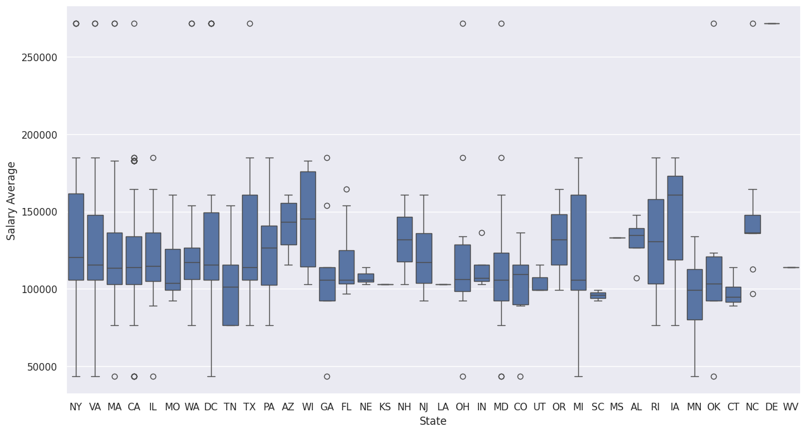
    


<div class="alert alert-block alert-info">
    <b>Key takeaway</b>: The data ordered by states contains the alot of outliers, indicating that the median is a better statistic than the mean. The median income across states is with few exceptions remains in a relatively small band between 105K and 140K, compared to vastly varying average costs of livings across the states.
</div>

##### 2.8.2) What are the average salaries across the different job titles?
A simple pivot table already shows that the mean of the Salary Average does not differ greatly for different job titles. The different between the highest (manager) and the lowest (data engineer) is only around $19000.


```python
#create a pivot table to analyse the mean of salary average
#rename column to avoid ambiguity
pd.pivot_table(df,
            index='Job Title simplyfied',
            values='Salary Average').rename(
                columns={'Salary Average': 'Mean Salary Average'}) 
```


<div>
<style scoped>
    .dataframe tbody tr th:only-of-type {
        vertical-align: middle;
    }

    .dataframe tbody tr th {
        vertical-align: top;
    }

    .dataframe thead th {
        text-align: right;
    }
</style>
<table border="1" class="dataframe">
  <thead>
    <tr style="text-align: right;">
      <th></th>
      <th>Mean Salary Average</th>
    </tr>
    <tr>
      <th>Job Title simplyfied</th>
      <th></th>
    </tr>
  </thead>
  <tbody>
    <tr>
      <th>Analyst</th>
      <td>115718.181818</td>
    </tr>
    <tr>
      <th>Data engineer</th>
      <td>113808.510638</td>
    </tr>
    <tr>
      <th>Data scientist</th>
      <td>125216.483516</td>
    </tr>
    <tr>
      <th>Director</th>
      <td>127333.333333</td>
    </tr>
    <tr>
      <th>MLE</th>
      <td>118986.842105</td>
    </tr>
    <tr>
      <th>Manager</th>
      <td>132500.000000</td>
    </tr>
    <tr>
      <th>Others</th>
      <td>128053.030303</td>
    </tr>
  </tbody>
</table>
</div>


##### 8.3) Does the required programming language affect salaries?
R is usually more frequently used in academia and research as opposed to industry positions. So there could be a difference in salaries according to the required programming language.


```python
# create list of languages 
language_list = ['Python only', 'Python + R','R only']
# excludes unspecified not in list
df_lang = df[df['Language'].isin(language_list)]
# set number of bins
n_bins = 20
# create unified bins for histplots
bins = np.linspace(df_lang['Salary Average'].min(), df_lang['Salary Average'].max(), n_bins)
# plotting histograms
fig, axes = plt.subplots(nrows = 1, ncols = 2, figsize = (14,6),gridspec_kw={'width_ratios': [2, 1.5]})
sns.histplot(x=df[df['Language']=='Python only']['Salary Average'],alpha =0.5, bins = bins, ax = axes[0],label = 'Python only')
sns.histplot(x=df[df['Language']=='Python + R']['Salary Average'],alpha =0.5, bins = bins, ax = axes[0],label = 'Python + R')
sns.histplot(x=df[df['Language']=='R only']['Salary Average'],alpha =0.5, bins = bins, ax = axes[0],label = 'R only')

# plotting boxplot
ax = sns.boxplot(data=df_lang, x='Language', y='Salary Average', hue='Language', ax = axes[1])

axes[0].set_title('Histogram of Salary Average \n per language requirement (not stacked)')
axes[0].legend()
axes[1].set_title('Histrogram of Salary Average \n per language requirement')
```


    Text(0.5, 1.0, 'Histrogram of Salary Average \n per language requirement')


    
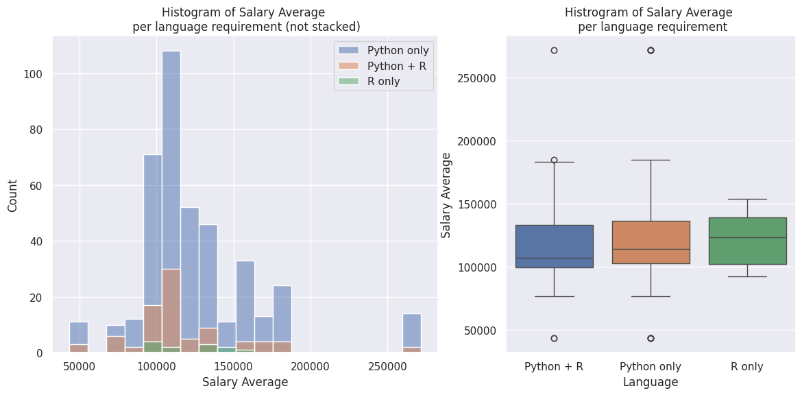
    


<div class="alert alert-block alert-info">
    <b>Key takeaway</b>: Salaries Averages include alot of observations classified as outliers. This makes the median a more suitable statistic that the mean to summarizes the salaries. Suprisingly, the median salary average is highest for the language requirement of only R. Yet, in this category there are the least amount of observations. 
</div>


##### 2.8.4) Is there a realtionship between salaries and the sector?


```python
# create a pivot table to store the number of observations per sector
pt_sector = pd.pivot_table(data = df,index='Sector', values = 'Salary Average', aggfunc=['mean','count']).sort_values(('mean','Salary Average'),ascending=False)
# create a list of counts
count_list = pt_sector[('count','Salary Average')].to_list()

pt_sector
```


<div>
<style scoped>
    .dataframe tbody tr th:only-of-type {
        vertical-align: middle;
    }

    .dataframe tbody tr th {
        vertical-align: top;
    }

    .dataframe thead tr th {
        text-align: left;
    }

    .dataframe thead tr:last-of-type th {
        text-align: right;
    }
</style>
<table border="1" class="dataframe">
  <thead>
    <tr>
      <th></th>
      <th>mean</th>
      <th>count</th>
    </tr>
    <tr>
      <th></th>
      <th>Salary Average</th>
      <th>Salary Average</th>
    </tr>
    <tr>
      <th>Sector</th>
      <th></th>
      <th></th>
    </tr>
  </thead>
  <tbody>
    <tr>
      <th>Consumer Services</th>
      <td>203750.000000</td>
      <td>2</td>
    </tr>
    <tr>
      <th>Media</th>
      <td>155300.000000</td>
      <td>5</td>
    </tr>
    <tr>
      <th>Retail</th>
      <td>150142.857143</td>
      <td>7</td>
    </tr>
    <tr>
      <th>Government</th>
      <td>134470.588235</td>
      <td>17</td>
    </tr>
    <tr>
      <th>Aerospace &amp; Defense</th>
      <td>132695.652174</td>
      <td>46</td>
    </tr>
    <tr>
      <th>Business Services</th>
      <td>130079.166667</td>
      <td>120</td>
    </tr>
    <tr>
      <th>Travel &amp; Tourism</th>
      <td>128666.666667</td>
      <td>3</td>
    </tr>
    <tr>
      <th>Accounting &amp; Legal</th>
      <td>124666.666667</td>
      <td>3</td>
    </tr>
    <tr>
      <th>Manufacturing</th>
      <td>123239.130435</td>
      <td>23</td>
    </tr>
    <tr>
      <th>Biotech &amp; Pharmaceuticals</th>
      <td>122871.212121</td>
      <td>66</td>
    </tr>
    <tr>
      <th>Health Care</th>
      <td>119761.904762</td>
      <td>21</td>
    </tr>
    <tr>
      <th>Information Technology</th>
      <td>118909.574468</td>
      <td>188</td>
    </tr>
    <tr>
      <th>Education</th>
      <td>117833.333333</td>
      <td>3</td>
    </tr>
    <tr>
      <th>Transportation &amp; Logistics</th>
      <td>117750.000000</td>
      <td>6</td>
    </tr>
    <tr>
      <th>Real Estate</th>
      <td>116833.333333</td>
      <td>3</td>
    </tr>
    <tr>
      <th>Finance</th>
      <td>115500.000000</td>
      <td>33</td>
    </tr>
    <tr>
      <th>Telecommunications</th>
      <td>112357.142857</td>
      <td>7</td>
    </tr>
    <tr>
      <th>Insurance</th>
      <td>111281.250000</td>
      <td>32</td>
    </tr>
    <tr>
      <th>Agriculture &amp; Forestry</th>
      <td>103833.333333</td>
      <td>3</td>
    </tr>
    <tr>
      <th>Oil, Gas, Energy &amp; Utilities</th>
      <td>101300.000000</td>
      <td>10</td>
    </tr>
    <tr>
      <th>Construction, Repair &amp; Maintenance</th>
      <td>74750.000000</td>
      <td>2</td>
    </tr>
    <tr>
      <th>Non-Profit</th>
      <td>43500.000000</td>
      <td>1</td>
    </tr>
  </tbody>
</table>
</div>


```python
fig = plt.subplots(figsize = (15,8))
# create a bar plot of mean of salary average including 90 % confidence intervals
sns.barplot(data = df, x='Sector',y='Salary Average',
            errorbar=('ci',90),
            width=1,
            order=pt_sector.index)
ax.set_xticklabels(ax.get_xticklabels(), fontsize=10)
plt.title('Mean Salary across sectors including 90 % Confidence Intervals')
plt.ylabel('Sector Mean for "Average Salary"')
plt.xlabel('Sector')
plt.xticks(rotation=90);
#include number of observations at bottom of bars
for i in range(len(count_list)):
    plt.text(x = i , y = 10000, s = count_list[i], size = 12,horizontalalignment = 'center', color = 'w')
# add 'n='
plt.text(x = 0 , y = 10000, s = "n = \n", size = 12,horizontalalignment = 'center', color = 'w')
```


    Text(0, 10000, 'n = \n')


    
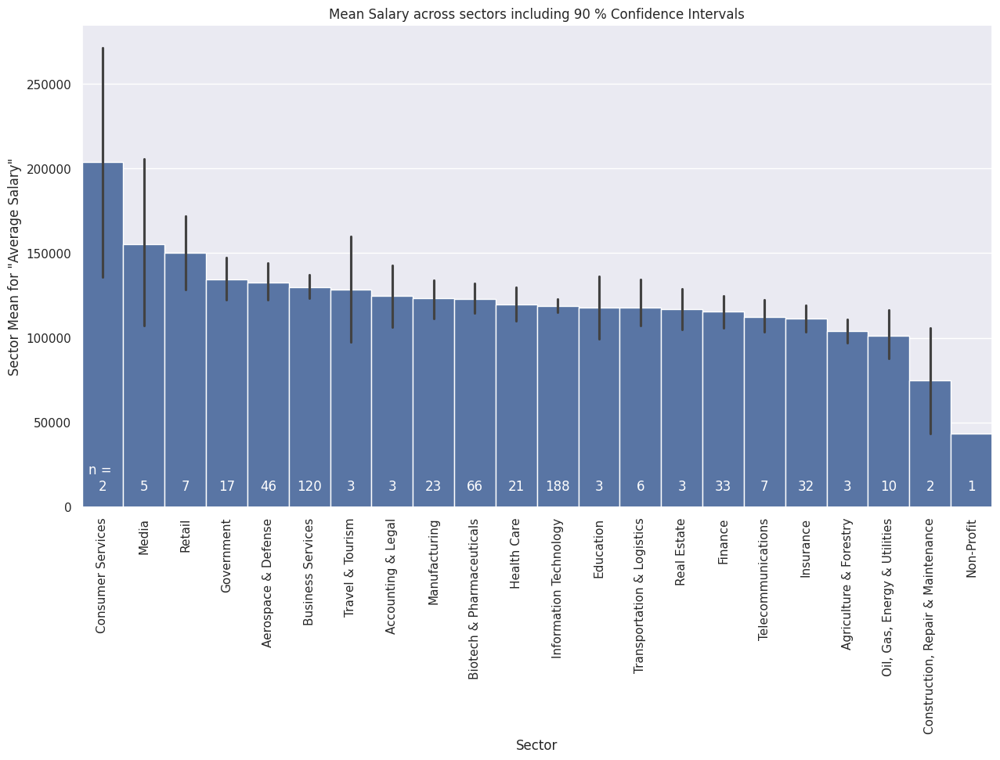
    


<div class="alert alert-block alert-info">
    <b>Key takeaway</b>: The average income is very similar between the different sectors at around 120K. Customer Services and Media (on the high end) and Construction, Repair & Maintance and Non-Profit (on the low end) deviate alot from the other sectors, and have a higher uncertainty indicated by the lower sample size n  or the the confidence interval.
</div> 

 #### 2.9) Miscellaneous:

 ##### 2.9.1) Is there more information to uncover from the job descriptions?
 The most information about the job postings are stored in the job description. One-hot encoded features for job requirements have been created. Maybe creating a word cloud helps to identify more job requirments.


```python
# create a custom list of stop words
stop_words = list(STOPWORDS) 
custom_stop_words = ['experience','user', 'need']
stop_words = set(stop_words + custom_stop_words)
# combine all job descriptions
words = " ".join(df['Job Description'])
# create a word cloud
wordcloud = WordCloud(max_words=400, width =1280, height = 720, background_color="black",stopwords=stop_words).generate(words)
plt.figure(figsize=[15,15])
plt.imshow(wordcloud, interpolation="bilinear")
plt.axis('off')
plt.savefig('wordcloud.png');
```


    
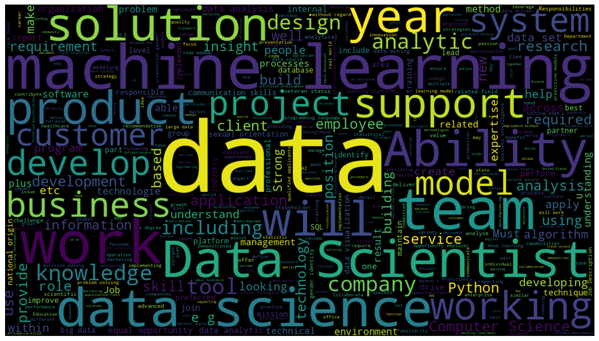
    


<div class="alert alert-block alert-info">
    <b>Key takeaway</b>: Machine learning is a word that is very frequent in the job descriptions. After analysing the word cloud, a one-hot encoded feature has been created, which was very sought after job requirement, as shown in earlier analyses. Word like model, analytic, develop, support and solution speak for the problem solving mentality that is needed in the field of data science.
</div> 

##### 2.9.2) Are there any other relationships in the data set?
Usually done earlier on in the analysis, a pair plot of the features can be created to detect trends in the data set. This is paired with a heat map of the correlation coefficients.


```python
#heat map of the correlation coefficients
plt.figure(figsize=(13, 6))
sns.heatmap(df.corr(numeric_only=True),annot=True,fmt=".2f")
```


    <Axes: >


    
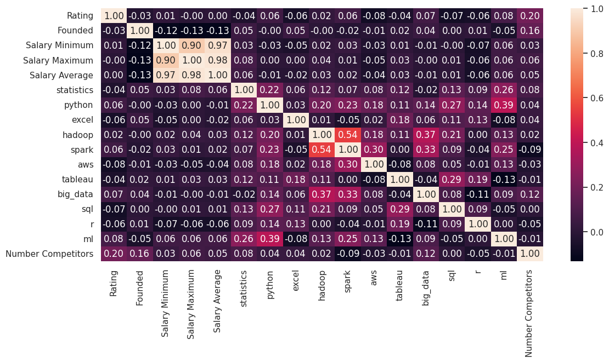
    


```python
features = ['Rating','Founded','Salary Average','Number Competitors']
sns.pairplot(data=df[features])
```


    <seaborn.axisgrid.PairGrid at 0x74431a519f00>


    
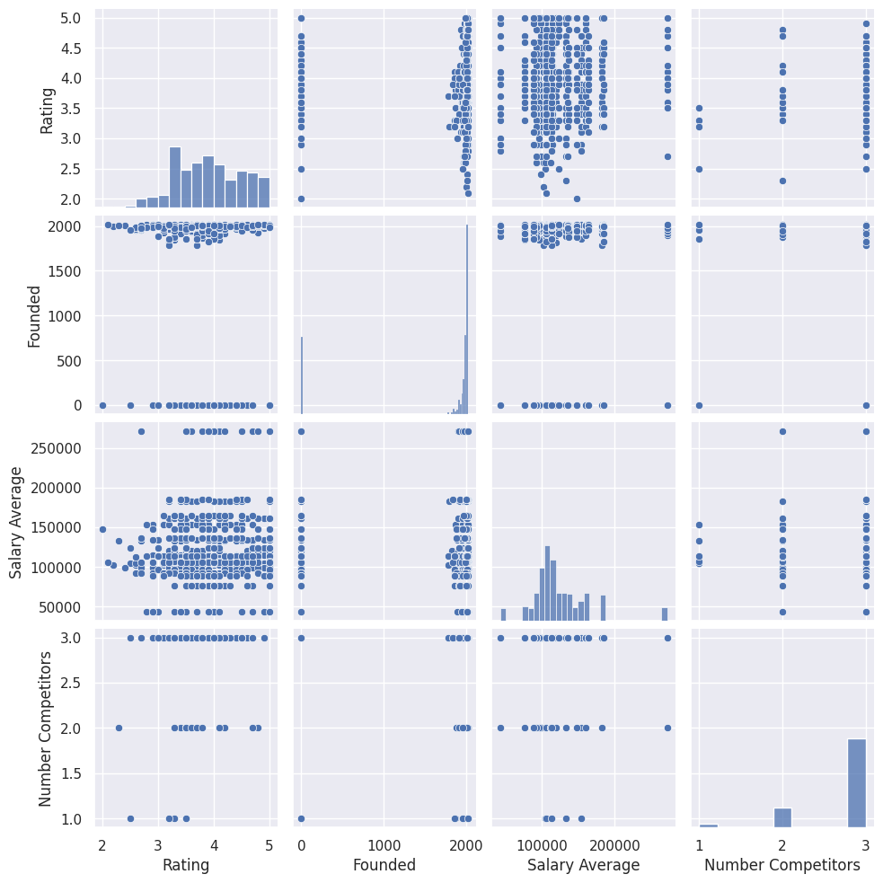
    


<div class="alert alert-block alert-info">
    <b>Key takeaway</b>: There is no strong correlations worth investigating any further. The strong correlation between the salary features is a result of the feature engineering. Some keywords pairs like spark/hadoop and big_data/hadoop seem to appear more often together. 
</div> 

## Summary
During this project, a data set about job postings scraped from Glassdoor has been analyzed. Due to the nature of the data set, the focus was on the exploratory analysis as the possibilities for building models was very limited. At first the data was cleaned and features were created.
Depending on the question at hand, a appropriate tool for visualization has been chosen including bar plots, word maps, interactive geospatial maps, and pie charts.

Here is a list of of the most interesting findings related to the job search:

* It's a good time to become a data scientist. There is an extremely wide variety in industries looking for talents in the field of data. Almost 70 % of those job postings are for data scientists. 
* There are a lot of different job titles. There are quite a few potential job offers to be missed by just strictly looking for the job title 'Data Scientist'.
* Almost 25 % of job offers are from California with a very high job density around San Fransisco being the area with the most job offers.
* Almost nobody is specifically looking for Data Science Juniors, which makes sense as this "scares off" talents with more experience.
* The biggest sectors in data science are IT, Business Services and Biotech & Pharamceuticals making up over 50 % of the data set
* Salaries are characterized a by a high amount of outliers. 
* Python, Machine Learning and Statistics are the most common job requirements


## Outlook
There are few things I like to get back to once times allows it:
* I would like to identify whether job requirements like Machine Learning can drive mean salaries using hypothesis testing. On-hot encoded features devide the data set in two partitions, which would be a good basis for the application of hypothesis testing.
* I would like to further improve on my dash boarding skills. This data set and its EDA is a good starting point.


[Return to Portfolio Page](https://sebastianghafafian.github.io/Portfolio/)
