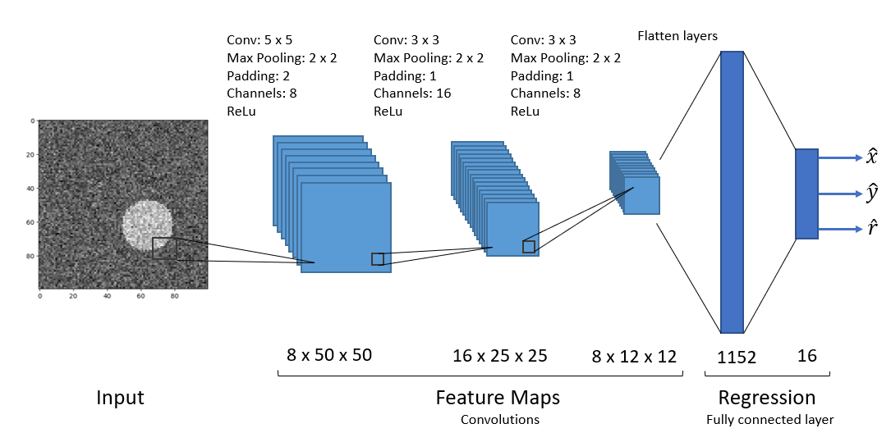

# About

Hi there! Welcome to my Portfolio.

My name is Sebastian Ghafafian. I am originally from Leipzig, Germany where I grew up. I moved to Berlin to study mechanical engineering. After receiving my Bachelor's and Master's degree, I worked four years in engineering positions (strong focus on composite materials) in the field of sustainable energy. I quickly found out that I love programming and working with data to gain meaningful insights. This lead me to join the MicroMaster's program in Statistics and Data Science from MIT, where I received a very broad yet in-depth understanding for statistics and machine learning algorithms. \
\
I am a passionate learner and I love walking through life picking up new skills along the way. Currently, learning to play the guitar and to speak Armenian keep the brain juices flowing. Besides that, I have a weird passion for fixing or repairing broken things.
\
Currently, I am looking for job oppurtunities in the field of data science or mechanical engineering where I can leverage my data related skill set. \
\
Feel free to reach out to me on [LinkedIn](https://www.linkedin.com/in/sebastian-ghafafian) or via [email](sghafafian@gmail.com) or to check out my [resume](https://github.com/SebastianGhafafian/Portfolio/blob/main/docs/assets/resume/CV_SebastianGhafafian.pdf). 

## Projects

Feel free to check out my projects related to data science. 

### [Exploratory Data Analysis of the Data Science Job market](https://sebastianghafafian.github.io/Portfolio/EDA.html)

This projects looks at a data set scraped from Glassdoor.com about job postings in America related to the field of data. The project entails cleaning the data, feature engineering, exploratory data analysis and creating interactive maps to draw insights about the job market, desired skills and potential employers in the Los Angeles area.

Keywords: EDA, Data visualization, Folium, Pandas, One-Hot Encoding, Cleaning data, Word Clouds

[Github Link](https://github.com/SebastianGhafafian/EDA_Data_Science_Job_Market)

### [Convolutional Neural Network (CNN) to detect circles in noisy images](https://sebastianghafafian.github.io/Portfolio/Circle_CNN.html)

This project sets up a relatively straightforward task for a Convoultional Neural Network to perform a regression task. Images contain a circle or random size and position. The goal is to output the position (x,y) and the radius r of the circle for varying levels of noise in the images. Two models are built and trained using PyTorch and their performances are analyzed.

Keywords: Convolutional Neural Networks (CNN), Pytorch, Regression, Data visualization, Pandas

[Github Link](https://github.com/SebastianGhafafian/Circle_CNN)
  
## Education

* MicroMaster in Statistics and Data Science Massachusetts Institute of Technology (MITx via edX)
* M.Sc. Mechanical Engineering Technical University of Berlin (TUB)
* B.Sc. Mechanical Engineering Technical University of Berlin (TUB)

## Work Experience

**Structural Engineer for Composite Materials** \
@ TPI Composites Germany GmbH in Berlin, Germany\
01/2021 – 08/2023 

**Research Associate** \
@ Federal Institute for Materials Research and Testing (BAM) in Berlin, Germany\
11/2019 – 12/2020 

**Intern for Composite Materials and Manufacturing** \
@ Institute for the Research and Development of Sports Equipment (FES) in Berlin, Germany\
10/2016 – 09/2018

**Teaching Assistant** \
@ Technical University Berlin in Berlin, Germany\
10/2016 – 09/2018

